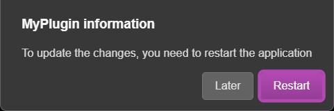

# API Serveur

### `Config`

Object globale regroupant la configuration d'A.V.A.T.A.R serveur.

### `Config.modules`

Object regroupant la configuration des plugins. Cet objet est généralement utilisé dans les plugins pour récupérer une valeur de clé de propriété.

=== "<Plugin\>.prop"
    ```json
     {
        "modules": { 
            "myFirstPlugin": {
                "version": "1.0",
                "name": "my first plugin",
                "rules": {
                    "test": ["test * (command|order)"]
                }
            }
        }
    }
    ```
=== "<Plugin\>.js"
    ```js
     const name = Config.modules.myFirstPlugin.name;
    ```

## Message loggers

Logger methods are used to display messages in the A.V.A.T.A.R. console.

Possible data types for all loggers:
```js
const str = 'a string';
const bool = true;
const arr = ['one', 'two', 3];
const obj = {key: "value"};
const f = () => console.log('hello');
```

### `info(...message)`

Affiche un message d'information dans la console.

```js
info(str, bool, arr, obj, f);
// returns in the console: 
// info: a string true ["one","two",3] {"key":"value"} () => console.log('hello')
```

### `infoGreen(...message)`

Affiche un message d'information  en <span style="color:green">vert</span> dans la console.

### `infoOrange(...message)`

Affiche un message d'information  en <span style="color:orange">orange</span> dans la console.


### `warn(...message)`

Affiche un message d'avertissement en <span style="color:orange">orange</span> dans la console.

```js
warn(str, bool, arr, obj, f);
// returns in the console: 
// warn: a string true ["one","two",3] {"key":"value"} () => console.log('hello')
```

### `error(...message)`

Affiche un message d'erreur en <span style="color:red">rouge</span> dans la console 

```js
error(str, bool, arr, obj, f);
// returns in the console: 
// error: a string true ["one","two",3] {"key":"value"} () => console.log('hello')
```

### `infoConsole(...message)`

Affiche un message dans la console de développement de Chromium (cliquez sur F11 dans l'interface A.V.A.T.A.R).

/// warning
Du fait de la mise en [bac à sable](https://www.electronjs.org/docs/latest/tutorial/sandbox) de Chromium, le rendu d'une fonction est impossible dans la console de développement.  
Afficher une fonction génèrera une erreur. Tous les autres types de données sont possibles.
///

```js
infoConsole(str, bool, arr, obj);
```
{width="350"}


## Dialog

### `Avatar.speak(tts, client[, end, callback, {voice, volume, speed, pitch}])`

Exécute un tts sur le système audio du client (enceinte du client ou autre système déclaré).

| paramètre| <div style="width:95px">type</div>| Obligatoire | Default value| Values | Description|
|----------|:---:|:-----------:|:-----------:|----------- |-----------|
|`tts`|string<br>object|**oui**| | |Le texte ou un tableau de textes à vocaliser. Peut être un texte simple, plusieurs textes séparés par un pipe ('\|') ou un tableau de textes (les textes peuvent être séparés par un pipe ('\|')). Une des valeurs sera choisie aléatoirement.|
|`client`|string|**oui**| Config.default.client| | Le client où le texte est vocalisé. Peut être un vrai client ou un client virtuel, dans ce cas le texte sera vocalisé sur le vrai client du client virtuel|
|`end`|boolean|non| true | true<br>false| Définie si la restitution de l'écoute sur le client est effectuée après le speak<br>**true**: restitue l'écoute<br>**false**: ne restitue pas l'écoute|
|`callback`|function|non| | |Fonction de callback exécutée après le speak|
|{voice, volume, speed, pitch}|object<br>voice: string<br>volume: number<br>speed: number<br>pitch: number|non| | |Définition de la voix à utiliser. Cette voix doit exister.<br>Les clés voice, volume, speed, pitch ne sont pas obligatoires.<br>Les valeurs `number` dépendent de la plateforme et de la voix|

Exemples :  

1. Vocalise le tts sur le client Living room et restitue l'écoute
    ```js
    Avatar.speak('Hello, what can i do for you?', 'Living room')
    ```
2. Vocalise un des tts aléatoirement sur le client Living room et restitue l'écoute
    ```js
    Avatar.speak('Hello, what can i do for you?|Hi, can I help you?', 'Living room')
    ```
3. Vocalise un des tts aléatoirement sur le client Living room et ne restitue pas l'écoute
    ```js
    Avatar.speak('Hello, what can i do for you?|Hi, can I help you?', 'Living room', false)
    ```
4. Vocalise un des tts aléatoirement sur le client Living room, restitue l'écoute et exécute un callback ensuite
    ```js
    Avatar.speak(['Hello, what can i do for you?', 'Hi, can I help you?'], 'Living room', () => {
        // Do stuff
    })
    ```
5. Vocalise le tts sur le client Living room, ne restitue pas l'écoute et exécute un callback ensuite
    ```js
    Avatar.speak('Hello, what can i do for you?', 'Living room', false, () => {
        // Do stuff
    })
    ```
6. Vocalise un des tts aléatoirement sur le client Living room, ne restitue pas l'écoute et exécute un callback ensuite
    ```js
    Avatar.speak(['Hello, what can i do for you?|Hi, can I help you?', 'I\'m home. Can I get you anything?'], 'Living room', false, () => {
        // Do stuff
    })
    ```
7. Vocalise le tts sur le client Living room et restitue l'écoute avec une définition de voix
    ```js
    // definition: voice name, volume, speed, pitch
    Avatar.speak('Hello, what can i do for you?', 'Living room', {voice: "Microsoft Julie - French (France)", volume: 100, speed: 80, pitch: 1})

    //Another definition: voice name and speed
    Avatar.speak('Hello, what can i do for you?', 'Living room', {voice: "Microsoft Julie - French (France)", speed: 70})
    ```


### `Avatar.askme(tts, client, grammar, timeout, callback[, rawSentence, {voice, volume, speed, pitch}])`

Exécute un tts sur le système audio du client (enceinte du client ou autre système déclaré), attend une réponse définie dans l'objet grammaire puis retourne le résultat dans le callback.

/// note
Pour améliorer le résultat des réponses du askme que vous prononcez, une recherche de la grammaire la plus proche est effectuée par une [distance de levenshtein](https://en.wikipedia.org/wiki/Levenshtein_distance). Cette recherche est effectuée uniquement pour les langues Française et Anglaise.
///


| paramètre| <div style="width:95px">type</div>| Obligatoire | Default value| Description|
|----------|:---:|:-----------:|:-----------:|:----------- |
|`tts`|string<br>object|non| | Le texte ou un tableau de textes à vocaliser. Peut être un texte simple, plusieurs textes séparés par un pipe ('\|') ou un tableau de textes (les textes peuvent être séparés par un pipe ('\|')). Une des valeurs sera choisie aléatoirement.|
|`client`|string|**oui**| Config.default.client| Le client où le texte est vocalisé. Peut être un vrai client ou un client virtuel, dans ce cas le texte sera vocalisé sur le vrai client du client virtuel|
|`grammar`|object|**oui**|  |Grammaire de réponses possibles sous la forme <grammaire\>:<tag d'exécution\> |
|`timeout`|number|**oui**| 20 |Délais d'attente de la réponse exprimée en secondes|
|`callback`|function|**oui**| | Fonction de callback exécutée pour le askme|
|`rawSentence`|string|non|  | Cas spécial: A préciser **obligatoirement** si le client est de type `mobile` (eg. Android)|
|{voice, volume, speed, pitch}|object<br>voice: string<br>volume: number<br>speed: number<br>pitch: number|non| | Définition de la voix à utiliser. Cette voix doit exister.<br>Les clés voice, volume, speed, pitch ne sont pas obligatoires.<br>Les valeurs `number` dépendent de la plateforme et de la voix|


Exemples :  

1. askme simple, action à exécuter avec une grammaire fixe
    ```js
    Avatar.askme("Hello, what is your name ?", client,
    {
        "paul": "doStuffForPaul",
        "john": "doStuffForJohn",
        "finish": "done"
    }, 15, (answer, end) => {
        // Removes the askme and resets listen to the client
        end(client);

        // Fixed Grammar
        switch(answer) {
            case "doStuffForPaul":
                // do stuff for Paul
                break;
            case "doStuffForJohn":
                // do stuff for John
                break;
            case "done": // "finish" rule. Ending the askme without execution
            default:
                // timeout reached without answer
                Avatar.speak("nothing to do", client);
        }
    })
    ```
2. askme générique, action à exécuter avec une grammaire générique et fixe
    
    askme accepte une règle de grammaire générique ('*') qui retourne le texte dicté sous la forme "generic:<réponse\>"
    Cette règle générique peut être utilisée en même temps que des règles de grammaires strictes.

    ```js
    Avatar.askme("Hello, what is your name ?", client,
    {
        "*": "generic",
        "finish": "done"
    }, 15, (answer, end) => {
        // Removes the askme and resets listen to the client
        end(client);

        // tests the generic grammar
        if (answer.split(':')[1]) return Avatar.speak(`Welcome ${answer.split(':')[1]}`, client);
        
        // Otherwise, fixed Grammar
        switch(answer) {
            case "done": // "finish" rule. Ending the askme without execution
            default:
                // timeout reached without answer
                Avatar.speak("nothing to do", client);
        }
    })
    ```
3. askme sans tts, par exemple une application (eg. Google Assistant) qui prononce elle-même la question et attend une réponse
    ```js
    Avatar.askme(null, client,
    {
        "*": "generic",
        "finish": "done"
    }, 15, (answer, end) => {
        // Removes the askme and resets listen to the client
        end(client);

        // tests the generic grammar
        if (answer.split(':')[1]) {
            // do stuff
            return answerForApp(answer.split(':')[1]);
        }
        
        // Otherwise, fixed Grammar
        switch(answer) {
            case "done": // "finish" rule. Ending the askme without execution
            default:
                // timeout reached without answer
                Avatar.speak("nothing to do", client);
        }
    })
    ```

### `Avatar.Speech.end(client[, activateListen, callback])`

Restitue l'écoute sur le client.

| <div style="width:100px">paramètre</div>| type| Obligatoire | Default value| Values | Description|
|----------|:---:|:-----------:|:-----------:|----------- |-----------|
|`client`|string|**oui**| Config.default.client| |Le client concerné. Peut être un vrai client ou un client virtuel, dans ce cas le texte sera vocalisé sur le vrai client du client virtuel|
|`activateListen`|boolean|non| true| true<br>false| Définie si la restitution de l'écoute sur le client est effectuée.<br> Dans tous les cas, la methode [`unmute`](tutorial-script.md#unmuteclientfrom-clientto) du plugin concerné est exécutée|
|`callback`|function|non| | | Fonction de callback exécutée après la restitution de l'écoute sur le client. Si la methode [`timeoutCallbackEnd`](tutorial-script.md#unmuteclientfrom-clientto) du plugin concerné existe, un délais pour exécuter le callback peut être défini.|

Exemples: 

1. Réactivation de l'écoute
    ```js
    // Reactivation of listening
    Avatar.Speech.end('Living room');
    
    // Do stuff
    ```

2. tts sur le client sans la réactivation de l'écoute (end = false) puis après avoir réaliser une action dans le callback, restitution de l'écoute 
    ```js
    Avatar.speak('Hello, what can i do for you?', 'Living room', false, () => {
        // Do Stuff
        // .......

        // Then reactivation of listening
        Avatar.Speech.end('Living room');
    }) 
    ```
3. Temporisarion de 5 secondes pour le timeout du callback end
    ```js
    /**
    * Returns a timeout for the callback of the Avatar.Speech.end method
    * @param {string=} client - the A.V.A.T.A.R client which execute the end, can be a real or virtual client
    * @return {number=} - required - returns timeout in milliseconds
    */
    export function timeoutCallbackEnd(client) {
        return 5000;
    }

    const test = () => {
        // tts on Living room, no reactivation of listening
        Avatar.speak('Hello, what can i do for you?', 'Living room', false, () => {
            // Do stuff
            // ........

            // Then, reactivation of listening and a callback
            Avatar.Speech.end('Living room', () => {
                // Do stuff
                // ........
            })
        }) 
    }
    ```

## Music play

### `Avatar.play(music, client, type[, end, callback])`

Joue un fichier son sur le client

| <div style="width:100px">paramètre</div>| type| Obligatoire | Default value| Values | Description|
|----------|:---:|:-----------:|:-----------:|----------- |-----------|
|`music`|string|**oui**|||Le fichier son à jouer. Peut être:<br>- Un fichier sur le serveur ou sur un client<br>- Une adresse web locale ou distante.<br>_\__dirname_ est remplacé par _<A.V.A.T.A.R\>/resources/app/core_|
|`client`|string|**oui**|Config.default.client||Le client sur lequel le fichier son doit être joué|
|`type`|string|**oui**||local<br>url|- _local_: Fichier sur le client ou sur le serveur<br>- _url_: Lien http local ou distant|
|`end`|string|non|after|before<br>after|Défini si la restitution de l'écoute sur le client est faite avant ou après de jouer le fichier son|
|`callback`|function|non|||Fonction de callback exécutée après le fichier son|

Exemples: 

1. Absolute path on the client, reactivates listening before playing, no callback 
    ```js
    Avatar.play('C:/music/siren.mp3', 'Living room', 'local', 'before'); 
    ```
2. _<A.V.A.T.A.R\>/resources/app/core_ path on the client, reactivates listening after playing and a callback   
    ```js
    Avatar.play('__dirname/music/siren.mp3', 'Living room', 'local', 'after', () => {
       // Do stuff
    }); 
    ```
3. Music on the web, reactivates listening after playing and a callback     
    ```js
    Avatar.play("https://ccrma.stanford.edu/~jos/mp3/cello.mp3", 'Living room', 'url', 'after', () => {
        // Do stuff
    });
    ```
4.  HTTP static folder on the server  (music file on the server), reactivates listening after playing    
    ```js
    const music = `http://${Config.http.ip}:${Config.http.port}/Love_Is_a_Battlefield.mp3`;

    // sets static folder on the server
    Avatar.static.set('C:/music', () => {
        // Plays music on the client
        Avatar.play(music, 'Living room', 'url');
    });
    ```
5.  HTTP static folder on the client (music file on the client), reactivates listening before playing    
    ```js
    const clientInfos = Avatar.Socket.getClient('Living room');
    const music = `http://${clientInfos.ip}:${clientInfos.loopback}/Love_Is_a_Battlefield.mp3`;

    // sets static folder on the client
    Avatar.static.setToClient('C:/music', 'Living room', () => {
        // Plays music on the client
        Avatar.play(music, 'Living room', 'url', 'before');
    });
    ```


### `Avatar.stop(client[, callback])`

Stoppe le fichier son sur le client

| <div style="width:100px">paramètre</div>| type| Obligatoire | Default value| Description|
|----------|:---:|:-----------:|:-----------:|:----------- |
|`client`|string|**oui**|Config.default.client| Le client où le fichier son doit être stopppé|
|`callback`|function|non||Fonction de callback exécutée après l'arrêt du fichier son|

Exemple :

```js
Avatar.stop('Living room');
```


## Files & folders

### `Avatar.copyFile(from, to, client[, end, backup, callback])`

Copie un fichier du serveur sur un client.

| <div style="width:100px">paramètre</div>| type| Obligatoire | Default value| Values | Description|
|----------|:---:|:-----------:|:-----------:|----------- |-----------|
|`from`|string|**oui**|||Nom du fichier source à copier sur le serveur|
|`to`|string|**oui**|||Nom du fichier destination sur le client.<br>_\__dirname_ est remplacé par _<A.V.A.T.A.R\>/resources/app/core_|
|`client`|string|**oui**|Config.default.client||Le client sur lequel le fichier est copié|
|`end`|string|non||before<br>after|Défini si la restitution de l'écoute sur le client est faite avant ou après la copie du fichier|
|`backup`|boolean|non|false|true<br>false|Défini si une copie en _\_old_ est faite si le fichier de destination existe|
|`callback`|function|non|||Fonction de callback exécutée après la copie|

Exemples: 

```js
// Absolute server and client paths, activate listening before copy of the file
Avatar.copyFile('C:/avatar-server/tmp/myfile.js', 'C:/tmp/myfile.js', 'Living room', 'before', () => {
    // Do stuff
})
```

```js
// <A.V.A.T.A.R\>resources/app/core path on the client and backup of the file if exists
Avatar.copyFile('C:/tmp/avatar.js', '__dirname/avatar.js', 'Living room', true); 
```

### `Avatar.transfertPlugin(plugin, client[, backup, callback])`

Copie le répertoire d'un plugin du serveur vers un client.

| <div style="width:100px">paramètre</div>| type| Obligatoire | Default value| Values | Description|
|----------|:---:|:-----------:|:-----------:|----------- |-----------|
|`plugin`|string|**oui**|||Nom du plugin à transférer sur le client|
|`client`|string|**oui**|Config.default.client||Le client sur lequel le répertoire du plugin est transférer|
|`backup`|boolean|non|false|true<br>false|Défini si une copie de sauvegarde dans le répertoire _<Client\>/app/resources/core/backup-plugins_ est faite si le plugin existe sur le client|
|`callback`|function|non|||Fonction de callback exécutée après le transfert|

Exemples: 

```js
// Copys the weather plugin to the `Living room` client with a backup before the copy
Avatar.transfertPlugin('weather, 'Living room', true, () => {
    // Do stuff
})
```

### `Avatar.static.set(folder[,callback])`

Défini un dossier statique sur le serveur.

| <div style="width:100px">paramètre</div>| type| Obligatoire | Description|
|----------|:---:|:-----------:|:----------- |
|`folder`|string|**oui**|Dossier à rendre static|
|`callback`|function|non|Fonction de callback|

Exemple: 

```js
// sets static folder on the server
Avatar.static.set('C:/music', () => {
     // Do stuff
});
```

### `Avatar.static.setToClient(folder, client[,callback])`

Définit un dossier statique sur un client.

| <div style="width:100px">paramètre</div>| type| Obligatoire | Description|
|----------|:---:|:-----------:|:----------- |
|`folder`|string|**oui**|Dossier à rendre static|
|`client`|string|**oui**|Le client sur lequel le dossier est à rendre static|
|`callback`|function|non|Fonction de callback|

Exemple: 

```js
// sets static folder on the server
Avatar.static.setToClient('C:/music', 'Living room', () => {
     // Do stuff
});
```

## Client methods

### `Avatar.clientFromRule(sentence)`

* `sentence` <span style="color:green"><string\></span> A sentence
* Returns: <span style="color:green"><string\></span> A client included in the sentence, can be a virtual client

Exemples: 

- Client réel: 'Living room'
- Client virtuel: 'Patio'

```js
const room = Avatar.clientFromRule('switch on the light in the Living room');
// Returns: 'Living room'
```

```js
const room = Avatar.clientFromRule('switch on the light in the patio');
// Returns: 'patio'
```

### `Avatar.clientPlugin(client, plugin[, param, callback])`

Exécute un plugin sur le client.

| <div style="width:100px">paramètre</div>| type| Obligatoire | Default value| Description|
|----------|:---:|:-----------:|:-----------:|:----------- |
|`client`|string|**oui**|Config.default.client|Le client sur lequel le plugin est exécuté|
|`plugin`|string|**oui**||Plugin à exécuter|
|`param`|objet|non||Paramètres de l'object _data_ du plugin à exécuter|
|`callback`|function|non||Fonction de callback exécutée après l'exécution du plugin|

Exemples: 

1. Exécute le plugin `time`
    ```js
    Avatar.clientPlugin('Living room', 'time');
    ```
2. Autre exécution du plugin `time` avec callback
    ```js
    Avatar.clientPlugin('Living room', "time", () => {
        // Do stuff
    });
    ```
3. Exécute le plugin `eeDomus` avec des paramètres 
    ```js
    Avatar.clientPlugin('Living room', 'eeDomus', {action: {command: 'set', periph: '568947', value: '1OO'}});
    ```


### `Avatar.getTrueClient(client)`

* `client` <span style="color:green"><string\></span> A virtual client
* Returns: <span style="color:green"><string\></span> The true client

Retourne le vrai client d'un client virtuel.

Exemples: 

- Client virtuel: 'patio'
- Client réel: 'Living room'

```js
const client = Avatar.getTrueClient('patio');
// Returns: 'Living room'
```

```js
const client = Avatar.getTrueClient('Living room');
// Returns: 'Living room'
```

### `Avatar.getVirtualClients(client)`

* `client` <span style="color:green"><string\></span> A true client
* Returns: <span style="color:green"><array\>[ ]</span> Virtual clients of the true client

Exemple: 

- Client réel: 'Living room'
- Client virtuel: 'patio'
- Client virtuel: 'kitchen'

```js
const virtualClients = Avatar.getVirtualClients('Living room');
// Returns: ['patio', 'kitchen']
```

```js
const virtualClients = Avatar.getVirtualClients('patio');
// Returns: []
```

### `Avatar.isMobile(client)`

* `client` <span style="color:green"><string\></span> A client
* Returns: <span style="color:green"><boolean\></span> _true_ if the client is mobile (eg. Android) or _false_

```js
const properties = Avatar.isMobile('Living room');
// Returns: true
```

### `Avatar.isVirtualClient(client)`

* `client` <span style="color:green"><string\></span> A client
* Returns: <span style="color:green"><boolean\></span> _true_ if the client is virtual or _false_

Exemples: 

- Client réel: 'Living room'
- Client virtuel: 'patio'

```js
const isVirtual = Avatar.isVirtualClient('Living room');
// Returns: false
```

```js
const isVirtual = Avatar.isVirtualClient('patio');
// Returns: true
```

### `Avatar.runApp(appExe, client[, param, callback])`

Exécute une application sur le client

| <div style="width:100px">paramètre</div>| type| Obligatoire | Default value| Description|
|----------|:---:|:-----------:|:-----------:|:----------- |
|`appExe`|string|**oui**||Application à exécuter<br>_\__dirname_ est remplacé par _<A.V.A.T.A.R\>/resources/app/core_|
|`client`|string|**oui**|Config.default.client|Le client sur lequel l'application est exécutée|
|`param`|string|non||Paramètres de l'application à exécuter|
|`callback`|function|non||Fonction de callback exécutée après l'exécution de l'application|

Exemples: 

```js
// Executes the `screensaver` application depending of the plateform (Windows, Linux, Darwin)
const screensaver = process.platform === 'win32'
? path.join(__dirname, "lib", "screensaver", "win32", "screensaver.bat")
: path.join(__dirname, "lib", "screensaver", process.platform, "screensaver.sh");

Avatar.runApp(screensaver, 'Living room');
```

```js
// Executes nircmd application on Windows only with parameters and callback
Avatar.runApp('C:/apps/nircmd/nircmd', 'Living room', 'win close class "IEFrame"',() => {
    // Do stuff
});
```

### `Avatar.isServerSpeak(client)`

Test si les [dialogues sont redirigés](client-properties.md#redirection-des-dialogues) vers des enceintes autres que celles du PC client.

Returns <span style="color:green"><boolean\></span> _true_ or _false_

```js
// 'Living room' has wifi speakers
const serverSpeak = Avatar.isServerSpeak('Living room');
Returns: true
```

### `Avatar.isMobile(client)`

Test si le client est un client mobile (eg. Android)

Returns <span style="color:green"><boolean\></span> _true_ or _false_

```js
const mobile = Avatar.isMobile('Living room');
Returns: false
```

### `Avatar.isLoopMode(client)`

Test si le client est configuré en [mode loop](client-properties.md#mode-loop)

Returns <span style="color:green"><boolean\></span> _true_ or _false_

```js
const mobile = Avatar.isLoopMode('Living room');
Returns: false
```

### `Avatar.Socket.getClients()`

* Returns: <span style="color:green"><array\></span> All connected clients

Exemple: 

```js
const clients = Avatar.Socket.getClients();
// Returns: <array\>[ ]</span> All connected clients
// [
//      Client {
//          id: 'Living_room',      // ID of the client
//          name: 'Living room',    // name of the client
//          Obj: Socket {...},      // client socket
//          loop_mode: false,       // dialog loops after each dialog 
//          server_speak: false,    // dialogs are redirected to other speakers
//          ip: '191.89.2.120',     // client IP adress 
//          loopback: '',           // client remote http port
//          language: 'en-EN',      // language of the client dialogs
//          is_mobile: false        // the client is mobile or not
//      }
// ]
```

### `Avatar.Socket.getClientSocket(client)`

* `client` <span style="color:green"><string\></span> A connected client
* Returns: <span style="color:green"><object\></span> Socket object of the connected client

Exemple: 

```js
const clientSocket = Avatar.Socket.getClientSocket('Living room');
//  Returns: 
//  <ref *1> Socket {....}
```

/// note
L'object retourné est ensuite utilisé pour émettre un _event_ sur un client par _clientSocket.emit(event)_
///


### `<clientSocket>.emit(event)`

* `event` <span style="color:green"><string\></span> Emet l'_event_ sur le client

Les événements possibles:

|Event| paramètres |Description|
|:-----|:----|:---|
|restart||Redémarre le client|
|quit||Ferme le client|
|shutdown||Arrête le serveur du client|
|start_listen||Déclenche l'écoute sur le client|
|stop_listen|(client, full)|Stoppe l'écoute sur le client<br>`client` <span style="color:green"><string\></span> Client name<br>`full` <span style="color:green"><boolean\></span> - true: Restitue l'écoute - false: Ne restitue pas l'écoute<br> Dans tous les cas, la methode [`unmute`](tutorial-script.md#unmuteclientfrom-clientto) du plugin concerné est exécutée|
|listenOnOff|(state)|Active/désactive l'écoute du client<br>`state` <span style="color:green"><boolean\></span>- true: Active l'écoute - false: désactive l'écoute|

```js
// Restarts the server of the client
const clientSocket = Avatar.Socket.getClientSocket('Living room');
clientSocket.emit('restart');
```

```js
// Stops listening of the client
const clientSocket = Avatar.Socket.getClientSocket('Living room');
clientSocket.emit('stop_listen', 'Living room', true);
```

## Plugin methods

### `Avatar.getProperty(file[, property])`

Retourne les propriétés du fichier JSON ou la valeur de _property_

| <div style="width:100px">paramètre</div>| type| Obligatoire | Description|
|----------|:---:|:-----------:|:-----------|
|`file`|string|**oui**|Le fichier de propriétés au format JSON|
|`property`|string|non|le nom de la propriété|

Exemples: 

```js
const properties = Avatar.getProperty('/folder/myProperties.prop');
// Returns:
// {
//     "myProperties":"This is my JSON file",
//     "values":100,
//     "description":"My first plugin"
// }
```

```js
const property = Avatar.getProperty('/folder/myProperties.prop', 'description');
// Returns: 'My first plugin'
```

### `Avatar.trigger(listener[, options])`

Déclenche un module d'écoute.

| <div style="width:100px">paramètre</div>| type| Obligatoire | Description|
|----------|:---:|:-----------:|:-----------|
|`listener`|string|**oui**|Nom du module d'écoute à déclencher|
|`options`|object|non|Paramètres à passer au module d'écoute|

Exemples: 

```js
Avatar.trigger('eeDomus', {key: 'SwitchLight', client: 'Living room', periph:'135968', state: "100" });
```

```js
// With callback
Avatar.trigger('eeDomus', {
    key: 'switchLight', 
    client: 'Living room', 
    periph:'135968', 
    state: "100", 
    callback: function (state) => { 
        // Do stuff
});
```


### `Avatar.listen(listener[, callback(options)])`

Déclaration d'un module d'écoute.

| <div style="width:100px">paramètre</div>| type| Obligatoire | Description|
|----------|:---:|:-----------:|:-----------|
|`listener`|string|**oui**|Nom du module d'écoute déclaré|
|`callback`|function|non|Fonction à exécuter avec les options passées dans le déclencheur|

Exemples: 

```js
Avatar.listen('eeDomus', async data => {
    // Executes the action
    await set(data);
});
```

```js
// With callback
Avatar.listen('eeDomus', async data => {
    // Executes the action
    await set(data);
    if (data.callback) callback();
});
```

### `Avatar.call(plugin[, options, callback])`

Fonction d'appel d'un plugin à exécuter par un plugin.

| <div style="width:100px">paramètre</div>| type| Obligatoire | Description|
|----------|:---:|:-----------:|:-----------|
|`plugin`|string|**oui**|Nom du plugin à exécuter|
|`options`|object|non|Options à passer au plugin|
|`callback`|function|non|Fonction à exécuter après l'appel du plugin.<br><b>Note:</b> Le plugin peut passer un paramètre dans la fonction de callback de sa méthode _action_|

Exemples: 

```js
// Executes 'time' plugin, no options required
Avatar.call('time');
```

```js
// Executes 'time' plugin with options and callback
Avatar.call('time', {action: {command: 'set'}, language: 'en', client: 'Living room'}, () => {
    //Do stuff
});
```

```js
// Executes 'time' plugin with callback 
// data <value> - if the plugin returns a value in its callback
Avatar.call('time', (data) => {
    //Do stuff
});
```

### `Avatar.run(plugin[, options, callback])`

Identique à _Avatar.call()_ mais est exécutée pour un appel de plugin par une requête HTTP contrairement à _Avatar.call()_ :

| <div style="width:100px">Action</div>| Avatar.call()| Avatar.run()| 
|----------|:---:|:-----------:|
|`Requète HTTP`|{width="12"}|{width="12"}|
|`Appel par plugin`|{width="12"}|{width="12"}|


| <div style="width:100px">Paramètre</div>| Type| Obligatoire | Description|
|----------|:---:|:-----------:|:-----------|
|`plugin`|string|**oui**|Nom du plugin à exécuter|
|`options`|object|non|Options à passer au plugin|
|`callback`|function|non|Fonction à exécuter après l'appel du plugin.<br><b>Note:</b> Le plugin peut passer un paramètre dans la fonction de callback de sa méthode _action_|

Exemples: 

```js
// Executes 'time' plugin, no options required
Avatar.run('time');
```

```js
// Executes 'time' plugin with options and callback
Avatar.run('time', {action: {command: 'set'}, language: 'en', client: 'Living room'}, () => {
    //Do stuff
});
```

```js
// Executes 'time' plugin with callback 
// data <value> - if the plugin returns a value in its callback
Avatar.run('time', (data) => {
    //Do stuff
});
```

### `Avatar.last(client)`

Récupère la dernière action exécutée pour le client.

```js
const lastAction = Avatar.last('Living room');
// Returns:
// [{
//      client: 'Living room',
//      plugin: 'sonosPlayer',
//      options: {
//          rawSentence: 'test musique',
//          client: 'Living room',
//          language: 'fr',
//          sentence: 'Music test',
//          tags: [Array],
//          tokens: [Array],
//          relations: [Object],
//          action: [Object],
//          toClient: 'Living room',
//          rule: 'test'
//      },
//      callback: false
// }]
```

### `Avatar.exists(plugin)`

Test si le plugin existe.

* `plugin` <span style="color:green"><string\></span> Le nom d'un plugin
* Returns:
    * true: Le plugin existe 
    * false: Le plugin n'existe pas

```js
const isExist = Avatar.exists('Living room');
// Returns: true
```


### `Avatar.ia.action(sentence, client, language[, callback])`

Déclenche l'exécution du [traitement de la sentence par NLP](tutorial-nlp.md) de la phrase puis exécute le plugin associé.

| <div style="width:100px">Paramètre</div>| Type| Obligatoire | Description|
|----------|:---:|:-----------:|:-----------:|
|`sentence`|string|**oui**|Phrase à traiter par [NLP](tutorial-nlp.md)|
|`client`|string|**oui**|Le client sur lequel l'action est exécutée|
|`language`|string|**oui**|Le code court du langage utilisé sur le client|
|`callback`|function|non|Fonction à exécuter après l'appel du plugin|

Exemples: 

```js
// NLP sentence processing then execution of the associated plugin
Avatar.ia.action('what time is it?', 'Living room', 'en');
```

```js
// NLP sentence processing, execution of the associated plugin then executes a callback
Avatar.ia.action('quelle heure est il ?', 'Living room', 'fr', () => {
    // Do stuff
});
```

## Language pack

Les packs de langues permettent de localiser les messages du plugin.
Les packs de langues doivent être créés dans le répertoire _locales_ du plugin et être sous la forme `<code court pays\>.pak`

/// tip
Une création du plugin par [Wigdet Studio](tutorial-plugin-studio.md) y dépose automatiquement un fichier `<lang>.pak` du langage courant.
///


### `Avatar.lang.addPluginPak(plugin)`

* `plugin` <span style="color:green"><string\></span> Plugin name

Ajoute [les fichiers de langage du plugin](tutorial-folder-plugin.md) dans la bibliothèque des packs de langues

/// note | Important
Ajoutez les packs de langues dans la méthode _init()_ du plugin pour ne l'effectuer qu'une seule fois.     
///

Exemple: 

```js
export async function init () {

    // Add plugin language packs to the language pack library
    await Avatar.lang.addPluginPak('myPlugin');

}
```

### `Avatar.lang.getPak(plugin, lang)`

Retourne le pack de langue.

| <div style="width:100px">paramètre</div>| type| Obligatoire | Description|
|----------|:---:|:-----------:|:-----------|
|`plugin`|string|**oui**|Le nom du plugin|
|`lang`|string|**oui**|Le langage recherché|

/// note | Important
L'application étant multi-rooms et que chaque client peut avoir son propre language de dialogue, il est préférable de chercher le pack de langue dans la méthode _action()_ du plugin.    
///

Exemples: 

```js
// global internal variable
let Locale;

export async function action (data, callback) {

    // searchs for lang pack for the current language
    Locale = await Avatar.lang.getPak('myPlugin', data.language);

    // .....

}
```

### `<lang pak\>.get(key)`

Récupère la valeur de la clé dans le pack de langue chargé dans la variable _Locale_ (voir [Avatar.lang.getPak()](#avatarlanggetpakplugin-lang))

* `key`: <span style="color:green"><string\> ou <array\>[ ]</span> La clé à récupérer

**Note:** Les `$$` sont remplacés dans la valeur de la clé **dans l'ordre** de leurs positions dans l'array (voir les exemples ci-dessous).

Exemples:

=== "en.pak"
    ```json
    {
        "error": {
            "decrypt": "Unable to decrypt the API password of the myPlugin plugin",
            "init": "Error in the init module of the myPlugin plugin"
        },
        "speech": {
            "answerSet": "right now|it's done|magic",
            "answerGet": "the temperature is $$ degrees in the $$"
        }
    }
    ```
=== "fr.pak"
    ```json
     {
        "error": {
            "decrypt": "Impossible de décrypter le mot de passe de l'API du plugin myPlugin",
            "init": "Erreur dans le module init du plugin myPlugin"
        },
        "speech": {
            "answerSet": "voilà|c'est fait|magique",
            "answerGet": "il fait $$ degrés dans la pièce $$"
        }
    }
    ```

```js
if (!myVar) {
    // myVar is empty, write error message
    return error(Locale.get('error.decrypt'));
}
```

```js
// Set an action then speak a confirmation message (string)
set(() => {
    Avatar.speak(Locale.get('speech.answerSet'), 'Living room');
}
```

```js
// Get a value then speak a message (array[ ])
// The $$ in the value of the key is replaced by the dynamic values in the sentence order
// First $$ in the message = value
// Second $$ in the message = client
get((value) => {
    Avatar.speak(Locale.get(["speech.answerGet", value, 'Living room']), 'Living room');
}
```

### `Avatar.lang..getLanguagePak(Plugin, lang)`

Retourne le packs de langue du plugin.

* `Plugin`: <span style="color:green"><string\></span> Le plugin 
* `lang`: <span style="color:green"><string\></span> Code court de la langue du pack à retourner
* Returns: <span style="color:green"><object\>[ ]</span> le pack de langue

```js

// Add plugin language packs to the language pack library
const langpak = await Avatar.lang.getLanguagePak('myPlugin', 'fr');
Returns:
// {
//      "error": {
//          "decrypt": "Impossible de décrypter le mot de passe de l'API du plugin myPlugin",
//          "init": "Erreur dans le module init du plugin myPlugin"
//      },
//      "speech": {
//          "answerSet": "voilà|c'est fait|magique",
//          "answerGet": "il fait $$ degrés dans la pièce $$"
//      }
// }
```


### `Avatar.lang..getPaksByPlugin(Plugin)`

Retourne les packs de langues du plugin.

* `Plugin`: <span style="color:green"><string\></span> Le plugin 
* Returns: <span style="color:green"><array\>[ ]</span> Tableau des packs de langue du plugin

Exemples:

```js
// Add plugin language packs to the language pack library
const packs = await Avatar.lang.getPaksByPlugin('myPlugin');
//Returns: 
// [
//      PluginLanguage {
//          get: [Function: get],
//          plugin: 'myPlugin',
//          locale: 'en',
//          pak: { error: [Object], speech: [Object] }
//      },
//      PluginLanguage {
//          get: [Function: get],
//          plugin: 'myPlugin',
//          locale: 'fr',
//          pak: { error: [Object], speech: [Object] }
//      }
// ]
```


## Encrypt/decrypt a value

Ces fonctions ajoutent une protection supplémentaire aux données stockées sur disque en utilisant le système de cryptographie fournis par le système d'exploitation. La sémantique de sécurité actuelle pour chaque plate-forme est décrite ci-dessous.

|Plateforme| Chiffrement | <div style="width:95px">Testé</div> |
|:-----|:---|:---:|
|Windows| [DPAPI](https://learn.microsoft.com/en-us/windows/win32/api/dpapi/nf-dpapi-cryptprotectdata)| {width="12"}|
|Linux| Varie selon le système:<br>kwallet, kwallet5, kwallet6 and gnome-libsecret<br>Certains systèmes comme Debian ou Ubuntu ont un chiffrement installé par défaut, dans le cas contraire vous devrez installer manuellement une option de chiffrement | Debian12 : {width="12"}|
|MacOS| [Keychain Access](https://support.apple.com/en-ca/guide/keychain-access/kyca1083/mac) | {width="12"}|

/// note
Utilisez la méthode de décryptage _Avatar.decrypt()_ pour décrypter la chaîne de caractères avant de l'utiliser.
///

### `Avatar.encrypt(value)`

* `value` <span style="color:green"><string\></span> A value to encrypt
* Returns: <span style="color:green"><array\>[ ]</span> A encrypted array of values or _false_

Exemples: 

```js
const encryptedValue = Avatar.encrypt('ipOhjugf11548OPpze');
// Returns: 
// [
//  118, 49, 48, 107, 188, 207, 26, 235, 24, 7,
//   75, 124, 162, 192, 141, 39, 182, 231, 71, 130,
//  123, 116, 190,  39, 220, 97, 61, 95, 13, 6,
//   90, 18,  13, 160, 250, 109, 143, 77, 7, 232,
//  244, 127, 133, 132, 116, 68, 96, 35, 144
// ]
```

```js
// Test on a platform without encryption
const encryptedValue = Avatar.encrypt('ipOhjugf11548OPpze');
// Returns: false
```

### `Avatar.decrypt(value)`

* `value` <span style="color:green"><string\></span> or <span style="color:green"><array\>[ ]</span> A string value ou array of values to decrypt
* Returns: <span style="color:green"><string</span> A decrypted value or _false_

Exemples: 

```js
// Decryption of string
const decryptedValue = Avatar.decrypt('118, 49, 48, 107, 188, 207, 26, 235, 24, 75, 124, 162, 192, 141, 39, 182, 231, 71, 130, 123, 116, 190,  39, 220, 97, 61, 95, 13, 6, 90, 18,  13, 160, 250, 109, 143, 77, 7, 232, 244, 127, 133, 132, 116, 68, 96, 35, 144');
// Returns: 'ipOhjugf11548OPpze'
```

```js
// Decryption of array
const decryptedValue = Avatar.decrypt([118, 49, 48, 107, 188, 207, 26, 235, 24, 75, 124, 162, 192, 141, 39, 182, 231, 71, 130, 123, 116, 190,  39, 220, 97, 61, 95, 13, 6, 90, 18,  13, 160, 250, 109, 143, 77, 7, 232, 244, 127, 133, 132, 116, 68, 96, 35, 144]);
// Returns: 'ipOhjugf11548OPpze'
```

```js
// Test on a platform without decryption
const encryptedValue = Avatar.decrypt('118, 49, 48, 107, 188, 207, 26, 235, 24, 75, 124, 1...');
// Returns: false
```

## HTTP request

Accès aux plugins par requète HTTP.

**Format:**  http://<_IP address_\>:<_Port_\>/avatar/<_Plugin_\>?_key=value_&_key=value_

|Paramètre| Obligatoire| Description |
|:-----|:----:|:---|
|IP address|**oui**|L'adresse IP du serveur A.V.A.T.A.R|
|Port|**oui**|Le port de communication du serveur A.V.A.T.A.R|
|Plugin|**oui**|Le nom du plugin à exécuter|
|key=value |non|Les paramètres de l'object _data_ à passer à la méthode _action_ du plugin<br>Si une clé de paramètre est égale à `command` alors l'object _data_ sera _{action: {command: value, key: value\}_ sinon _{key: value\}_|

Exemples:

```js
// Serveur IP address: 192.168.2.34
// Port: 3000
// Plugin: myPlugin
// keys: command=updateInfo&id=225665
// Object data reçu dans le plugin: {action: {command: updateInfo, id: 225665}}
try {
    const response = await axios (url: 'http://192.168.2.34:3000/avatar/myPlugin?command=updateInfo&id=225665');
    if (response.status !== 200) {
        throw new Error ('status '+response.status);
    }
} catch (err) {
    error ('HTTP error:', err);
}
```

```js
// Serveur IP address: 192.168.2.34
// Port: 3000
// Plugin: myPlugin
// keys: id=225665
// Object data reçu dans le plugin: {id: 225665}
try {
    const response = await axios ('http://192.168.2.34:3000/avatar/myPlugin?id=225665');
    if (response.status !== 200) {
        throw new Error ('status '+response.status);
    }
} catch (err) {
    error ('HTTP error:', err);
}
```

## Interface

### `Avatar.Interface.mainWindow()`

Retourne l'instance de [BrowserWindow](https://www.electronjs.org/fr/docs/latest/api/browser-window) de la fenêtre principale d'A.V.A.T.A.R.

Exemple: 

``` js
const mainWindow = Avatar.Interface.mainWindow();
```

### `Avatar.Interface.BrowserWindow(options, html[, isMenu])`

Crée une nouvelle `BrowserWindow` avec les propriétés natives définies par les options.

* Returns: <span style="color:green"><string</span> The instance of the window

| <div style="width:100px">paramètre</div>| type| Obligatoire| Values | Default values| Description|
|----------|:---:|:-----------:|:-----------:|:-----------:|:-----------|
|`options`|object|**oui**|||Les options de création de la fenêtre|
|`html`|string|**oui**|||Le fichier html du renderer process de la fenêtre|
|`isMenu`|boolean|non|true<br>false|false|Défini si la fenêtre conserve son menu par défaut|

/// note | Important
Consultez [BrowserWindow](https://www.electronjs.org/docs/latest/api/browser-window#class-browserwindow-extends-basewindow) de la documentation Electron pour plus d'information sur les options de création.  

Retrouvez plus d'information dans l'exemple de création d'une fenêtre pour le plugin [weather forecast](meteo-widget.md)
///

Exemple: 

```js
// Style of the window
const style = {
    parent: Avatar.Interface.mainWindow(),
    frame: false,
    movable: true,
    resizable: true,
    minimizable: false,
    alwaysOnTop: false,
    show: false,
    width: 320,
    height: 150,
    opacity : 1,
    icon: path.resolve(__dirname, 'assets', 'images', 'weather.png'),
    webPreferences: {
        preload: path.resolve(__dirname, 'weather-preload.js')
    },
    title: "Weather forecast"
}

// Creates a new window with the style, the 'weather.html' file and no menu
const WeatherWindow = await Avatar.Interface.BrowserWindow(style, path.resolve(__dirname, 'weather.html'), false);

```

### `Avatar.Interface.ipcMain()`

Permet de communiquer de manière asynchrone depuis le processus main avec les processus de rendu.  
Retourne le module ipcMain d'A.V.A.T.A.R.

/// note | Important
Consultez [ipcMain](https://www.electronjs.org/fr/docs/latest/api/ipc-main) de la documentation Electron pour plus d'information sur ses méthodes d'écoutes.  

Retrouvez plus d'information dans l'exemple de création d'une fenêtre pour le plugin [weather forecast](meteo-widget.md)
///

Exemple: 

``` js
const ipcMain = Avatar.Interface.ipcMain();
```

### `Avatar.Interface.Menu()`

Retourne le module [Menu](https://www.electronjs.org/fr/docs/latest/api/menu)

``` js hl_lines="15"
const template = [
    {
        label: "Edit",
        icon: path.resolve(__dirname, 'assets/images/edit.png'),
        click: () => edit()
    },
    {type: 'separator'},
    {
        label: "View",
        icon: path.resolve(__dirname, 'assets/images/view.png'),
        click: () => view()
    },
];

const menu = Avatar.Interface.Menu();
const myMenu = menu.buildFromTemplate(template);
myMenu.popup({window: myWindow});
```

### `Avatar.Interface.dialog()`

Retourne le module [dialog](https://www.electronjs.org/fr/docs/latest/api/dialog)

``` js hl_lines="9"
const options = {
    type: 'question',
    title: "My message",
    message: "Are you sure ?",
    detail: "Answer Yes or No !",
    buttons: ["Yes i do !", "I don't know !"]
};

const answer = Avatar.Interface.dialog().showMessageBoxSync(myParentWindow, options);
switch (answer) {
    case 0: 
        info('You said Yes !');
        break;
    case 1:
        info('You said Maybe !');
}
```

### `Avatar.Interface.shell()`

Retourne le module [shell](https://www.electronjs.org/fr/docs/latest/api/shell)

``` js hl_lines="2"
// Opens the site in the default internet browser 
Avatar.Interface.shell().openExternal('https://google.com');
```

``` js hl_lines="2"
// Moves the item to the trash
Avatar.Interface.shell().trashItem(path.resolve(__dirname, 'myfile'));
```

### `Avatar.Interface.globalShortcut()`

Retourne le module [globalShortcut](https://www.electronjs.org/fr/docs/latest/api/global-shortcut)

``` js hl_lines="2-4"
// Registers the F2 key to do a stuff
Avatar.Interface.globalShortcut().register('F2', () => {
    // Do stuff
})


```

/// note | Important
Les raccourcis globaux sont automatiquement supprimés par A.V.A.T.A.R lorsque vous quittez l'application.

**Attention :**  Le raccourci F11 est pris par A.V.A.T.A.R serveur et le raccourci F10 est pris par A.V.A.T.A.R client pour ouvrir la console Chromium des fenêtres
///

### `Avatar.Interface.showRestartBox(msg)`

Affiche une boite de dialogue de redémarrage dans l'interface A.V.A.T.A.R

* `msg`: <span style="color:green"><object\> {title, detail}</span> Les messages d'informations de la boite de dialogue

Exemple :

```js
Avatar.Interface.showRestartBox({title: "MyPlugin information", detail: "To update the changes, you need to restart the application"});
```

{width="350"}

<br><br>
[:material-skip-previous: Developer Guide](developer-guide.md){ .md-button style="float:left;"} 
<br><br>