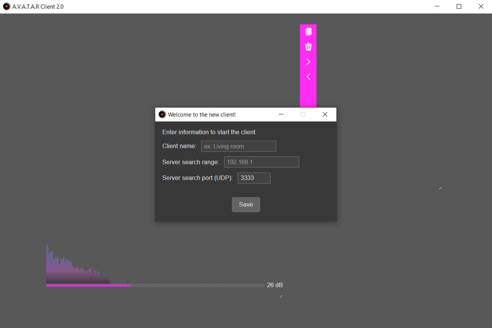
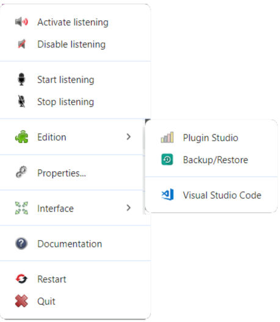
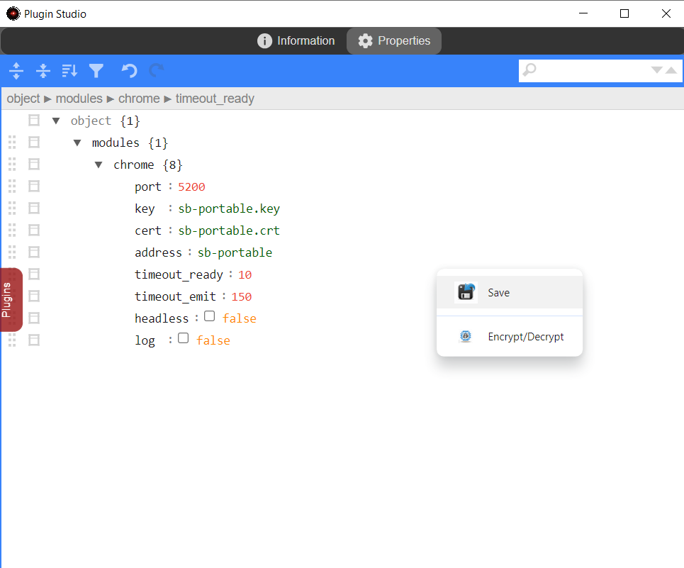

# Installer un client

## Préparation du package
1. Créer un dossier _C:\\packager\\client_ (Windows) ou _/packager/client_ (Linux) qui servira à packager l'application
2. Téléchargez le zip [A.V.A.T.A.R client](https://github.com/Spikharpax/avatarClient) depuis GitHub
    * Utilisez le bouton {width="60"} et `Download zip`
3. Dézippez `avatarClient-master.zip`
4. Copiez le contenu du dossier _avatarClient-master/dist_ dans _packager/client_

## Installation du module packager
1. Ouvrez un terminal et déplacez-vous dans le dossier _/packager/client_
2. Entrez la commande suivante pour installer le packager et tous les modules de l'application:
```
npm install --save-dev @electron/packager
```
3. Après quelques instants, vous devez voir le résultat suivant:
```
added 405 packages, and audited 406 packages in 19s

57 packages are looking for funding
  run `npm fund` for details

found 0 vulnerabilities
```

??? note "A propos des vulnérabilités"
    La mise à jour de l'application est régulière mais il est possible que vous constatiez des vulnérabilités.  
    Si c'est le cas, l'installation n'est pas impactée et peut continuer.  
    Vous pouvez contribuer en laissant une issue sur le GitHub A.V.A.T.A.R afin de mettre à jour l'application

## Exécution du module packager

Afin d'avoir `Electron` à la dernière version pour votre installation, vous devez récupérer la version courante sur le [GitHub Electron](https://github.com/electron/electron) qui sera utilisée pour le packager.

* A droite dans la section **Releases**, en dessous de la section **About** notez la version courante

    {width="220"}

1. Toujours dans le dossier _/packager/client_
2. Exécutez le packager :
    * Pour l'exemple, la version courante est _31.2.1_, modifiez la valeur par la version courante récupérée sur le GitHub Electron

    ```
    npx electron-packager . --electron-version=31.2.1 --icon=./avatar.ico --out=output
    ```
3. Après quelques instants, vous devez voir le résultat suivant (varie selon la plateforme):
    ```
    Packaging app for platform win32 x64 using electron v31.2.1
    Wrote new app to: output\avatarClient-win32-x64
    ```

## Ajouter le fichier de config Chrome pour l'exécutable A.V.A.T.A.R. client
1. Déplacez-vous dans le dossier _output/avatarClient-<platform\>/resources/app_

2. Repérez le fichier _puppeteer.config.cjs_
3. **Copiez** (ne le déplacez pas !) le fichier dans _output/avatarClient-platform-arch_ (au niveau du dossier de l'exécutable)
4. Editez le fichier copié _output/avatarClient-platform-arch/puppeteer.config.cjs_
5. Modifiez la propriété `cacheDirectory` avec le bon dossier d'accès pour le dossier _.cache_ de Chrome

    **NOTE:** `__dirname` est le dossier où se trouve le fichier _puppeteer.config.cjs_. Dans l'exemple ci-dessous, changez le dossier en fonction de votre plateforme si nécessaire (surtout pour MacOS).

    ```js
    const {join} = require('path');

    /**
    * @type {import("puppeteer").Configuration}
    */
    module.exports = {
    // Changes the cache location for Puppeteer.
    cacheDirectory: join(__dirname, 'resources/app/core/chrome/.cache', 'puppeteer'),
    };
    ```

## Installation du module Electron
1. Déplacez-vous dans le dossier _output/avatarClient-<platform\>/resources/app_
2. Entrez la commande suivante pour installer Electron dans le package :
```
npm install electron --save-dev
```
3. Après quelques instants, vous devez voir le résultat suivant :
```
added 137 packages, changed 13 packages, and audited 406 packages in 31s

57 packages are looking for funding
  run `npm fund` for details

found 0 vulnerabilities
```

## Certificat HTTPS

La reconnaissance vocale du client utilise l'interface [Web Speech API](https://developer.mozilla.org/en-US/docs/Web/API/Web_Speech_API/Using_the_Web_Speech_API), accessible par tous les navigateurs. Par conséquent, un client embarque une version de Google Chrome lors de son installation, afin d'assurer une parfaite compatibilité avec la version du client à tout moment.

Pour que la communication entre Google Chrome et le client soit sécurisée, il est nécessaire de créer un certificat HTTPS.  
Suivez d'abord la première étape puis revenez sur cette page pour terminer l'installation du client.

1. [Créer un certificat autosigné](certificate.md)
2. Copiez le certificat (pour moi _sb-portable_) dans le dossier des certificats du client :

    _sb-portable.key_ et _sb-portable.crt_ dans _output/avatarClient-<platform\>/resources/app/core/chrome/certificates_

## FFmpeg

A.V.A.T.A.R client a besoin de ffplay pour jouer les fichiers de sons et musiques.

`Windows` : 

* Téléchargez la dernière version de FFmpeg depuis [FFmpeg](https://www.gyan.dev/ffmpeg/builds/)
    * Choisissez dans la section 'git master builds' la version complète _ffmpeg-git-full.7z_
* Dézippez et copiez FFmpeg dans _output/avatarClient-win32-x64/resources/app/core/lib/ffmpeg/win32_

??? warning "Attention"
    Copiez uniquement les dossiers de l'application et non pas le dossier de 1er niveau du zip !

    Résultat attendu :

    ```
    app/
        core/
            lib/
                ffmpeg/
                    win32/
                        bin/
                        doc/
                        presets/
    ```

`Linux Debian / Ubuntu` :
    ```
    sudo apt-get update
    sudo apt-get install ffmpeg
    ```

`Linux Fedora`:
    ```
    sudo yum update
    sudo yum install ffmpeg
    ```

`MacOS` :

Installez les packages nécessaires avec [Homebrew](https://brew.sh/)
    ```
    brew install ffmpeg
    ```

## Voix

|Système| Voix locales| Voix distantes Google Chrome | Commentaire |
|:-----|:---:|:---:|:---|
|Windows | {width="12"} | {width="12"} | Aucune action requise |
|Linux | {width="12"} | {width="12"} | Voix disponibles par espeak et mbrola. Voir ci-dessous pour l'installation|
|MacOS | {width="12"} | {width="12"}| Aucune action requise. Aucun test effectué sur cette plateforme pour les voix distantes. Faites un test dans la sélection de voix dans les paramètres du client. Si aucune voix apparaît, choisissez les voix locales |

`Linux` :

* `espeak` est un synthétiseur vocal multi-langue, que l’on utilisera uniquement pour la conversion phonétique.  
* `mbrola` est un synthétiseur vocal multi-langue qui offre un meilleur rendu qui peut être couplé à espeak.

1. Téléchargez les packages et voix

    ```
    sudo apt install espeak mbrola
    ```

    Installez ensuite des voix disponibles depuis le site GitHub de [mbrola](https://github.com/numediart/MBROLA-voices?tab=readme-ov-file)

    Les voix sont à copier dans le dossier _/usr/share/mbrola/`nom`/_  
    Par exemple pour la voix `mb-fr4`, le fichier est `fr4` :

    ```
    /usr/
        share/
            mbrola/
                fr4/
                    fr4
    ```

    ??? Tip "A savoir"

        Après le téléchargement d'une voix, faites un test dans un terminal pour vérifier son fonctionnement.  
        Par exemple, pour le Français, seules les voix mb-fr1 (homme) et mb-fr4 (femme) fonctionnent.

        Par exemple, pour faire un test sur la voix mb-fr4 :
        ```
        espeak -v mb-fr4 -q --pho "Je parle correctement" | mbrola -t 1.5 -e -C "n n2" /usr/share/mbrola/fr4/fr4 - /tmp/test.wav
        aplay --file-type wav /tmp/test.wav
        ```

2. Configurez les voix mbrola

    * Créez et éditez le fichier _output/avatarClient-linux-x64/resources/app/core/lib/tts/linux/voices/voices.jon_   
    * Ajoutez chaque voix téléchargées avec le format suivant :

    |paramètre| type | Commentaire |
    |:-----|:---|:---|
    |default|boolean|`true` ou `false`. Si la voix est par défaut ou non|
    |name|string|Le nom affiché dans les paramètres de sélection de la voix |
    |gender|string|`male` ou `female`. Le genre de la voix |
    |language|string|Le code language de la voix |
    |code|string|Le nom  de la voix mbrola|
    |file|string|Le dossier de la voix mbrola|
   
    Exemple de fichier `voices.json` avec 2 voix :

    ```json
    [
        {
            "default": true,
            "name": "French female voice (mbrola)",
            "gender": "female",
            "language": "fr-fr",
            "code": "mb-fr4",
            "file": "/usr/share/mbrola/fr4/fr4"
        },
        {
            "default": false,
            "name": "French male voice (mbrola)",
            "gender": "male",
            "language": "fr-fr",
            "code": "mb-fr1",
            "file": "/usr/share/mbrola/fr1/fr1"
        }
    ]
    ```

    ??? note
        Contrairement aux voix `mbrola` qui nécessitent un fichier de configuration, les voix `espeak` sont automatiquement ajoutées et apparaissent dans les propriétés de sélection de voix du client.


## Déployer le client comme application
Le client est maintenant prêt à etre déployé comme application

### Windows
1. Créez un dossier pour le client (Par exemple _C:\\avatar\\client_)
2. Déplacez le contenu de _output\\avatarClient-win32-x64_ dans le dossier créé
3. Supprimez le dossier _C:\\packager\\client_

### Linux
Vous avez 2 choix possibles:

* Déplacer le contenu de _output\\avatarClient-linux-arch_ dans un dossier et démarrer le client par son exécutable `avatarClient`
* Créer un package `.deb` pour installer A.V.A.T.A.R client comme application

Choisissez ce que vous voulez faire ci-dessous (Entre « Déplacer dans un dossier » ou « Créer un package `.deb` »)

#### Déplacer dans un dossier
1. Créer un dossier pour le client (Par exemple _/avatar/client_)
2. Déplacez le contenu de _output/avatarClient-darwin-arch_ dans le dossier créé
3. Supprimez le dossier _/packager/client_

#### Créer un package `.deb`
1. Installez les packages nécessaires

    `Linux Debian / Ubuntu`:
        ```
        sudo apt-get update
        sudo apt-get install fakeroot dpkg
        ```

    `Linux Fedora`:
        ```
        sudo yum update
        sudo yum install fakeroot dpkg
        ```

2. Installer electron-installer-debian
```
npm install -g electron-installer-debian
```
3. Dans le dossier _/packager/client_, créez le package `.deb`
```
electron-installer-debian --src output/avatarClient-linux-x64/ --dest output/installer/ --arch amd64
```
4. Déplacez-vous dans le dossier _output/installer_ et installez le package (le nom peut varier selon la plateforme)
```
sudo apt install ./avatarClient_4.0.0_amd64.deb
```
5. Ajoutez une icône d'application
    * Editez le fichier _/usr/share/applications/avatarClient.desktop_
    * Modifiez la valeur de la propriété `Icon`

    ```
    Icon=/usr/lib/avatarClient/resources/app/avatar.ico
    ```

### MacOS
Vous avez 2 choix possibles:

* Déplacer le contenu de _output\\avatarClient-darwin-arch_ dans un dossier et démarrer le client par son exécutable `avatarClient`.
* Créer un package `.deb` pour installer le client comme application

Choisissez ce que vous voulez faire ci-dessous (Entre « Déplacer dans un dossier » ou « Créer un package `.deb` »)

#### Déplacer dans un dossier
1. Créer un dossier pour le client (par exemple: _/avatar/client_)
2. Déplacez le contenu de _output/avatarClient-darwin-arch_ dans le dossier créé
3. Supprimez le dossier _/packager/client_

#### Créer un package `.deb`
1. Installez les packages nécessaires avec [Homebrew](https://brew.sh/)
    ```
    brew install fakeroot dpkg
    ```
2. Installez electron-installer-debian
```
npm install -g electron-installer-debian
```
3. Dans le dossier _/packager/client_, créez le package `.deb`
    ```
    electron-installer-debian --src output/avatarClient-darwin-<arch>/Contents/Resources/app --dest output/installer/ --arch <arch>
    ```
4. Déplacez-vous dans le dossier _output/installer_ et installez le package 
    ```
    dpkg -c ./avatarClient_4.0.0_<arch>.deb
    ```
5. Ajoutez une icône d'application

    Si l'icône d'application n'apparait pas, vous pouvez la modifier en utilisant le fichier `avatar.ico` accessible dans les dossiers de l'application. 

6. Chercher le client dans les applications

??? warning "A propos de MacOS"
    Bien que théoriquement possible, l'installation d'un package `.deb` avec [electron-installer-debian](https://github.com/electron-userland/electron-installer-debian) pour MacOS n'a pas été testée.  
    Si vous rencontrez des problèmes, vous pouvez consulter les [issues](https://github.com/electron-userland/electron-installer-debian/issues) reportées par les utilisateurs.  

    Vous pouvez aussi utiliser [electron-deboa-maker](https://github.com/erikian/electron-deboa-maker) à la place de `electron-installer-debian`.

## Démarrer le client

1. Démarrez A.V.A.T.A.R. server
2. Démarrez le client

    {width="520"}

3. Entrez les informations nécessaires au démarrage du client:
    * Le nom du client
    * La plage de recherche UDP du serveur
        * Vous pouvez entrer une plage de recherche sous la forme :
            * XXX.XXX.XXX.XXX-XXX
            * Par exemple, pour _192.168.1.100-110_, le client cherchera le serveur dans l'adressage 192.168.1.100 à 110
        * Vous pouvez entrez aussi directement l'adresse du serveur
            * Par exemple 192.168.1.100
    * Le port de recherche UDP
        * Par défaut: 3333
        * Ce numéro de port doit être identique avec celui défini dans les propriétés du serveur
        * Si vous ne l'avez pas modifié sur le serveur, laissez le port par défaut
4. Le client redémarre

## Ajouter le certificat hôte

1. La fenêtre du client affiche un message d'avertissement vous signifiant que la configuration HTTPS n'est pas faite

    {width="520"}

2. Faites un clic gauche sur le nom du client et ouvrez son menu contextuel 
3. Cliquez sur `Edition` -> `Plugin Studio`

    {width="280"}

4. Dans `Plugin Studio`, cliquez sur l'onglet `Plugins` puis cliquez sur le plugin `Chrome`
5. Cliquez sur l'onglet `Properties`
    * Ajoutez le nom du fichier (pour moi _sb-portable.key_) dans la propriété `key`
    * Ajoutez le nom du fichier (pour moi _sb-portable.crt_) dans la propriété `cert`
    * Ajoutez le nom du serveur dans la propriété `address`
    * Décochez la propriété `headless` pour afficher Chrome au prochain démarrage et vérifier si le certificat est valide
6. Faites un clic droit et cliquez sur `Save` pour sauvegarder les propriétés Chrome

    {width="450"}

7. Fermez la fenêtre (par la croix)
8. Redémarrez A.V.A.T.A.R client 
9. Après le redémarrage du client, Chrome apparaît
10. Vérifiez si le certificat HTTPS est valide dans la fenêtre Chrome

    {width="450"}

11. Ouvrez de nouveau `Plugin Studio` et modifiez la propriété `headless` à _true_ pour cacher Chrome au prochain démarrage

    {width="200"}

/// warning | Attention
Les propriétés de Chrome sont définies dans un plugin `chrome` pour pouvoir les modifier aisément depuis `Plugin Studio`.

Ne supprimez jamais ce plugin sinon le client ne fonctionnera plus !
///

<br><br>
[:material-skip-previous: Introduction](introduction.md){ .md-button style="float:left;"}
<br><br>
