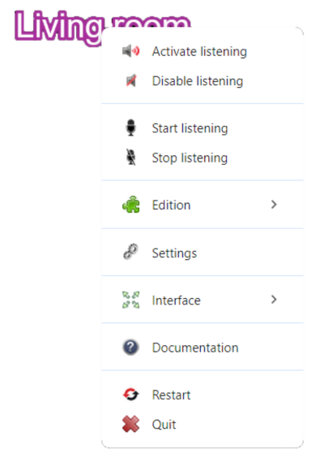
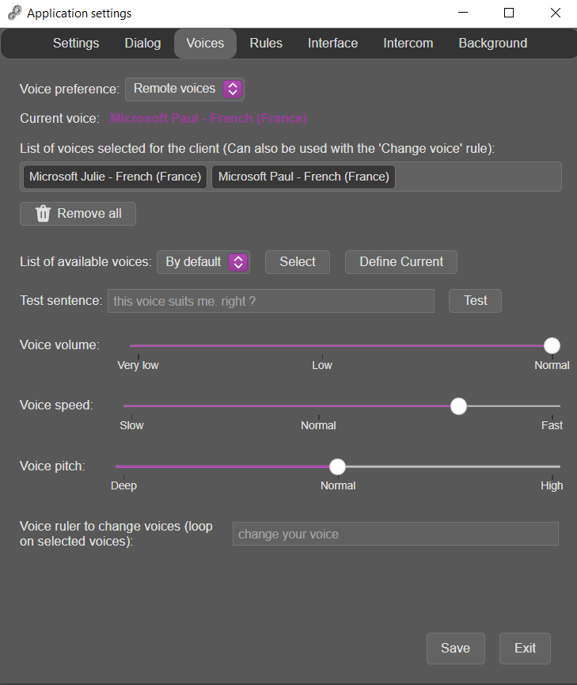

# Paramètres d'un client

Les paramètres du client sont accessibles via son nom dans l'interface de l'application.

{width="250"}

1. Faites un clic gauche sur le nom du client pour afficher son menu contextuel

    /// note
    Le clic gauche est délibéré pour la compatibilité avec les tablettes graphiques sans clavier 
    ///

2. Cliquez sur _Settings_

**NOTE:** La description de tous les paramètres ci-dessous est faite dans l'ordre d'affichage dans les fenêtres    

## L'onglet Settings

{width="400"}

### `Show all informations in the console`
Choisissez si vous voulez que toutes les informations s'affichent dans la console.  
Cela peut être très utile si vous voulez savoir si un plugin se charge correctement au démarrage.

### `Application language`
Defini le langage utilisé pour toutes les interfaces graphiques et les messages de l'application dans la console.

???+ info
    Le langage utilisé pour les règles vocales est défini dans l'onglet `Dialog`

2 langages sont proposés avec l'application :

* L'Anglais
* Le Français
* \+ By default
    * La langue courante du système

    ???+ warning
        Définir `By default` suppose que le fichier de localisation pour la langue courante existe 

Vous pouvez traduire un fichier de localisation dans la langue qui vous plait et l'ajouter dans les langues de l'application : 

1. Copiez un des fichiers de localisation dans _app/locales/_ en le nommant par le code du pays (2 lettres)
2. Modifiez toutes les valeurs des clés

    ??? warning
        Les caractères $$ sont remplacés par des valeurs dynamiques lors de l'affichage du message.  
        Ils ne doivent pas être supprimés. 

3. Ajoutez une entrée dans le fichier _app/locales/BCP47-app.loc_ pour faire apparaître le nouveau langage dans les propriétés et l'utiliser

    * Par exemple, supposons un nouveau fichier de localisation _pt.loc_
    * La nouvelle entrée dans le fichier sera :

    ```json
    {
        "1": {
            "tag": "en",
            "region": "English (US English)"
        },
        "2": {
            "tag": "fr",
            "region": "French (especially in France)"
        },
        "3": {
            "tag": "pt",
            "region": "Portuguese (Portugal)"
        }
    }
    ```

### `Client name`
Le nom du client A.V.A.T.A.R

### `Server search range`

La plage de recherche UDP du serveur.  
Vous pouvez entrer une plage de recherche sous la forme :

* XXX.XXX.XXX.XXX-XXX
* Par exemple: pour _192.168.2.100-110_, le client cherchera le serveur dans l'adressage 192.168.2.100 à 110

Vous pouvez entrez aussi directement l'adresse du serveur
* Par exemple 192.168.2.100

### `Server communication port (HTTP)`
Le port de communication avec le serveur A.V.A.T.A.R.  

??? warning
    Ce numéro de port HTTP doit être identique sur le serveur et sur chaque client 

### `Server search port (UDP)`
Le port de recherche UDP du serveur

??? warning
    Ce numéro de port UDP doit être identique sur le serveur et sur chaque client 

### `Delay between server searches`
Délais en secondes entre chaque scan du réseau pour trouver le serveur dans la plage de recherche indiquée

??? Tip
    Si le serveur ne peut pas être trouvé, par exemple si une mauvaise plage d'adresse a été définie, vous devrez modifier manuellement la propriété:

    1. Ouvrez le fichier _app/core/Avatar.prop_ dans un éditeur de texte
    2. Cherchez la propriété `target` et modifiez sa valeur
    3. Sauvegardez le fichier et redémarrez le client


### `Client communication port (HTTP)`
Le port de communication avec le serveur A.V.A.T.A.R..  

### `Client communication route`

Le port utilisé pour un accès aux plugins du client par requêtes HTTP (voir [HTTP request](APIClient.md#http-request) dans l'[API](APIClient.md) pour plus de détails).


### `Number of automatic client restarts per 24h`

* Valeur par défaut: 0 (aucun redémarrage)

Pour rafraichir le serveur en le redémarrant régulièrement, vous pouvez entrer une valeur comprise entre 1 et 24. 

??? Tip "A savoir"
    Afin de ne pas interférer avec des programmes automatiques qui pourraient être lancés à heures fixes, 7 minutes sont ajoutées aux heures choisies.


### Economiseur d'écran

Permet d'activer un économiseur d'écran qaprès le chargement complet du client.  
Utile, par exemple, si vous utilisez A.V.A.T.A.R en mode tablette pour éteindre automatiquement l'écran.

`Windows` : Ecran noir par défaut. Aucun fichier économiseur d'écran n'est requis.

* Si vous voulez utiliser un économiseur d'écran spécifique:
    * Renommez le fichier _app/lib/screensaver/win32/screensaver.bat_ en _app/lib/screensaver/win32/noscreensaver.bat_. L'application utilisera alors automatiquement le fichier _app/lib/screensaver/win32/screensaver.vbs_
    * Sélectionnez ensuite un économiseur d'écran qui sera passé en paramètre
        * Sélectionnez _C:\\Windows\\System32\\scrnsave.scr_ pour avoir un écran noir

`Linux` - `macOS` : Ecran noir par défaut. Aucun fichier économiseur d'écran n'est requis.

* Si vous voulez utiliser un économiseur d'écran spécifique, modifiez le fichier _app/lib/screensaver/<platform\>/screensaver.sh_. 
* Sélectionnez ensuite un économiseur d'écran qui sera passé en paramètre

### Mises à jour

Choisissez si vous voulez que l'application recherche une mise à jour au démarrage
Si oui, et si une nouvelle version de l'application est disponible, le message clignotant "Nouvelle version disponible" s'affichera dans l'interface.

## L'onglet Dialog

{width="450"}

Dans cet onglet, vous pouvez définir les propriétés des règles vocales

### `Dialog language`

Sélectionnez la langue utilisée pour les règles vocales.

??? Info
    Les langues affichées sont définies dans le fichier _app/locales/BCP47-dialog.loc_

### `Voice regognition module`

Ce paramètre défini le répertoire où se situe le module de reconnaissance vocale utilisé.

    app /
        core /
            chrome /

La reconnaissance vocale qui a été développé utilise l'interface [Web Speech API](https://developer.mozilla.org/en-US/docs/Web/API/Web_Speech_API/Using_the_Web_Speech_API) accessible par les navigateurs. Par conséquent, une version de Google Chrome est installée pendant l'installation d'un client A.V.A.T.A.R. 

???+ info
    Il est tout à fait possible de développer un autre module de reconnaissance vocale basé sur une autre application.  
    Pour plus de détails, laissez un message sur le github de l'application.

### `Trigger keywords`

La liste des mots-clés qui déclenchent l'écoute.

### `Word separators`

Plusieurs actions peuvent être définies dans la même phrase.  
Lorsque A.V.A.T.A.R trouvera un de ces sépérateurs dans une phrase, il découpera la phrase par autant d'actions et les exécutera les unes après les autres.

Par exemple:

Séparateur| Phrase  | Action |
|:-----|:---|:----------|
|et<br>puis|stop la musique<br><br><br>stop la musique et allume la télé <br><br><br>stop la musique et allume la télé puis met la 1ère chaine|1. stop la musique<br><br><br>1. stop la musique<br>2. allume la télé<br><br>1. stop la musique<br>2. allume la télé<br>3. met la 1ère chaine |

### `Restart listening`
La liste des phrases qui peuvent être dites lorsqu'un problème a bloqué l'écoute afin de la redémarrer.

### `Dialogue redirection`
Il est possible d'utiliser un plugin pour rediriger les dialogues vers des enceintes différentes que celles des PC clients.

Par exemple, vers des enceintes [Sonos](https://www.sonos.com/) pour lesquelles il existe un plugin [SonosPlayer](https://github.com/Spikharpax/Avatar-Plugin-SonosPlayer).  

Si le dialogue est redirigé, la selection de la voix se fait dans le plugin de redirection. La voix courante ainsi que la liste des voix ne sont plus utilisés.

Dans cet exemple, le paramètre sera:

{width="400"}

???+ info
    Ce paramètre est lié à chaque client.  
    Un client peut avoir ses dialogues redirigés vers une enceinte dédiée et un autre client utiliser l'enceinte de son PC.


### `Loop mode`

Choisissez si vous désirez que le dialogue boucle après chaque dialogue.  

Prenons l'exemple suivant:  
<span style="color:green;">Vous:</span> Jarvis (_mot clé déclencheur_)  
<span style="color:orange;">A.V.A.T.A.R:</span> Je t'écoute  
<span style="color:green;">Vous:</span> stop la musique  
<span style="color:orange;">A.V.A.T.A.R:</span> C'est fait  
<span style="color:orange;">A.V.A.T.A.R:</span> Tu veux autre chose ? (_réponse de boucle mode loop_)  
<span style="color:green;">Vous:</span> allume la télé     
<span style="color:orange;">A.V.A.T.A.R:</span> C'est fait  
<span style="color:orange;">A.V.A.T.A.R:</span> autre chose ? (_réponse de boucle mode loop_)  
etc...  
etc...  
<span style="color:orange;">A.V.A.T.A.R:</span> Tu veux autre chose ? (_réponse de boucle mode loop_)  
<span style="color:green;">Vous:</span> c'est bon merci  (_termine le mode loop_)  
<span style="color:orange;">A.V.A.T.A.R:</span> A ton service (_réponse de fin du dialogue en mode loop_)  

??? Info
    Le mode loop est effectif uniquement par l'ouverture d'un dialogue par le mot-clé déclencheur seul sans règle.  
    Le mode loop est compatible avec [word separators](client-properties.md#word-separators).
    
    Les phrases clés sont définies dans l'onglet [Rules](client-properties.md#longlet-rules).

### `Automatic dialog stop`

Entrez une valeur en secondes pour que le dialogue s'interrompt automatiquement si aucune phrase n'est prononcée lorsque l'écoute est déclenchée.


### `Time before and after each speak`

Entrez une valeur en secondes pour laisser un délais avant et après une réponse d'A.V.A.T.A.R, par exemple si vous trouvez un problème de synchronisation.


## L'onglet Voices

{width="350"}

### `Voice preference`

=== "Local voices"
    
    Affiche les voix systèmes dans la liste [available voices](client-properties.md#available-voices).
    
    /// note | A propos de Linux
    Aucune voix système n'est disponible pour Linux.  
    La sélection des voix locales affichera les voix `espeak` et `mbrola`.

=== "Remote voices"

    Affiche les voix [Web Speech API](https://developer.mozilla.org/en-US/docs/Web/API/Web_Speech_API/Using_the_Web_Speech_API) de Google Chrome dans la liste des [available-voices](client-properties.md#available-voices).

    | Platforme| Disponible  | Commentaire |
    |:-----|:---:|:----------|
    |Windows|{width="12"}|Voix homme et femme disponibles|
    |Linux|{width="12"}|Aucune voix disponible|
    |MacOS|{width="12"}|Aucune voix disponible|

 
### `Current voice`

La voix courante utilisée pour les dialogues


### `Selected voices`

Les voix sélectionnées pour le client et utilisées par la règle [change voice](client-properties.md#change-voice).  


### `Available voices`

Affiche les voix systèmes ou les voix distantes suivant la préférence de voix séléctionée.

* `Bouton Sélectionner` : 
    * Ajoute la voix dans la liste des voix sélectionnées
* `Bouton Define current` : 
    * Ajoute la voix dans la liste des voix sélectionnées et la définie comme courante


### `Test sentence`

Entrez une phrase pour tester la voix puis cliquez sur le bouton `Tester`


### `Paramètres de voix`  

* `Voice volume` 
* `Voice speed` 
* `Voice pitch` : 
    * Le timbre de la voix
    * **NOTE:** Uniquement pour les voix distantes


### `Change voice`

Entrez une règle qui sera utilisée pour changer de voix.  
Les voix de la liste des [available voices](client-properties.md#available-voices) seront sélectionnées les unes après les autres à chaque changement de voix.


## L'onglet Rules

{width="350"}

L'onglet `Rules` est divisé en 2 parties:

* La 1ère section en haut, les phrases que vous pouvez prononcer :
    * Pour terminer le [loop mode](client-properties.md#loop-mode)
    * Pour mettre fin au dialogue si celui-ci se déclenche sans invite (par exemple un faux positif)
* La 2ème section en bas, ce que le client vous répond :
    * Lorsque le dialogue est déclenché par le mot-clé
    * Lorsque le dialogue boucle en [loop mode](client-properties.md#loop-mode)
    * Lorsque le client ne comprend pas votre réponse pendant un askme (jeu de question/réponse)
    * Quand vous terminez le dialogue en [loop mode](client-properties.md#loop-mode)
    * Quand vous mettez fin au dialogue sans invite (par exemple un faux positif)

## L'onglet Interface

{width="350"}

Les propriétés de gestion de l'interface client sont regroupées par type: 

* Les propriétés du nom du client
* Les propriétés de la console
* Les propriétés du visualizer


## L'onglet Intercom

{width="350"}

### `List of rules`
Dans l'ordre, les 4 listes de règles regroupent les phrases qui peuvent être dites pour déclencher l'intercom:

* Les règles pour l'intercom avec un client
* Les règles pour l'intercom avec tous les clients
* La phrase que le client prononce pour signifier que l'enregistrement démarre
* La phrase que le client prononce pour signifier que le message est envoyé au(x) client(s)

### `Silence time`

Le délais de silence en secondes pour que l'enregistrement s'arrête et que le client envoie le message au(x) client(s)

### `Silence level to start recording`
Plus le niveau est faible, plus le bruit est élevé.

### `Silence level to stop recording`

Plus le niveau est faible, plus le bruit est élevé.

### `Recording driver` 

`waveaudio` est normalement le driver utilisé pour générer le fichier `.wav`.  
Si vous le désirez, vous pouvez modifier ce driver pour un autre type d'enregistrement.

### `Recording device`

`default` est normalement le device utilisé pour l'enregistrement.  
Si vous le désirez, vous pouvez modifier ce device.

### `Debug mode` 

Si vous constatez un problème, vous pouvez afficher plus d'information dans la console du client.
    

## L'onglet Background

{width="350"}

Choisissez un fond d'écran au format `jpg` pour l'interface graphique du client

Par défaut, A.V.A.T.A.R vous propose quelques fonds d'écrans dans le répertoire _app/assets/images/background_

/// note
Vous pouvez choisir un fond d'écran dans n'importe quel répertoire.  
A la sauvegarde, il sera copié dans le répertoire _app/assets/images/background_
///

<br><br>
[:material-skip-previous: Server settings](server-properties.md){ .md-button style="float:left;"} 
<br><br>