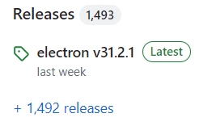
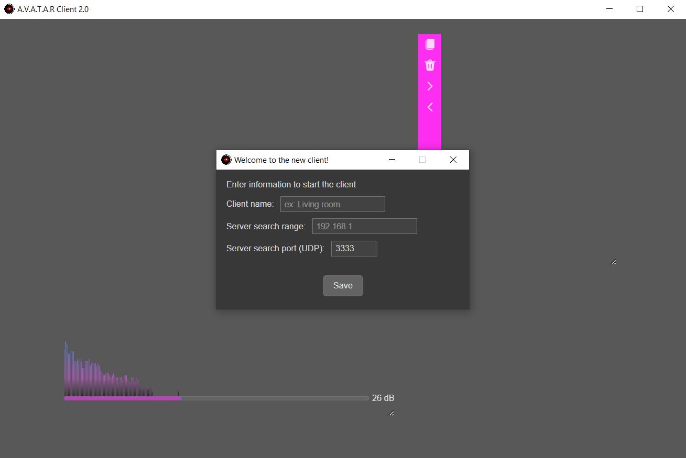
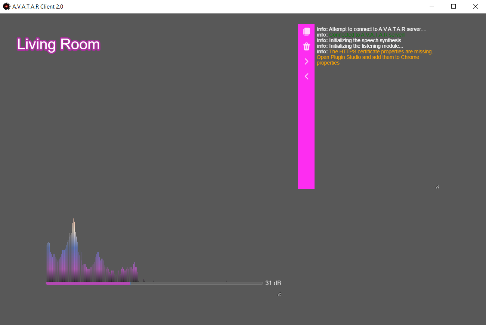
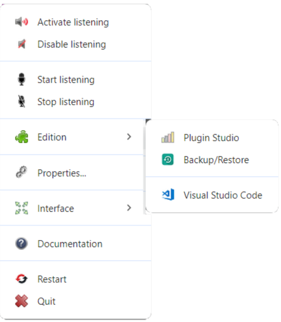
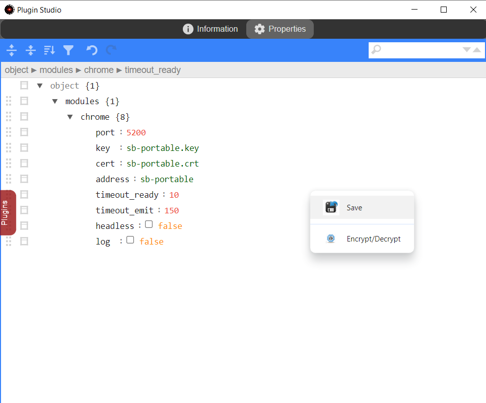
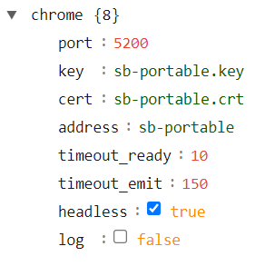

# Client installation

## Preparing the package
1. Create a _C:\\packager\client_ (Windows) or _/packager/client_ (Linux) folder which will be used to package the application
2. Download the [A.V.A.T.A.R client](https://github.com/Spikharpax/avatarClient) zip file from GitHub
    * Use the {width="60"} button and `Download zip`
3. Unzip `avatarClient-master.zip`
4. Copy the contents of the _avatarClient-master/dist_ folder to _/packager/client_

## Installing the packager module
1. Open a terminal and move to the _/packager/client_ folder
2. Enter the following command to install the packager and all application modules:
```
npm install --save-dev @electron/packager
```
3. After a few moments, you should see the following result:
```
added 405 packages, and audited 406 packages in 19s

57 packages are looking for funding
  run `npm fund` for details

found 0 vulnerabilities
```

???+ note "About vulnerabilities"
    The application is updated regularly, but it is possible that you may discover vulnerabilities.  
    If this is the case, installation is unaffected and can continue.  
    You can also contribute by leaving an issue on the A.V.A.T.A.R. GitHub to update the application.

## Running the packager module

In order to have the latest version of `Electron` for your installation, you need to retrieve the current version from [GitHub Electron](https://github.com/electron/electron) which will be used to package it.

* On the right in the **Releases** section, below the **About** section, note the current version

    {width="220"}

1. Still in the _packager/client_ folder
2. Run the packager :
    * For the example, the current version is _31.2.1_, change the value to the current version retrieved from GitHub Electron

    ```
    npx electron-packager . --electron-version=31.2.1 --icon=./avatar.ico --out=output
    ```
3. After a few moments, you should see the following result (varies by platform):
    ```
    Packaging app for platform win32 x64 using electron v31.2.1
    Wrote new app to: output\avatarClient-win32-x64
    ```

## Add Chrome config file for A.V.A.T.A.R. client executable
1. Move to the _output/avatarClient-<platform\>/resources/app_ folder
2. Locate the _puppeteer.config.cjs_ file
3. **Copy** (do not move!) the file to _output/avatarClient-platform-arch_ (in the executable folder)
4. Edit the copied file _output/avatarClient-platform-arch/puppeteer.config.cjs_.
5. Change the `cacheDirectory` property to the correct access folder for Chrome's _.cache_ folder

    **NOTE:** `__dirname` is the folder where the _puppeteer.config.cjs_ file is. In the example below, change the folder regarding your platform if needed (Especially for MacOS).

    ```js
    const {join} = require('path');

    /**
    * @type {import("puppeteer").Configuration}
    */
    module.exports = {
    // Changes the cache location for Puppeteer.
    cacheDirectory: join(__dirname, 'resources/app/core/chrome/.cache', 'puppeteer'),
    };
    ```

## Electron module installation
1. Move to the _output/avatarClient-<platform\>/resources/app_ folder
2. Enter the following command to install Electron in the package:
```
npm install electron --save-dev
```
3. After a few moments, you should see the following result:
```
added 137 packages, changed 13 packages, and audited 406 packages in 31s

57 packages are looking for funding
  run `npm fund` for details

found 0 vulnerabilities
```

## HTTPS certificate

The client's speech recognition uses the [Web Speech API](https://developer.mozilla.org/en-US/docs/Web/API/Web_Speech_API/Using_the_Web_Speech_API) interface, which can be accessed by all browsers. As a result, a client embades a version of Google Chrome when it is installed to ensure perfect compatibility with the client's version at all times.

To ensure secure communication between Google Chrome and the client, you need to create an HTTPS certificate.  
Follow the first step first, then return to this page to complete the client installation.

1. [Create a self-signed certificate](certificate.md)
2. Copy the certificate (in my case _sb-portable_) to the client's certificate folder:
    
    _sb-portable.key_ and _sb-portable.crt_ files to _output/avatarClient-<platform\>/resources/app/core/chrome/certificates_
    

## FFmpeg

A client needs ffplay to play sound and music files.

`Windows` : 

* Download the latest version of FFmpeg from [FFmpeg](https://www.gyan.dev/ffmpeg/builds/)
    * In the 'git master builds' section, select the full version _ffmpeg-git-full.7z_.
* Unzip and copy FFmpeg to _output/avatarClient-win32-x64/resources/app/core/lib/ffmpeg/win32_

???+ warning
    Copy only the application folders, not the 1st level zip folder!

    Expected result:

    ```
    app/
        core/
            lib/
                ffmpeg/
                    win32/
                        bin/
                        doc/
                        presets/
    ```

`Linux Debian / Ubuntu` :
    ```
    sudo apt-get update
    sudo apt-get install ffmpeg
    ```

`Linux Fedora`:
    ```
    sudo yum update
    sudo yum install ffmpeg
    ```

`MacOS` :

Install the required packages with [Homebrew](https://brew.sh/)
    ```
    brew install ffmpeg
    ```

## Voices

|Platform| Local voices| Google Chrome remote voices | Comment |
|:-----|:---:|:---:|:---|
|Windows | {width="12"} | {width="12"} | No action required |
|Linux | {width="12"} | {width="12"} | Voices available through espeak and mbrola. See below for installation|
|MacOS | {width="12"} | {width="12"}| No action required. No test performed on this platform for remote voices. Test voice selection in client settings. If no voices appear, select local voices |

`Linux` :

* `espeak` is a multi-language speech synthesizer, which we'll use only for phonetic conversion.  
* `mbrola` is a multi-language voice synthesizer that offers improved rendering and can be coupled with espeak.

1. Download packages and voices

    ```
    sudo apt install espeak mbrola
    ```

    Then install the voices available from the [mbrola] GitHub site (https://github.com/numediart/MBROLA-voices?tab=readme-ov-file).

    Copy the voices to the _/usr/share/mbrola/`name`/_ folder  
    For example, for the `mb-fr4` voice, the file is `fr4`:

    ```
    /usr/
        share/
            mbrola/
                fr4/
                    fr4
    ```

    ???+ Tip

        After downloading a voice, run a test in a terminal to check that it works.  
        For example, for French, only the mb-fr1 (male) and mb-fr4 (female) voices work.

        For example, to test the mb-fr4 voice:
        ```
        espeak -v mb-fr4 -q --pho "Je parle correctement" | mbrola -t 1.5 -e -C "n n2" /usr/share/mbrola/fr4/fr4 - /tmp/test.wav
        aplay --file-type wav /tmp/test.wav
        ```

2. Configure mbrola voices

    * Create and edit the _output/avatarClient-linux-x64/resources/app/core/lib/tts/linux/voices/voices.jon_ file 
    * Add each downloaded voice in the following format:

    |parameter| type | Comment |
    |:-----|:---|:---|
    |default|boolean|`true` ou `false`. Whether the voice is default or not|
    |name|string|The name displayed in the voice selection parameters |
    |gender|string|`male` ou `female`. Voice genre |
    |language|string|The language code of voice |
    |code|string|The name of the mbrola voice|
    |file|string|The mbrola voice file|
   
    Example of a `voices.json` file with 2 voices :

    ```json
    [
        {
            "default": true,
            "name": "French female voice (mbrola)",
            "gender": "female",
            "language": "fr-fr",
            "code": "mb-fr4",
            "file": "/usr/share/mbrola/fr4/fr4"
        },
        {
            "default": false,
            "name": "French male voice (mbrola)",
            "gender": "male",
            "language": "fr-fr",
            "code": "mb-fr1",
            "file": "/usr/share/mbrola/fr1/fr1"
        }
    ]
    ```

    ???+ note
        Unlike `mbrola` voices, which require a configuration file, `espeak` voices are automatically added and appear in the client's voice selection properties.


## Deploy the client as an application
The client is now ready to be moved into its application directory

### Windows
1. Create a folder for the client (e.g. _C:\avatar\\client_)
2. Move the contents of _output\avatarClient-win32-x64_ to the created folder
3. Delete the _C:\\packager\client_ folder

### Linux
You have 2 possible choices:

* Move the contents of _output\avatarClient-linux-arch_ to a folder and start the server with its `avatarClient` executable
* Create a `.deb` package to install the client as an application

Choose what you want to do below (between « Move to folder » or « Create a `.deb` package »)

#### Move to folder
1. Create a folder for the client (e.g. _/avatar/client_)
2. Move the contents of _output/avatarClient-darwin-arch_ to the created folder
3. Delete the _/packager/client_ folder

#### Create a `.deb` package
1. Install the required packages

    `Linux Debian / Ubuntu`:
        ```
        sudo apt-get update
        sudo apt-get install fakeroot dpkg
        ```

    `Linux Fedora`:
        ```
        sudo yum update
        sudo yum install fakeroot dpkg
        ```

2. Install electron-installer-debian
```
npm install -g electron-installer-debian
```
3. In the _/packager/client_ folder, create the `.deb` package
```
electron-installer-debian --src output/avatarClient-linux-x64/ --dest output/installer/ --arch amd64
```
4. Move to the _output/installer_ folder and install the package (the name may vary depending on the platform)
```
sudo apt install ./avatarClient_4.0.0_amd64.deb
```
5. Add an application icon
    * Edit the _/usr/share/applications/avatarClient.desktop_ file
    * Change the value of the `Icon` property

    ```
    Icon=/usr/lib/avatarClient/resources/app/avatar.ico
    ```

### MacOS
You have 2 possible choices:

* Move the contents of _output\avatarClient-darwin-arch_ to a folder and start the server with its `avatarClient` executable
* Create a `.deb` package to install the client as an application

Choose what you want to do below (between “Move to a folder” or “Create a .deb package”)

#### Move to folder
1. Create a folder for the client (e.g. _/avatar/client_)
2. Move the contents of _output/avatarClient-darwin-arch_ to the created folder
3. Delete the _/packager/client_ folder

#### Create a `.deb` package
1. Install the required packages with [Homebrew](https://brew.sh/)
    ```
    brew install fakeroot dpkg
    ```
2. Install electron-installer-debian
```
npm install -g electron-installer-debian
```
3. In the _packager/client_ folder, create the `.deb` package
    ```
    electron-installer-debian --src output/avatarClient-darwin-<arch>/Contents/Resources/app --dest output/installer/ --arch <arch>
    ```
4. Move to the _output/installer_ folder and install the package
    ```
    dpkg -c ./avatarClient_4.0.0_<arch>.deb
    ```
5. Add an application icon

    If the application icon does not appear, you can modify it using the `avatar.ico` file accessible in the application directories.  

6. Search for the client in applications

??? warning "About MacOS"
    Although theoretically possible, installation of a `.deb` package with [electron-installer-debian](https://github.com/electron-userland/electron-installer-debian) for macOS has not been tested.  
    If you encounter any problems, please consult the [issues](https://github.com/electron-userland/electron-installer-debian/issues) reported by users.  

    You can also use [electron-deboa-maker](https://github.com/erikian/electron-deboa-maker) instead of `electron-installer-debian`.

## Start the client

1. Start A.V.A.T.A.R server
2. Start the client

    {width="520"}

3. Enter the information required to start the client:
    * Client name
    * The server's UDP search range
        * You can enter a search range in the format :
            * XXX.XXX.XXX.XXX-XXX
            * For example, for _192.168.1.100-110_, the client will look for the server in address 192.168.1.100 to 110
        * You can also enter the server address directly
            * For example, 192.168.1.100
    * The UDP search port
        * By default: 3333
        * This port number must be identical to the one defined in the server properties  
        * If you haven't changed it on the server, leave the default port
4. The client restarts

## Add the host certificate

1. The client window displays a warning message telling you that HTTPS has not been configured

    {width="520"}

2. Left-click on the client's name to open its context menu 
3. Click on `Edit` -> `Plugin Studio`

    {width="280"}

4. In `Plugin Studio`, click on the `Plugins` tab, then click on the `Chrome` plugin
5. Click on the `Properties` tabs_
    * Add the file name (in my case: _sb-portable.key_) to the `key` property
    * Add the file name (in my case: _sb-portable.crt_) to the `cert` property
    * Add the server name to the `address` property
    * Uncheck the `headless` property to display Chrome on next startup and check if the certificate is valid
6. Right-click and click `Save` to save Chrome properties

    {width="450"}

7. Close the window (using the cross)
8. Restart the client 
9. After restarting the client, Chrome appears
10. Check that the HTTPS certificate is valid in the Chrome window

    {width="450"}

11. Open `Plugin Studio` again and change the `headless` property to _true_ to hide Chrome the next time it is started

    {width="200"}

/// warning
Chrome properties are defined in a `chrome` plugin so that they can be easily modified from within `Plugin Studio`.

Never delete this plugin, or the client will stop working!
///

<br><br>
[:material-skip-previous: Introduction](introduction.md){ .md-button style="float:left;"}
<br><br>
