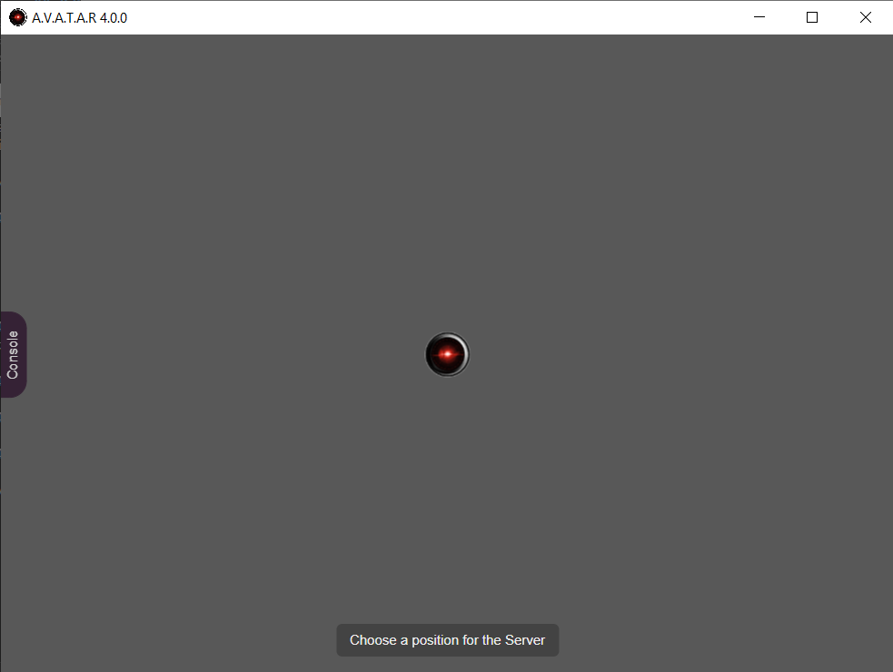

# Server installation

## Preparing the package
1. Create a _C:\\packager\server_ (Windows) or _/packager/server_ (Linux) folder which will be used to package the application
2. Download the [A.V.A.T.A.R](https://github.com/Spikharpax/A.V.A.T.A.R) zip file from GitHub
    * Use the {width="60"} button and `Download zip`
3. Unzip `A.V.A.T.A.R-master.zip`
4. Copy the contents of the _A.V.A.T.A.R-master/dist_ folder to _/packager/server_

## Installing the packager module
1. Open a terminal and move to the _/packager/server_ folder
2. Enter the following command to install the packager and all application modules:
```
npm install --save-dev @electron/packager
```
3. After a few moments, you should see the following result:
```
added 339 packages, and audited 340 packages in 15s

55 packages are looking for funding
  run `npm fund` for details

found 0 vulnerabilities
```

???+ note "About vulnerabilities"
    The application is updated regularly, but it is possible that you may discover vulnerabilities.  
    If this is the case, installation is unaffected and can continue.  
    You can also contribute by leaving an issue on the A.V.A.T.A.R. GitHub to update the application.

## Running the packager module

In order to have the latest version of `Electron` for your installation, you need to retrieve the current version from [GitHub Electron](https://github.com/electron/electron) which will be used to package it.

* On the right in the **Releases** section, below the **About** section, note the current version

    {width="220"}

1. Still in the _packager/server_ folder
2. Run the packager :
    * For the example, the current version is _31.2.1_, change the value to the current version retrieved from GitHub Electron

    ```
    npx electron-packager . --electron-version=31.2.1 --icon=./avatar.ico --out=output
    ```
3. After a few moments, you should see the following result (varies by platform):
    ```
    Packaging app for platform win32 x64 using electron v31.2.1
    Wrote new app to: output\avatar-win32-x64
    ```

## Electron module installation
1. Move to the _output/avatar-<platform\>/resources/app_ folder
2. Enter the following command to install Electron in the package:
```
npm install electron --save-dev
```
3. After a few moments, you should see the following result:
```
added 144 packages, changed 4 packages, and audited 346 packages in 13s

55 packages are looking for funding
  run `npm fund` for details

found 0 vulnerabilities
```

## Deploy A.V.A.T.A.R. as an application
A.V.A.T.A.R. is now ready to be moved into its application folder

### Windows
1. Create a folder for A.V.A.T.A.R. (e.g. _C:\avatar\\server_).
2. Move the contents of _output\avatar-win32-x64_ to the created folder
3. Delete the _C:\\packager\server_ folder

### Linux
You have 2 possible choices:

* Move the contents of _output\avatar-linux-arch_ to a folder and start the server with its `avatar` executable
* Create a `.deb` package to install A.V.A.T.A.R. as an application

Choose what you want to do below (between « Move to folder » or « Create a `.deb` package »)

#### Move to folder
1. Create a folder for A.V.A.T.A.R (e.g. _/avatar/server_)
2. Move the contents of _output/avatar-darwin-arch_ to the new folder
3. Delete the _/packager/server_ folder

#### Create a `.deb` package
1. Install the required packages

    `Linux Debian / Ubuntu`:
        ```
        sudo apt-get update
        sudo apt-get install fakeroot dpkg
        ```

    `Linux Fedora`:
        ```
        sudo yum update
        sudo yum install fakeroot dpkg
        ```

2. Install electron-installer-debian
```
npm install -g electron-installer-debian
```
3. In the _/packager/server_ folder, create the `.deb` package
```
electron-installer-debian --src output/avatar-linux-x64/ --dest output/installer/ --arch amd64
```
4. Move to the _output/installer_ folder and install the package (the name may vary depending on the platform)
```
sudo apt install ./avatar_4.0.0_amd64.deb
```
5. Add an application icon
    * Edit the _/usr/share/applications/avatar.desktop_ file
    * Change the value of the `Icon` property

    ```
    Icon=/usr/lib/avatar/resources/app/avatar.ico
    ```

### MacOS
You have 2 possible choices:

* Move the contents of _output\avatar-darwin-arch_ to a folder and start the server with its `avatar` executable.
* Create a `.deb` package to install A.V.A.T.A.R as an application

Choose what you want to do below (between “Move to a folder” or “Create a .deb package”)

#### Move to folder
1. Create a folder for A.V.A.T.A.R. (e.g. _/avatar/server_)
2. Move the contents of _output/avatar-darwin-arch_ to the created folder
3. Delete the _/packager/server_ folder

#### Create a `.deb` package
1. Install the required packages with [Homebrew](https://brew.sh/)
    ```
    brew install fakeroot dpkg
    ```
2. Install electron-installer-debian
```
npm install -g electron-installer-debian
```
3. In the _packager/server_ folder, create the `.deb` package
    ```
    electron-installer-debian --src output/avatar-darwin-<arch>/Contents/Resources/app --dest output/installer/ --arch <arch>
    ```
4. Move to the _output/installer_ folder and install the package
    ```
    dpkg -c ./avatar_4.0.0_<arch>.deb
    ```
5. Add an application icon

    If the application icon does not appear, you can modify it using the `avatar.ico` file accessible in the application directories. 

6. Search for A.V.A.T.A.R. in applications

???+ warning "About MacOS"
    Although theoretically possible, installation of a `.deb` package with [electron-installer-debian](https://github.com/electron-userland/electron-installer-debian) for macOS has not been tested.  
    If you encounter any problems, please consult the [issues](https://github.com/electron-userland/electron-installer-debian/issues) reported by users.  

    You can also use [electron-deboa-maker](https://github.com/erikian/electron-deboa-maker) instead of `electron-installer-debian`.

## Start A.V.A.T.A.R. server
    
### Windows
1. Add a desktop shortcut for the A.V.A.T.A.R. executable: _C:\avatar\\server\avatar.exe_
2. Start A.V.A.T.A.R. server by clicking on the desktop icon

### Linux/MacOS

Start A.V.A.T.A.R. according to installation choice

* In a folder:
    * Click on the executable in its installation folder
        * `Linux`: Start A.V.A.T.A.R server by clicking on _/avatar/server/avatar_
        * `MacOS`: Start A.V.A.T.A.R server by clicking on _/avatar/server/avatar.app_
* As an application: 
    * Search for the A.V.A.T.A.R. application in applications and run it

{width="520"}

<br><br>
[:material-skip-previous: Introduction](introduction.md){ .md-button style="float:left;"}
[Installing a client :material-skip-next:](client-install.md){ .md-button style="float:right;"}   
<br><br>