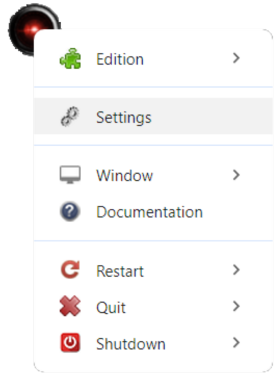
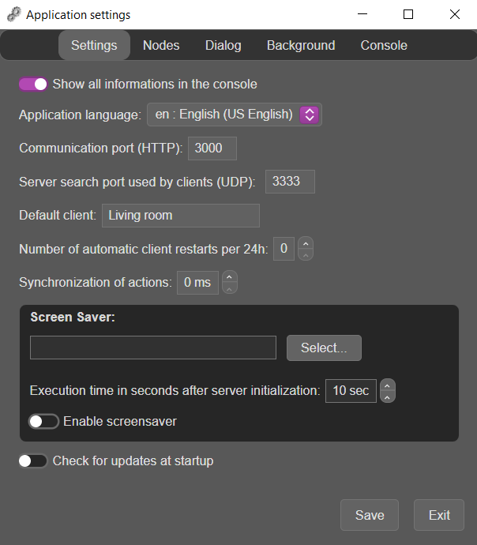
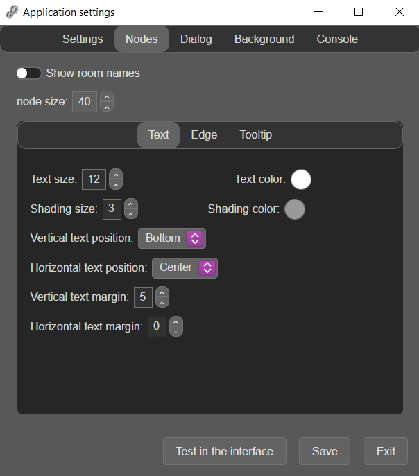
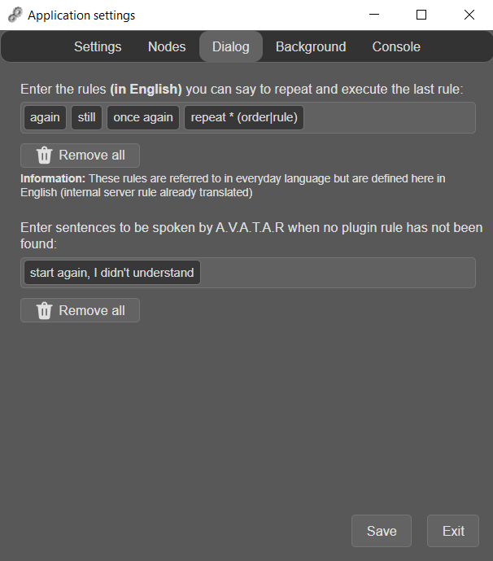
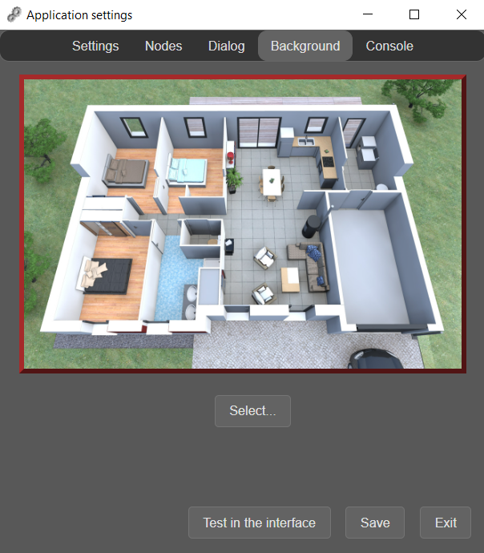
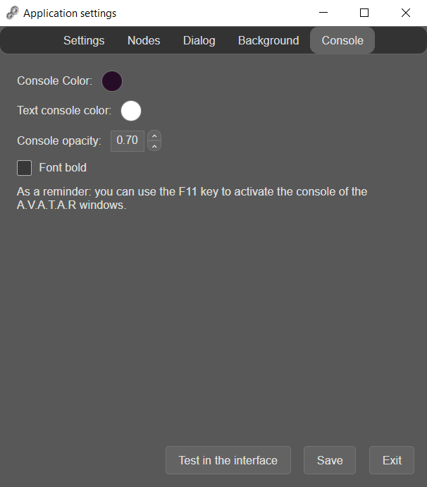

# Server settings

Server settings are accessed via its node in the application interface.

{width="200"}

1. Left-click on the node to display its context menu

    ???+ Tip
        Left-click is deliberate for compatibility with graphic tablets without keyboard 

**NOTE:** All the parameters below are described in the order in which they appear in the window.        

2. Click on _Settings_

## Settings tab

{width="350"}


### `Show all informations in the console`
Select whether you want all information to be displayed in the console.  
This can be very useful if you want to know whether or not a plugin loads correctly on startup.

### `Application language`
Defines the language used for all graphical interfaces and application messages in the console.

???+ info
    Not to be confused with the language used for voice rules, which is defined in each client's settings

2 languages are offered by default with the application:

* English
* French

You can translate a localization file into the language of your choice and add it to the application's languages: 

1. Copy one of the localization files to _app/locales/_, naming it with the country code (2 letters)
2. Modify the values of all keys

    ???+ warning
        The $$ characters are replaced by dynamic values when the message is displayed. Do not delete them 

3. Add an entry in _app/locales/BCP47.loc_ to show the new language in the properties and use it

    * For example, suppose a new location file _pt.loc_ is created
    * The new entry in the file will be :

    ```json
    {
        "1": {
            "tag": "en",
            "region": "English (US English)"
        },
        "2": {
            "tag": "fr",
            "region": "French (especially in France)"
        },
        "3": {
            "tag": "pt",
            "region": "Portuguese (Portugal)"
        }
    }
    ```

### `Communication port (HTTP)`
The communication port with the A.V.A.T.A.R. server.  
This port is also an access to the plugins by HTTP requests (see [HTTP request](server-API.md#http-request) in the [API](server-API.md) for more details).

???+ warning
    This HTTP port number must be the same on each client 

### `Server search port used by clients (UDP)`

The UDP search port used by clients to search for the server.

* Default value: 3333

???+ warning
    This UDP port number must be the same on each client 

### `Default client`
The name of a default client when it is homis in an action to be executed.


### `Number of automatic client restarts per 24h`

* Default value: 0 (no restart)

To refresh the server by restarting it regularly, you can enter a value between 1 and 24. 

???+ Tip "To know"
    In order not to interfere with automatic programs that may be launched at fixed times, 7 minutes are added to the selected times.


### `Action synchronization`

* Default value: 0 milli-seconde

Use to add a timeout (in milliseconds) between speech recognition and plugin script execution if a synchronization problem occurs.

### Screen saver

Activates a screen saver after the server has been fully loaded.  
Useful, for example, if you use A.V.A.T.A.R. in tablet mode to automatically switch off the screen.

`Windows` : Black screen by default. No screensaver file required.

* If you want to use a specific screensaver:
    * Rename _app/lib/screensaver/win32/screensaver.bat_ to _app/lib/screensaver/win32/noscreensaver.bat_. The application will then automatically use the _app/lib/screensaver/win32/screensaver.vbs_ file
    * Then select a screensaver to be passed as a parameter
        * Select _C:\Windows\\System32\scrnsave.scr_ to have a black screen

`Linux` - `macOS` : Black screen by default. No screensaver file required.

* If you want to use a specific screensaver, edit the _app/lib/screensaver/<platform\>/screensaver.sh_ file
* Then select a screensaver to be passed as a parameter

### Updates

Choose whether you want the application to check for updates on startup.  
If Yes, and if a new version of the application is available, the flashing message “New version available!” will be displayed in the interface.

## Nodes tab

{width="350"}

In this tab, you can define the properties of client nodes in the application interface:

* Display client names
* Node size
* Client name text properties
* Line properties between nodes
* Rule text display properties 

## Dialog tab

{width="350"}

In this tab, you can define internal voice rules for the A.V.A.T.A.R. server.  

### `Repeat the last rule`

Enter the rules you can say to repeat the last action performed by A.V.A.T.A.R.

???+ warning
    These internal rules have already been translated and are to be defined in English only.


### `Rule not understood`

Enter the sentences A.V.A.T.A.R. can say when no action has been found for the rule.


## Background tab

{width="350"}

Choose a wallpaper in `jpg` format for the A.V.A.T.A.R graphical interface.

By default, the application offers a number of wallpapers in the _app/assets/images/background_ folder.

/// note
You can choose a wallpaper from any folder.  
When saved, it will be copied to the _app/assets/images/background_ folder.
///

## Console tab

{width="350"}

In this tab, you can set the console properties of the A.V.A.T.A.R. interface.

<br><br>
[:material-skip-previous: Getting started](getting-started.md){ .md-button style="float:left;"}
[Client settings :material-skip-next:](client-properties.md){ .md-button style="float:right;"}   
<br><br>