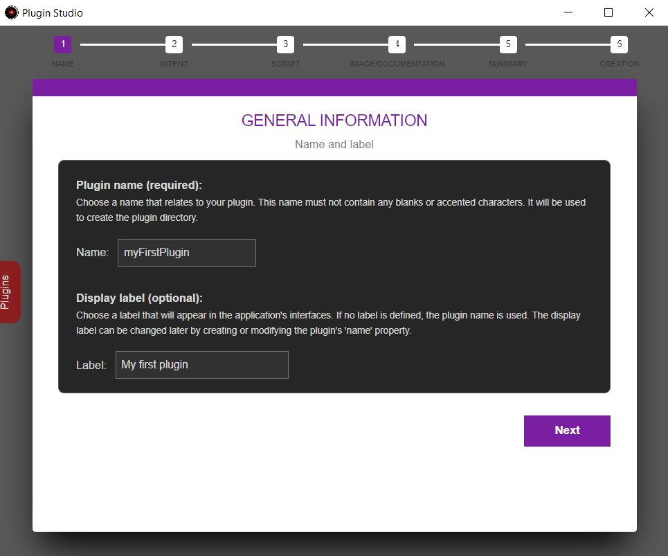
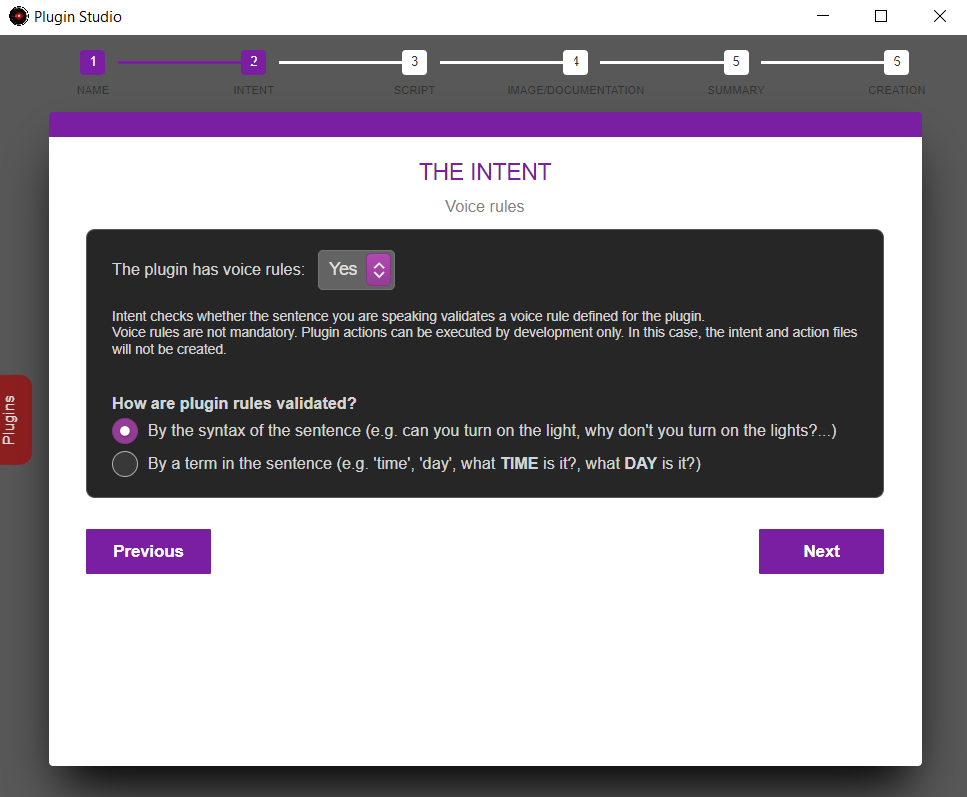
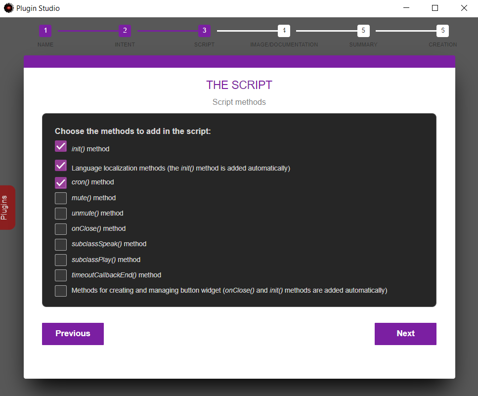
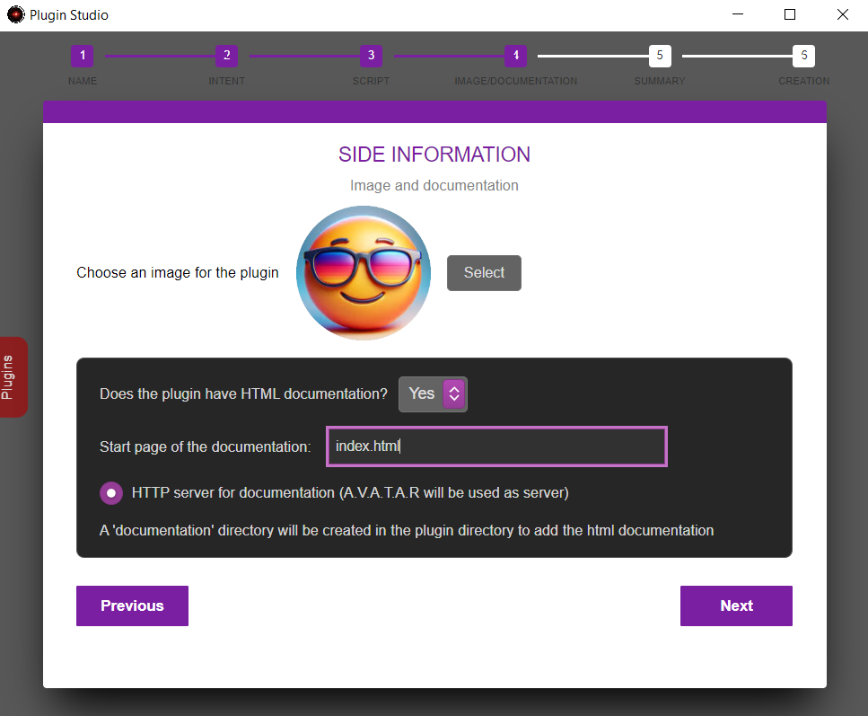
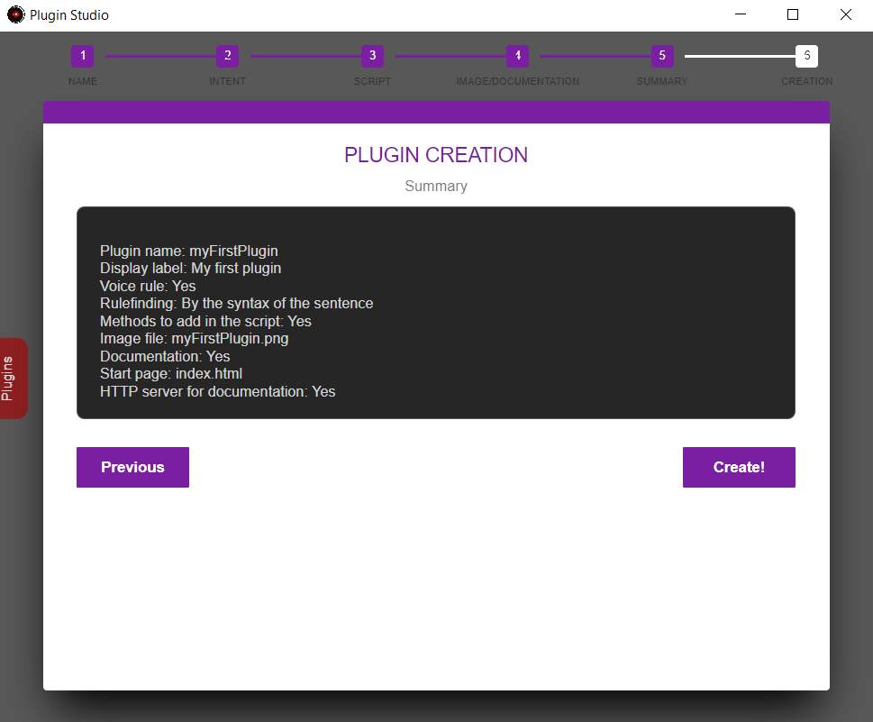
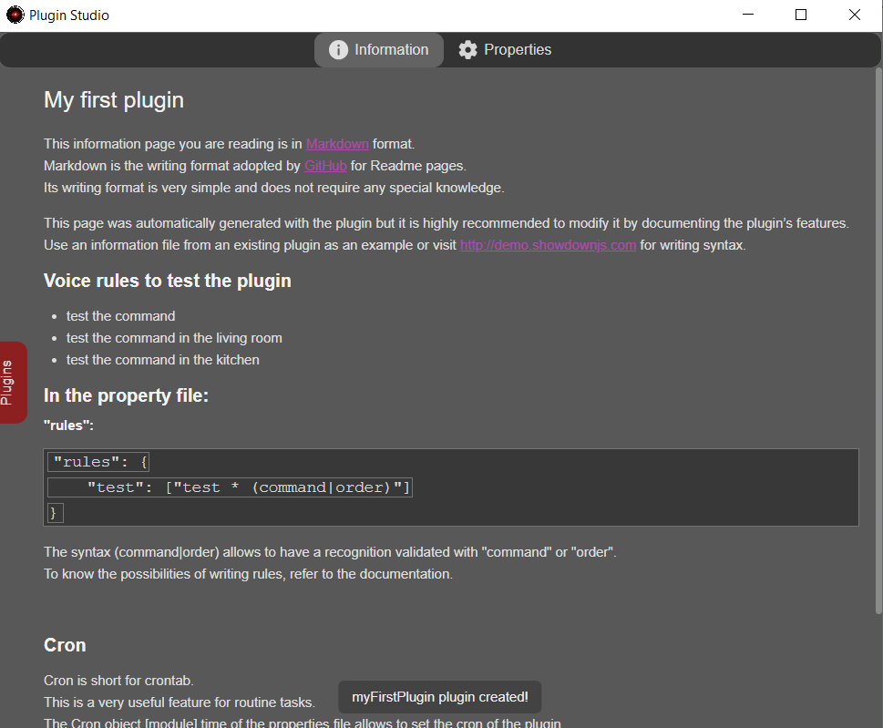
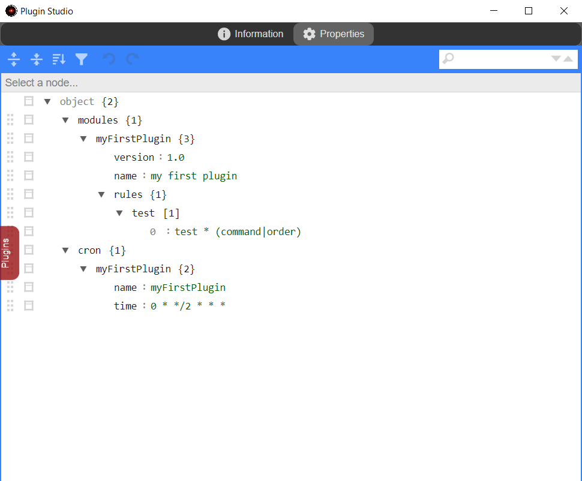
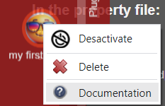

# Create a plugin

The application allows you to create a plugin automatically via the _Plugin Studio_ interface. Although this is not essential for advanced users, we strongly advise you to always use it to have file templates directly in the right format and including the methods and properties useful for your development.

In addition to the server, plugins can be added to each A.V.A.T.A.R. client.  
A client plugin is generally used to perform client-specific actions that cannot be performed with APIs from a server plugin, or to add button wigdets to the client interface.

???+ note
    it is not possible to create a plugin in a client's _Plugin Studio_ window.

    To create a plugin for a client :

    1. Create the plugin via the server's _Plugin Studio_
    2. Then copy the plugin to the client _plugins_ folder


1. In the **server** interface, left-click on the server node
2. Menu _Edit_ -> _Plugin Studio_
3. Left-click to open the _Plugin_ tab
4. Click on _Create a Plugin_ to open the plugin creation window.

## Step 1 - General information

* `Enter a name` (required):
    * For the exercise, enter **_myFirstPlugin_**
* `Enter a display label` (optional):
    * For the exercise, enter **_my first plugin_**

{: style="height:400px;width:auto"}

* Click on **_Next_**

## Step 2 - The intent
Intent allows to check whether the sentence you are speaking validates a voice rule defined for the plugin.

* `The plugin has voice rules?`
    * Voice rules are not mandatory for a plugin.  
    For example, a plugin can manage automations or actions on peripherals directly without voice rules.
    * For the exercise, choose **_Yes_**.
* `How are plugin rules checked?`
    * There are two ways to check a speech rule:
        * By the syntax of the sentence 
        * By a term in the sentence
    * For the exercise, choose **_By sentence syntax_**.

???+ warning
    Be careful with the choice of a term in the sentence, which can easily be duplicated by other rules in other plugins.


{: style="height:400px;width:auto"}
    
* Click on **_Next_**

## Step 3 - The script
The script is the entry point for developing a plugin.  
This step allows you to automatically add [methods](tutorial-script.md#the-methods) that interact with the application when necessary. 

{: style="height:400px;width:auto"}

* For the exercise, choose **_init()_**, **_Language localization methods_** annd **_cron()_**<br>
* Click on **_Next_**


## Step 4 - Image and documentation

* `Image` - Choose an image in `png` format to be displayed for the plugin. An image is added by default if no image is selected.
* `Documentation` - The _Information_ tab in _Plugin Studio_ is available for displaying information about the plugin. In some cases, it may be preferable to create html documentation accessible via a browser. If the documentation requires an HTTP server, the A.V.A.T.A.R. server can be used as the documentation server.

???+ note
    To access a plugin's documentation, open the plugins tab, then _left-click_ on the plugin. If the plugin is not the current one, the tab will close, so try again to display its contextual menu. If the plugin has documentation, the _Documentation_ menu will appear.

{: style="height:400px;width:auto"}

* Click on **_select_** then move to the _assets/images/pluginCreation_ folder
* Select the _myFirstPlugin_ image
    * This image is an example; you can choose any `png` image from any directory. The image will be copied and renamed in the plugin's _images_ folder. 
* Click on **_yes_** for HTML documentation.
    * Add a _index.html_ start page.
    * Click on the “Documentation server” checkbox.
* click on **_Next_**

## Step 5 - Summary

{: style="height:400px;width:auto"}

* View the creation information, then click on **_Create_**

## Step 6 - Creation 

* The _myFirstPlugin_ plugin information page is displayed
* Open the plugins tab, _My first plugin_ has been added

{: style="height:400px;width:auto"}


* Click on the **_Properties_** tab to view the plugin's properties

{: style="height:400px;width:auto"}


* Click on the plugin to open its menu and click on **_documentation_**



* Close the _Plugin Studio_ window


Details of the files created for the _myFirstPlugin_ project:

=== "intent.myFirstPlugin.js"

    ```js linenums="1"
    import {default as _helpers} from '../../ia/node_modules/ava-ia/helpers/index.js';

    export default async function (state, actions) {
        if (state.isIntent) return (0, _helpers.resolve)(state);
        
        for (var rule in Config.modules.myFirstPlugin.rules) {	 
            var match = (0, _helpers.syntax)(state.sentence, Config.modules.myFirstPlugin.rules[rule]); 	
            if (match) break;
        }
        
        if (match) {
            state.isIntent = true;
            state.rule = rule;
            return (0, _helpers.factoryActions)(state, actions);
        } else 
            return (0, _helpers.resolve)(state); 
    };
    ```

    :information_source:
    The intention file is explained in detail in part 5 of the tutorial: [The intention](tutorial-intention.md) :

=== "action.myFirstPlugin.js"
    
    ``` js linenums="1"
    import {default as _helpers} from '../../ia/node_modules/ava-ia/helpers/index.js'

    export default function (state) {
        return new Promise((resolve) => {
            setTimeout(() => { 
                state.action = {
                    module: 'myFirstPlugin',
                    command: state.rule
                };
                resolve(state);
            }, Config.waitAction.time);
        });
    };
    ```

    :information_source:
    The action file is explained in detail in part 6 of the tutorial: [The action](tutorial-action.md)

=== "myFirstPlugin.js" 
    - <p style="font-size:14px">`Line 7`: The `init()` method executed when the plugin is loaded</p>
    - <p style="font-size:14px">`Line 8`: Loads pack of the localized messages</p>
    - <p style="font-size:14px">`Line 13`: The `cron()` function for executing tasks at regular intervals</p>
    - <p style="font-size:14px">`Line 17`: The `action()` function is the entry point for all plugin actions</p>
    - <p style="font-size:14px">`Line 20`: Searchs for localized messages for the client language</p>
    - <p style="font-size:14px">`Ligne 45`: The `test()` function is the generic private test function added when the plugin was created. It must then be deleted.</p>

    ```js linenums="1"
    import * as path from 'node:path';
    import * as url from 'url';
    const __dirname = url.fileURLToPath(new URL('.', import.meta.url));

    let Locale;

    export async function init() {
        if (!await Avatar.lang.addPluginPak("myFirstPlugin")) {
            return error('myFirstPlugin: unable to load language pak files');
        }   
    }
    
    export async function cron () {
        // Do stuff
    }

    export async function action(data, callback) {

        try {
            Locale = await Avatar.lang.getPak("myFirstPlugin", data.language);
            if (!Locale) {
                throw new Error (`myFirstPlugin: Unable to find the '${data.language}' language pak.`);
            }

            // Table of actions
            const tblActions = {
                // test (see rules table in the property file)
                test : () => test(data.client)					
            }
            
            // Writes info console
            info("myFirstPlugin:", data.action.command, L.get("plugin.from"), data.client);
                
            // Calls the function that should be run
            tblActions[data.action.command]();
        } catch (err) {
            if (data.client) Avatar.Speech.end(data.client);
            if (err.message) error(err.message);
        }	
            
        callback();
    
    }

    const test = (client) => {
    
	    Avatar.speak(Locale.get(["message.test", client]), client);
  
    }   
    ```

     :information_source:
    The script file is explained in detail in part 7 of the tutorial: [The script](tutorial-script.md)

=== "myFirstPlugin.prop" 
    <p style="font-size:14px">The plugin properties file including:</p>

    - <p style="font-size:14px">`Ligne 3`: A **required** `modules`.`myFirstPlugin` object containing all plugin properties</p>
    - <p style="font-size:14px">`Ligne 6`: A `modules`.`myFirstPlugin`.`rules` object with which intent is checked in the `intent.myFirstPlugin.js` file</p>
    - <p style="font-size:14px">`Ligne 11`: A `cron` object as requested when creating the _myFirstPlugin_ plugin and defining the execution interval of the `cron()` function in the `myFirstPlugin.js` file. Default is every 2 hours</p>

    ```json linenums="1"
    {
        "modules": { 
            "myFirstPlugin": {
                "version": "1.0",
                "name": "My first plugin",
                "rules": {
                    "test": ["test * (command|order)"]
                }
            }
        },
        "cron": {
            "myFirstPlugin": { 
                "name": "myFirstPlugin",
                "time": "0 * */2 * * *"
            }
        }
    }
    ```

=== "package.json"
    <p style="font-size:14px">The `package.json` file is not mandatory, the plugin can work just fine without it.<br>However, this configuration file is preferable if you are adding `npm` modules to the plugin</p>

    <p style="font-size:14px">Modify section values as required</p>

    ```json linenums="1"
    {
        "name": "myFirstPlugin",
        "version": "1.0.0",
        "type": "module",
        "description": "Plugin myFirstPlugin for A.V.A.T.A.R",
        "repository": "https://github.com/YOUR-REPOSITORY",
        "keywords": [
            "myFirstPlugin"
        ],
        "author": "YOUR-NAME",
        "license": "mit"
    }
    ```

=== "locales\\<_lang_>.pak"
    <p style="font-size:14px">This file has been created as an example and needs to be completed. It contains main objects (here “message”) grouping by category the messages you wish to add in <_key_>:<_value_></p>
    <p style="font-size:14px">Use the function `Locale.get(“message.first”)` to retrieve the value</p>

    ```json linenums="1"
    {
        "message": {
            "first":"i am testing the command for $$"
        }
    }
    ```

=== "documentation\\index.html"
    <p style="font-size:14px">The documentation start page defined in the _documentation.ini_ file. This file has been created as an example and must be modified</p>

    ``` html
    <!DOCTYPE html>
    <html>
        <head>
            <meta charset="UTF-8">
            <meta http-equiv="Content-Security-Policy" content="default-src 'self'; script-src 'self'; style-src 'self' 'unsafe-inline'">
        </head>
        <body>
            <h1>myFirstPlugin documentation</h1>
        </body>
    </html>
    ```


## Test the plugin

A.V.A.T.A.R is updated with the new plugin without needing to restart.  
You can view the plugin loading in the console if [show all information](server-properties.md#show-all-informations-in-the-console) option is active. 

say the rule to test the plugin:

* **Rule:** `test the command`


<br><br>
[:material-skip-previous: Prerequisites](tutorial-prerequisites.md){ .md-button style="float:left;"}[Folders and files :material-skip-next:](tutorial-plugin-folders-files.md){ .md-button style="float:right;"}   
<br><br>
