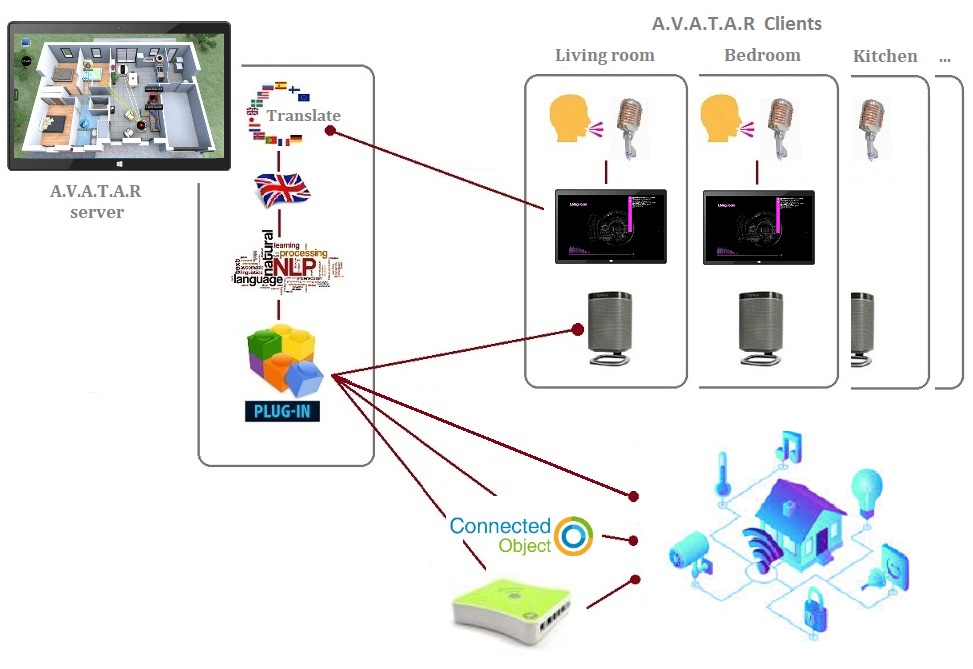

# Bienvenue dans A.V.A.T.A.R.  
<figure markdown="span">
  
</figure>

A.V.A.T.A.R. est un assistant de reconnaissance vocale web open source clients-serveur dédié à la conception de maisons intelligentes et à l'Internet des objets.  
A.V.A.T.A.R. est développé avec le framework [Electron](https://www.electronjs.org/) qui intègre [Chromium](https://www.chromium.org/chromium-projects/) et [Node.js](https://nodejs.org/) dans son exécutable.

<figure markdown="span">
  
</figure>

## Principe d'utilisation

Le principe est de dicter vocalement une règle via un client qui est ensuite envoyée au serveur. Celui-ci la traduit en Anglais et l'analyse par [Traitement Naturel du Langage](https://en.wikipedia.org/wiki/Natural_language_processing).  
Si une intention est trouvée, le serveur déclenche le script associé. Ces scripts (ou plugins) développés en [Node.js](https://nodejs.org/) interagissent ensuite avec tous les objets connectés pouvant être pilotés (box domotique, box TV, TV, enceinte Wi-Fi, Sonos, lampe, gadget…), l’Open Data (programmes TV, horaires de cinéma, météo du monde, wikipedia…) ou encore Google Assistant.

<figure markdown="span">
  {width="600"}
</figure>

A.V.A.T.A.R. est le `core` de vos applications, ainsi vous ne vous occupez uniquement que de développer les plugins interragissant avec ce que vous voulez piloter, A.V.A.T.A.R. se charge du reste. Pour ce faire, A.V.A.T.A.R. vous propose une API de développement et de nombreux outils permettant de créer et de gérer vos plugins facilement, ainsi qu'une bibliothèque de plugins mise à disposition par la communauté de contributeurs.  
Si vous voulez vous passer de la reconnaissance vocale, A.V.A.T.A.R. vous propose aussi un outil pour créer et gérer des widgets boutons dans les interfaces serveur et clients. Vous pouvez aussi ajouter vos propres fenêtres developpées en JS/HTML/CSS qui viendront s'ajouter aux interfaces de l'application.

## Plateformes supportées

|System| Version  | Serveur |Client| Commentaire |
|:-----|:---|:----------:|:----------:|:----------|
|Windows| >= 10 | {width="12"} | {width="12"} | La plateforme par excellence pour les choix possibles de voix|
|Linux| Debian >= 12 Fedora >= 32 Ubuntu >= 18.04|  {width="12"} | {width="12"} | Voix disponibles par `espeak`|
|Mac0S| Catalina et supérieur|{width="12"} | {width="12"} | Voix disponibles |

Le développement d'A.V.A.T.A.R. a été réalisé sur Windows 10 et Linux (Debian 12)  
Ci-dessous les plateformes qui ont été testées : 

|System| Version | arch | Test serveur |Test client| Commentaire |
|:-----|:---:|:---:|:----------:|:----------:|:----------|
|Windows| 10 | x64 | {width="12"} | {width="12"} ||
|Windows| 11| x64 | {width="12"} | {width="12"} |  |
|Debian| 12| x64 |{width="12"} | {width="12"} | |
|MacOS| | x64 |{width="12"} | {width="12"} | |
|Raspberry Pi| Raspberry Pi OS| arm | {width="12"}| {width="12"}| Aucune reconnaissance vocale disponible, aucune voix disponible |

### Autres architectures

* RHEL / CentOS
* Manjaro

[Electron](https://www.electronjs.org/) est compatible avec ces architectures. Il est donc théoriquement possible d'installer A.V.A.T.A.R. sur ces plateformes.

  

