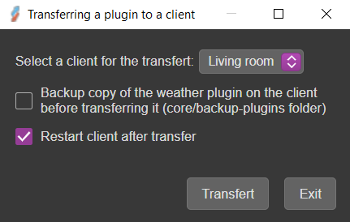
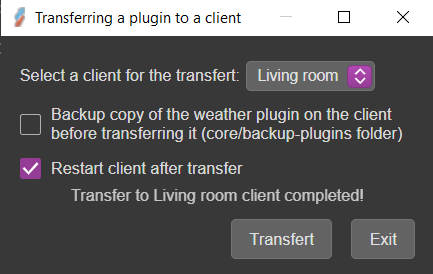

#  Weather forecast Client - Part 3

Dans la 3ème partie, nous allons transférer le plugin météo sur un client. POur cela, nous allons utiliser la commande `transfert`du `Plugin Studio`.

1. Ouvrez `Plugin studio`
2. Cliquez 2 fois sur le plugin `weather forecast` pour ouvrir son menu contextuel
3. Cliquez sur la command `transfert`
4. Sélectionnez un client dans la liste des clients
5. Cliquez sur `Redémarrez le client après le transfert`

    {width="350"}

6. Cliquez sur le bouton _Transfert_
7. Le plugin est copié sur le client sélectionné

    {width="350"}

8. Le client redémarre    

Si vous désirez faire une copie de sauvegarde du plugins si celui-ci existe sur le client, cliquez sur la case à cocher.  
Le plugin sera sauvegardé dans le répertoire <_Client_\>/app/resources/core/backup-plugins

```
A.V.A.T.A.R
    ├── resouces
        ├── app
            ├── core
                ├── backup-plugins
                    ├── weather
                        ├── <DATE\>-<HOUR\>
                            ├── plugin files

```


???+ warning
    En théorie, un plugin réalisé sur le serveur peut être copié sans modification sur un client pour peu qu'il n'utilise pas des imports de modules de l'application qui n'existent pas sur le client. 

    Pour son utiisation, verifiez que des méthodes avec des options différentes, comme par exemple `Avatar.speak()`, soient modifiées avec les bonnes options.

    Testez le plugin une fois transféré pour vérifier que celui-ci est fonctionnel.

