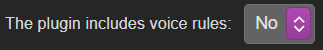
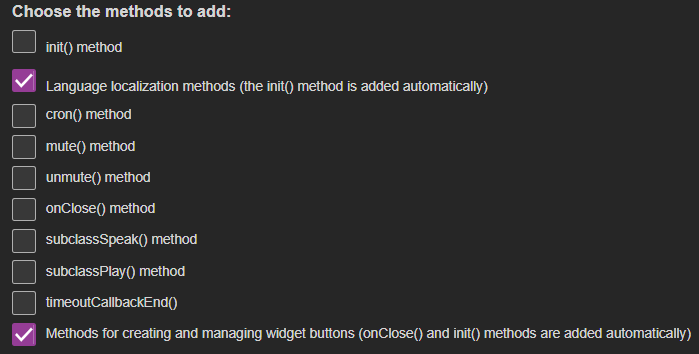
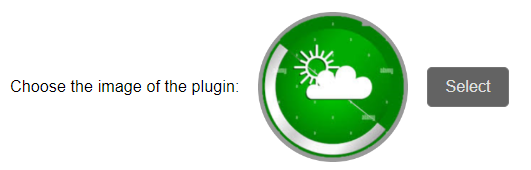
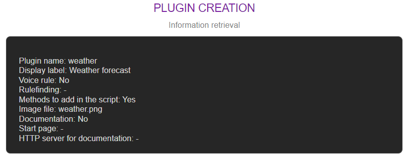
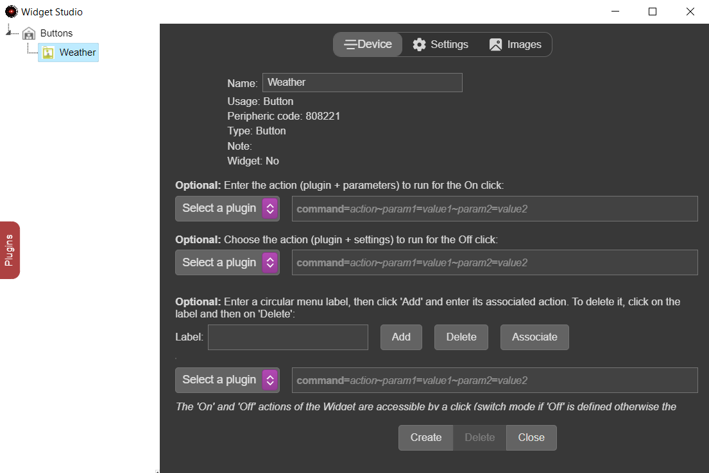
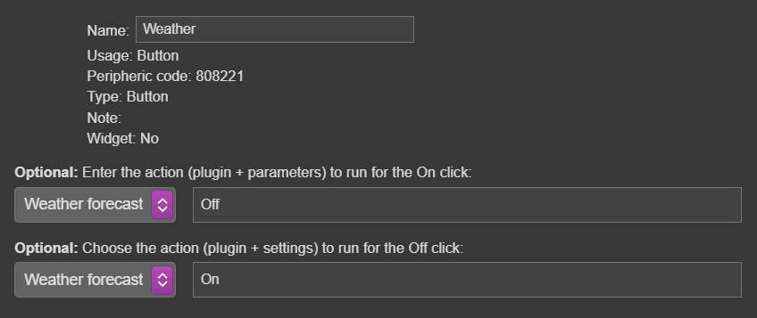
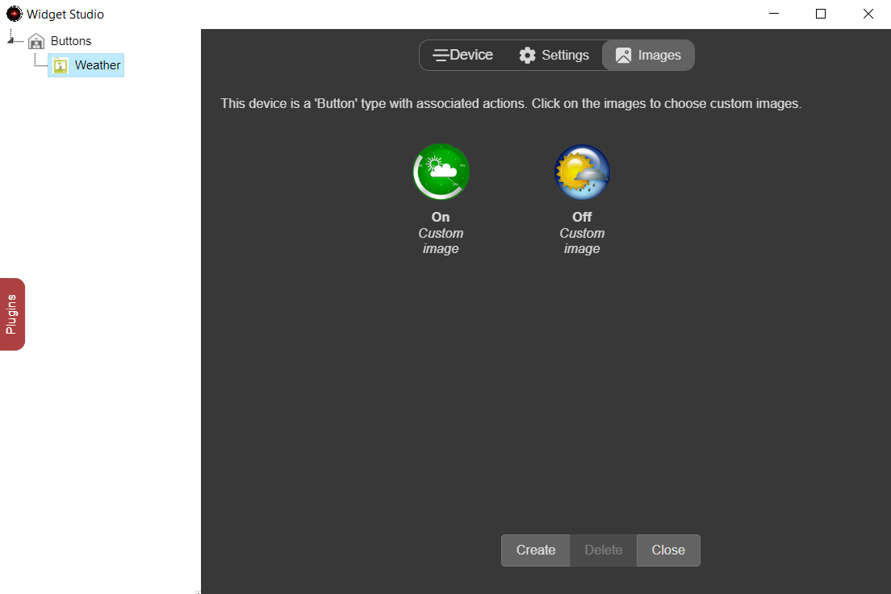
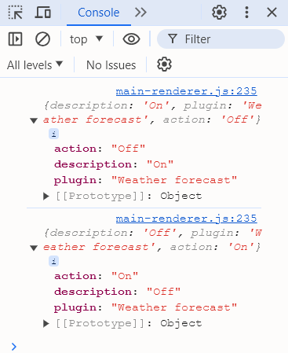

# Weather forecast - Part 1

Dans la 1ère partie de la création du plugin `Weather forecast`, nous allons commencer par créer le plugin puis voir la création d'un widget bouton.

## Création du plugin

1. [Démarrez le serveur dans un terminal](tutorial-best-practices.md#terminal-de-demarrage-et-debogage)
2. [Créez un plugin par _Plugin Studio_](tutorial-plugin-studio.md)
    * Nom : `weather`
    * Affiché: `Weather forecast`
    * Rules: Non

        {width="250"}

    * Script methods: 
        * `Méthodes de localisation du langage`
        * `Methods for creating and managing widget buttons (onClose() and init() methods are added automatically)`

        {width="450"}    

    * Ajouter une image 
        * Sélectionnez l'image `<A.V.A.T.A.R>/resources/app/assets/images/PluginCreation/weather.png`

        {width="350"}

    * Pas de documentation

    {width="450"}

## Modification du plugin

 Le _Plugin Studio_ créé automatiquement un core d'application complet avec des fichiers et des méthodes qui peuvent être nécessaires suivant le type de bouton et la complexité du plugin.  
 Le plugin weather est un plugin simple qui ne nécessite pas de méthodes spécifiques pour mettre à jour des informations, par conséquent nous pouvons faire un peu de ménage.
 
 1. Supprimez le répertoire _lib_ et son contenu.
    * Ouvrez un terminal et déplacez-vous dans le répertoire du plugin
        ```
        cd <A.V.A..T.A.R>/resources/app/cores/plugin/weather
        ```
    * Supprimez le répertoire _lib_

2. Modifiez ensuite le fichier script du plugin dans [Visual Studio](tutorial-prerequisites.md#editeur-de-code) (ou un autre éditeur de texte)
    * Ouvrez le fichier `<A.V.A.T.A.R>/resources/app/core/plugins/weather/weather.js  `
    * Puisqu'il n'y a pas de règles vocales, nous allons en profiter pour déplacer la méthode _getpak()_ de la méthode _action()_ dans la méthode _init()_
        - **Attention:** Changez _data.language_ par _Config.language_ puisque le code de langue est maintenant lié à l'application et non pas à un client
    * Supprimez tous les commentaires et les imports inutiles ajoutés pendant la création du plugin pour avoir un résultat comme ci-dessous (vous pouvez garder les commentaires qui vous intéressent)

    ``` js title="weather.js" hl_lines="29-32"
    import * as path from 'node:path';
    import * as url from 'url';
    const __dirname = url.fileURLToPath(new URL('.', import.meta.url));
    import * as widgetLib from '../../../widgetLibrairy.js';
    const Widget = await widgetLib.init();

    // devices table
    let periphInfo = [];
    //language pak
    let Locale;

    const widgetFolder = path.resolve(__dirname, 'assets/widget');
    const widgetImgFolder = path.resolve(__dirname, 'assets/images/widget');

    export async function onClose (widgets) {
        // Save widget positions
        if (Config.modules.weather.widget.display === true) {
            await Widget.initVar(widgetFolder, widgetImgFolder, null, Config.modules.weather);
            if (widgets) await Widget.saveWidgets(widgets);
        }
    }


    export async function init () {
        if (!await Avatar.lang.addPluginPak("weather")) {
            return error('weather: unable to load language pak files');
        }

        Locale = await Avatar.lang.getPak("weather", Config.language);
		if (!Locale) {
			return error (`weather: Unable to find the '${Config.language}' language pak.`);
		}
    }


    export async function getWidgetsOnLoad () {
        if (Config.modules.weather.widget.display === true) {
            await Widget.initVar(widgetFolder, widgetImgFolder, null, Config.modules.weather);
            let widgets = await Widget.getWidgets();
            return {plugin: "weather", widgets: widgets, Config: Config.modules.weather};
        } 
    }


    export async function readyToShow () {
        
    }


    export async function getNewButtonState (arg) {
        return;
    }


    export async function getPeriphInfo () {
        return periphInfo;
    }


    export async function widgetAction (even) {
        
        infoConsole(even.value);
        
    }


    export async function action(data, callback) {
        callback();
    }
    ```

3. Redémarrez A.V.A.T.A.R
    * Faite un ++ctrl++ +`C` dans le terminal pour arrêter le serveur
    * Récupérez la dernière commande `npm start .` pour redémarrer le serveur

4. Testez le plugin  
    * Aucune erreur ne doit apparaîte dans le terminal et dans la console A.V.A.T.A.R
 

## Ajouter un widget bouton

### Initialisation

La 1ère étape est d'initaliser le bouton dans le script du plugin en ajoutant un widget de type `button` dans la variable _periphInfo_.

Ci-dessous la description des clés possibles:

|Clé| Format | Obligatoire|Commentaire |
|:-----|:---:|:---:|:----------|
|name|string|**oui**|Le nom du widget|
|value_type|string|**oui**|Le type de bouton.<br>Il existe 3 types de widget possibles, les types `list` et `float` sont créés automatiquement dans _Widget Studio_ en fonction du type de device (domotique). Le type `button` est le seul type possible pouvant être initialisé dans un plugin.|
|usage_name|string|**oui**|Le nom d'un répertoire dans _<plugin\>/assets/images/widget_ où seront utilisés les fichiers images pour les états du widget|
|periph_id|string|**oui**|une valeur aléatoire **unique**|
|notes|string|non|Une note associée au widget|

1. Ajoutez les lignes suivantes dans la méthode init()

    ``` js title="weather.js" hl_lines="11-21"
    export async function init () {
        if (!await Avatar.lang.addPluginPak("weather")) {
            return error('weather: unable to load language pak files');
        }

        Locale = await Avatar.lang.getPak("weather", Config.language);
		if (!Locale) {
			return error(`weather: Unable to find the '${Config.language}' language pak.`);
		}
		
		periphInfo.push({
			Buttons: [
				{
					name: "Weather",
                    value_type: "button",
                    usage_name: "Button",
                    periph_id: "808221",
                    notes: "Open weather forecast"
				}
			]
		});
    }
    ```

2. Ajoutez une variable globale _currentwidgetState_ pour garder l'état courant du bouton

    ``` js title="weather.js" hl_lines="5-6"
    // devices table
    let periphInfo = [];
    //language pak
    let Locale;
    // button state
    let currentwidgetState; 

    const widgetFolder = path.resolve(__dirname, 'assets/widget');
    ```

3. Ajoutez dans les 2 méthodes ci-dessous les appels à _currentwidgetState_

    ``` js title="weather.js" hl_lines="2 10"
    export async function getNewButtonState (arg) {
        return currentwidgetState === true ? "Off" : "On";
    }

    export async function getPeriphInfo () {
        return periphInfo;
    }

    export async function widgetAction (even) {
        currentwidgetState = even.value.action === 'On' ? true : false;
        infoConsole(even.value);
    }
    ```

4. Redémarrez A.V.A.T.A.R
    * Faite un ++ctrl++ +`C` dans le terminal pour arrêter le serveur
    * Récupérez la dernière commande `npm start .` pour redémarrer le serveur


### Paramètrage

Après avoir initialisé le widget, il est nécessaire de le paramètrer pour le faire apparaître dans l'interface A.V.A.T.A.R

1. Ouvrez  _Widget Studio_
2. Cliquez sur l'onglet _Plugins_ et cliquez sur le plugin `Weather forecast`
3. Déroulez _Buttons_ et cliquez sur _Weather_

    {width="550"}

4. `Action On`: 
    * Sélectionnez le plugin `Weather forecast` 
    * Ajoutez un paramètre **Off**
5. `Action Off`: 
    * Sélectionnez le plugin `Weather forecast` 
    * Ajoutez un paramètre **On**

    {width="450"}

6. Cliquez sur l'onglet _Images_
7. Cliquez sur l'image _On_
    * Sélectionnez l'image `<A.V.A.T.A.R>/resources/app/assets/images/PluginCreation/weather.png`
    * Sélectionnez _Customized for the device_ 
7. Cliquez sur l'image _Off_
    * Sélectionnez la même image `<A.V.A.T.A.R>/resources/app/assets/images/PluginCreation/weather-icon.png`
    * Sélectionnez _Customized for the device_ 

    {width="550"}

8. Cliquez sur le bouton _Create_
    * Le bouton apparaît dans l'interface A.V.A.T.A.R
    * Vous pouvez le tester en cliquant dessus
9. Cliquez sur l'onglet _Settings_
10. Positionnez le slider _Opacity_ à 0
11. Cliquez sur le bouton _Modify_
    * La bordure du bouton est maintenant transparente dans l'interface A.V.A.T.A.R
12. Cliquez sur _close_ pour fermer la fenêtre Widget Studio
13. Dans l'interface A.V.A.T.A.R, déplacez le bouton en le sélectionnant par sa bordure (transparente)
14. Pour enregistrer son emplacement, quittez A.V.A.T.A.R par le menu du node server

    ???+ warning
        Ne faite pas un ++ctrl++ +`C` dans le terminal sinon la méthode _Onclose()_ ne sera pas exécuté et l'emplacement ne sera pas sauvegardé.

15. Dans le terminal, récupérez la dernière commande `npm start .` pour redémarrer le serveur

???+ success
    Nous avons maintenant un bouton _Weather_ dans l'interface A.V.A.T.A.R !   

## Ajouter les actions de bouton

La méthode _widgetAction_ exécute un [_infoConsole_](API.md#infoconsolemessage), vous pouvez vérifier les actions que nous avons appelés `On` et `Off` en ouvrant la console Chromium d'A.V.A.T.A.R

``` js hl_lines="3"
export async function widgetAction (even) {
    currentwidgetState = even.value.action === 'On' ? true : false;
    infoConsole(even.value);
    // Returns: 
    // {
    //    action: "On"
    //    description: "Off"
    //    plugin: "Weather forecast"
    // }
}
```

{width="300"}


Dans l'exemple suivant, nous allons exécuter l'affichage de la météo dans une fenêtre fille d'A.V.A.T.A.R.

<br><br>
[:material-skip-previous: Introduction](examples-developer.md){ .md-button style="float:left;"}[Créer une fenêtre - Part 2 :material-skip-next:](meteo-widget.md){ .md-button style="float:right;"}   
<br><br>
