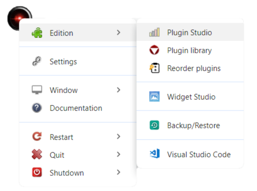
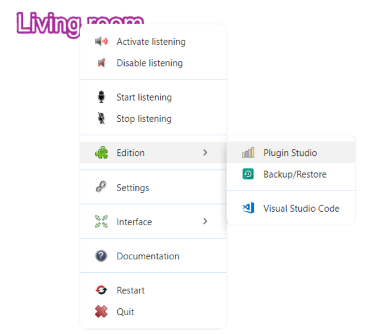
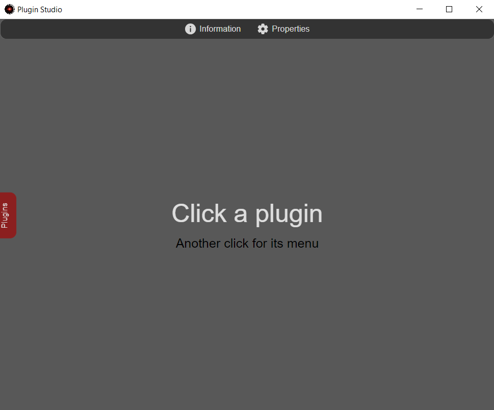
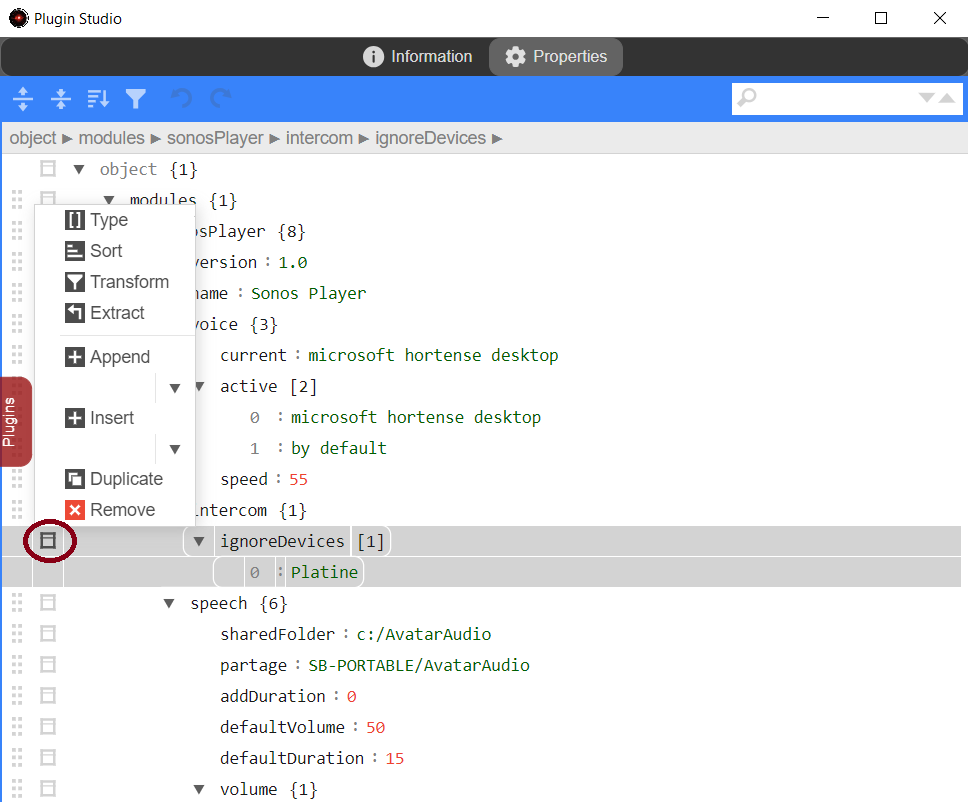
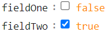
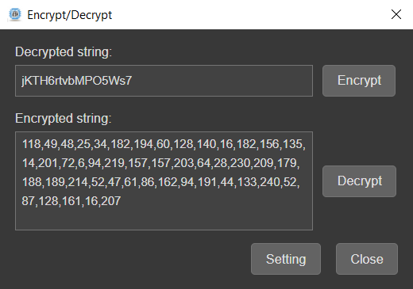
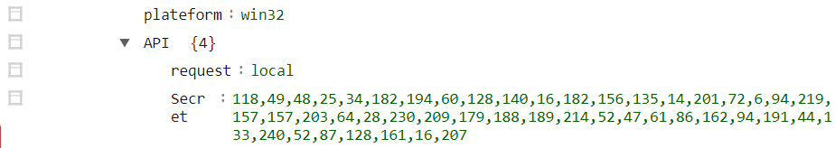

# Plugin Studio

Each plugin has a properties file (_.prop_) in `json` format in which all its properties are defined (see [Plugin files](tutorial-plugin-folders-files.md#files) for more details). 

_Plugin Studio_ interface lets you manage plugin properties much more easily than with a text editor.

In addition to [managing plugin properties](#property-management), _Plugin Studio_ lets you :

- Display the plugins' [information page](#information-page)
- [activate/deactivate](#activatedeactivate-a-plugin) a plugin
- Open the plugin's [HTML documentation](#html-documentation)
- [Delete a plugin](#delete-a-plugin) 
- [Transfert a plugin to a client](#transfert-a-plugin) 
- To [encrypt/decrypt](#cryptdecrypt-a-string) a string (useful for passwords)
- [translate-a-sentence](#translate-a-sentence) in English (_Plugin Studio_ server only)

=== "Server"
    1. Click on the server node to open the context menu
    2. Click on **`Edition`** -> **`Plugin Studio`**

    {width="350"}
    
=== "Client"
    1. Click on the client name to open the context menu
    2. Click on **`Edition`** -> **`Plugin Studio`**

    {width="350"}

 {width="450"}

## Information Page

The information page is generally used as a presentation and user manual for a plugin.  

1. On the left, open the list of plugins and click on the relevant plugin
2. The information page is displayed by default

???+ note
    If the plugin is too large, HTML documentation is recommended.

## Activate/Deactivate a plugin

1. On the left, open the list of plugins and click on the relevant plugin
2. The _Plugins_ tab closes. Open the _Plugins_ tab again and click on the plugin a 2nd time to display its contextual menu
3. Depending on its current status, click on _Activate_ or _Desactivate_

## HTML Documentation

Some plugins may have documentation that is too large to be displayed in the information page.   
If the plugin has HTML documentation, the _Documentation_ menu will automatically appear in its context menu.

1. On the left, open the list of plugins and click on the relevant plugin
2. The _Plugins_ tab closes. Open the _Plugins_ tab again and click on the plugin a 2nd time to display its contextual menu
3. Click on _Documentation_

## Delete a plugin

1. On the left, open the list of plugins and click on the relevant plugin
2. The _Plugins_ tab closes. Open the _Plugins_ tab again and click on the plugin a 2nd time to display its contextual menu
3. Click on _Delete_
4. Click on _Delete_ in the confirmation window

/// danger
Be careful! deleting a plugin is definitive! 
///

## Property management

1. On the left, open the list of plugins and click on the relevant plugin
2. Click on the _Properties_ tab to display plugin properties

The management menu is accessed by left-clicking on each line, as in the example below: 

{width="450"}

### Adding a property

To add a property, click on a line and then use _Append_ or _Insert_ depending on what you want to do:

- `Insert`: Adds an entry **before** the selected line
- `Append`: Adds an entry **after** the selected line

/// Tip
Choose the right line for the location where you want to add an entry.  

A good way to know if you're adding the entry correctly is to collapse or expand the parent object or array by its little arrow (to the left of its name), the new entry should appear or disappear with it.
///

Then select the type of input you require from the submenu associated with the command.  
Table of input types:

|Type| Description | Input| Result |
|:-----|:---|:---|:---|
|String|string|1. Enter a key 2. Enter value|The value appears in green field : By default|
|Number|Integer or float value|1. Click on _String_ 2. Enter a key 3. Add a value 4. Open the entry submenu and click on _Type_. 5. Click on _Auto_ {width="15"}|The value appears in red field : 20 field : 20.98|
|Boolean|boolean (_true_ ou _false_) |1. Click on _String_ 2. Enter a key 3. Add a value _true_ ou _false_ 4. Open the entry submenu and click on _Type_ 5.  Click on _Auto_ {width="15"}|The value appears in orange with a checkbox  {width="120"}|
|Array|[ ] Table of values|1. Click on _Array_ 2. Enter a key 3. Open the entry submenu _(new array)_ and click on _Append_ then select the type of entry to add to the array 4. To add another entry, select the last line created and repeat the operation|The values in the table are coloured according to type|
|Object|{ } Key/value collection|1. Click on _Array_ 2. Enter a key 3. Open the entry submenu _(new object)_ and click on _Append_ then select the type of entry to add to the object 4. To add another entry, select the last line created and repeat the operation|Object values appear in color according to type|

### Delete a property

1. Click on the line to be deleted
2. Open the menu
3. Click on _Remove_

/// warning
The action deletes the entry with its contents. If the type is Array or Object, all entries below will be deleted.
///

### Save properties

1. Click in the properties interface to show the contextual menu
2. Click on _Save_

### Reload properties

Use this command if you want to reload the properties without restarting A.V.A.T.A.R.

1. Click in the properties interface to show the contextual menu
2. Click on _Reload_

/// note
When you close _Plugin Studio_, the application will notice that you've modified the properties and will ask you if you want to restart to reload them. Since you've done this manually, you can then click on _Later_.
///

## Encrypt/Decrypt a string

This string encryption/decryption interface is useful for saving an encrypted value, such as a password, in the properties file.

1. Click in the properties interface to show the contextual menu
2. Click on _Encrypt/Decrypt_

### Encrypt

1. Enter a **decrypted** value to be encrypted in the _Decrypted string_ field
2. Click on _Encrypt_
3. The encrypted value appears in the _Encrypted string_ field

    {width="350"}

4. Copy the encrypted value (_CTRL-C_) and paste it into a plugin property value field

{width="600"}

5. Save properties

### Decrypt

1. Enter a **encrypted** value to be decrypted in the _Encrypted string_ field.
2. Click on _Decrypt_
3. The decrypted value appears in the _Decrypted string_ field.

## Translate a sentence

1. Click in the properties interface to show the contextual menu
2. Click on _Translate_

Then copy the translated sentence into a plugin property value field.  
If you wish, you can then modify the sentence to add a NLP [match](plugin-rules.md#matches)

  
[:material-skip-previous: Getting started](getting-started.md){ .md-button style="float:left;"} 
  