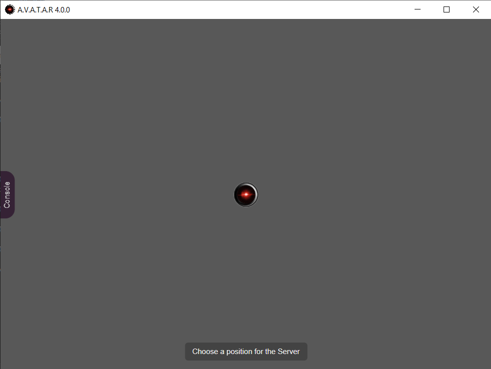

# Installation du serveur

## Préparation du package
1. Créer un dossier _C:\\packager\\server_ (Windows) ou _/packager/server_ (Linux) qui servira à packager l'application
2. Téléchargez le zip [A.V.A.T.A.R](https://github.com/Spikharpax/A.V.A.T.A.R) depuis GitHub
    * Utilisez le bouton {width="60"} et `Download zip`
3. Dézippez `A.V.A.T.A.R-master.zip`
4. Copiez le contenu du dossier _A.V.A.T.A.R-master/dist_ dans _/packager/server_

## Installation du module packager
1. Ouvrez un terminal et déplacez-vous dans le dossier _packager/server_
2. Entrez la commande suivante pour installer le packager et tous les modules de l'application:
```
npm install --save-dev @electron/packager
```
3. Après quelques instants, vous devez voir le résultat suivant :
```
added 339 packages, and audited 340 packages in 15s

55 packages are looking for funding
  run `npm fund` for details

found 0 vulnerabilities
```

??? note "A propos des vulnérabilités"
    La mise à jour de l'application est régulière mais il est possible que vous constatiez des vulnérabilités.  
    Si c'est le cas, l'installation n'est pas impactée et peut continuer.  
    Vous pouvez contribuer en laissant une issue sur le GitHub A.V.A.T.A.R afin de mettre à jour l'application

## Exécution du module packager

Afin d'avoir `Electron` à la dernière version pour votre installation, vous devez récupérer la version courante sur le [GitHub Electron](https://github.com/electron/electron) qui sera utilisée pour le packager.

* A droite dans la section **Releases**, en dessous de la section **About** notez la version courante

    {width="220"}

1. Toujours dans le dossier _packager/server_
2. Exécutez le packager :
    * Pour l'exemple, la version courante est _31.2.1_, modifiez la valeur par la version courante récupérée sur le GitHub Electron

    ```
    npx electron-packager . --electron-version=31.2.1 --icon=./avatar.ico --out=output
    ```
3. Après quelques instants, vous devez voir le résultat suivant (varie selon la plateforme):
    ```
    Packaging app for platform win32 x64 using electron v31.2.1
    Wrote new app to: output\avatar-win32-x64
    ```

## Installation du module Electron
1. Déplacez-vous dans le dossier  _output/avatar-<platform\>/resources/app_
2. Entrez la commande suivante pour installer Electron dans le package :
```
npm install electron --save-dev
```
3. Après quelques instants, vous devez voir le résultat suivant :
```
added 144 packages, changed 4 packages, and audited 346 packages in 13s

55 packages are looking for funding
  run `npm fund` for details

found 0 vulnerabilities
```

## Déployer A.V.A.T.A.R. comme application
A.V.A.T.A.R. est maintenant prêt à etre déplacé dans son dossier d'application

### Windows
1. Créer un dossier pour A.V.A.T.A.R. (par exemple _C:\\avatar\\server_)
2. Déplacez le contenu de _output\\avatar-win32-x64_ dans le dossier créé
3. Supprimez le dossier _C:\\packager\\server_

### Linux
Vous avez 2 choix possibles :

* Déplacer le contenu de _output\\avatar-linux-arch_ dans un dossier et démarrer le serveur par son exécutable `avatar`
* Créer un package `.deb` pour installer A.V.A.T.A.R. comme application

Choisissez ce que vous voulez faire ci-dessous (entre « Déplacer dans un dossier » ou « Créer un paquet `.deb` »)

#### Déplacer dans un dossier
1. Créer un dossier pour A.V.A.T.A.R (Par exemple _/avatar/server_)
2. Déplacez le contenu de _output/avatar-darwin-arch_ dans le dossier créé
3. Supprimez le dossier _/packager/server_

#### Créer un package `.deb`
1. Installez les packages nécessaires

    `Linux Debian / Ubuntu`:
        ```
        sudo apt-get update
        sudo apt-get install fakeroot dpkg
        ```

    `Linux Fedora`:
        ```
        sudo yum update
        sudo yum install fakeroot dpkg
        ```

2. Installer electron-installer-debian
```
npm install -g electron-installer-debian
```
3. Dans le dossier `packager/server`, créez le package `.deb`
```
electron-installer-debian --src output/avatar-linux-x64/ --dest output/installer/ --arch amd64
```
4. Déplacez-vous dans le dossier _output/installer_ et installez le package (le nom peut varier selon la plateforme)
```
sudo apt install ./avatar_4.0.0_amd64.deb
```
5. Ajoutez une icône d'application
    * Editez le fichier _/usr/share/applications/avatar.desktop_
    * Modifiez la valeur de la propriété `Icon`

    ```
    Icon=/usr/lib/avatar/resources/app/avatar.ico
    ```

### MacOS
Vous avez 2 choix possibles:

* Déplacer le contenu de _output\\avatar-darwin-arch_ dans un dossier et démarrer le serveur par son exécutable `avatar`
* Créer un package `.deb` pour installer A.V.A.T.A.R. comme application

Choisissez ce que vous voulez faire ci-dessous (entre « Déplacer dans un dossier » ou « Créer un paquet `.deb` »)

#### Déplacer dans un dossier
1. Créer un dossier pour A.V.A.T.A.R. (par exemple: _/avatar/server_)
2. Déplacez le contenu de _output/avatar-darwin-arch_ dans le dossier créé
3. Supprimez le dossier _/packager/server_

#### Créer un package `.deb`
1. Installez les packages nécessaires avec [Homebrew](https://brew.sh/)
    ```
    brew install fakeroot dpkg
    ```
2. Installer electron-installer-debian
```
npm install -g electron-installer-debian
```
3. Dans le dossier _packager/server_, créez le package `.deb`
    ```
    electron-installer-debian --src output/avatar-darwin-<arch>/Contents/Resources/app --dest output/installer/ --arch <arch>
    ```
4. Déplacez-vous dans le dossier _output/installer_ et installez le package 
    ```
    dpkg -c ./avatar_4.0.0_<arch>.deb
    ```
5. Ajoutez une icône d'application

    Si l'icône d'application n'apparait pas, vous pouvez la modifier en utilisant le fichier `avatar.ico` accessible dans les dossiers de l'application. 

6. Chercher l'application A.V.A.T.A.R. dans les applications

??? warning "A propos de MacOS"
    Bien que théoriquement possible, l'installation d'un package `.deb` avec [electron-installer-debian](https://github.com/electron-userland/electron-installer-debian) pour macOS n'a pas été testée.  
    Si vous rencontrez des problèmes, vous pouvez consulter les [issues](https://github.com/electron-userland/electron-installer-debian/issues) reportées par les utilisateurs.  

    Vous pouvez aussi utiliser [electron-deboa-maker](https://github.com/erikian/electron-deboa-maker) à la place de `electron-installer-debian`.

## Démarrer A.V.A.T.A.R. serveur
    
### Windows
1. Ajoutez un raccourci de bureau pour l'exécutable A.V.A.T.A.R : _C:\\avatar\\server\\avatar.exe_
2. Démarrez A.V.A.T.A.R serveur en cliquant sur l'icône de bureau

### Linux/MacOS

Démarrez A.V.A.T.A.R. suivant le choix d'installation

* Dans un dossier : 
    * Cliquez sur l'exécutable dans son dossier d'installation
        * `Linux`: Démarrez A.V.A.T.A.R. serveur en cliquant sur _/avatar/server/avatar_
        * `MacOS`: Démarrez A.V.A.T.A.R. serveur en cliquant sur _/avatar/server/avatar.app_
* Comme application : 
    * Chercher l'application A.V.A.T.A.R. dans les applications pour l'exécuter

{width="520"}

<br><br>
[:material-skip-previous: Installation](installation.md){ .md-button style="float:left;"}
[Installation d'un client :material-skip-next:](client-install.md){ .md-button style="float:right;"}   
<br><br>