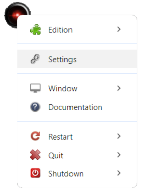
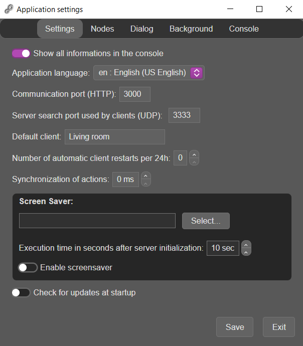
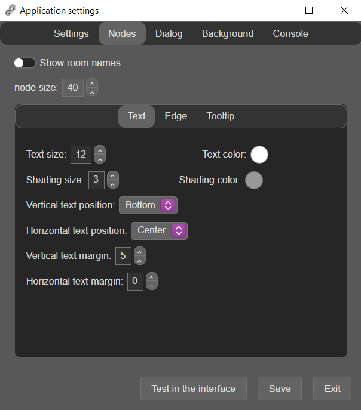
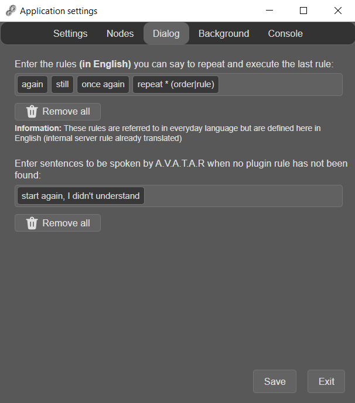
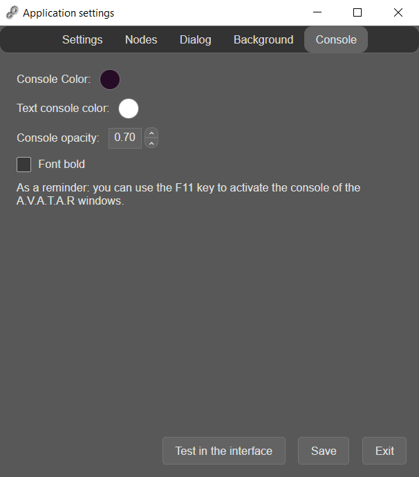

# Paramètres du serveur

L'accès aux paramètres du serveur se fait par le node du serveur dans l'interface de l'application.

{width="200"}

1. Faites un clic gauche sur le node pour afficher son menu contextuel

    ??? Tip
        Le clic gauche est délibéré pour la compatibilité avec les tablettes graphiques sans clavier 

2. Cliquez sur _Paramètres_

## L'onglet Settings

{width="350"}

**NOTE:** La description des paramètres ci-dessous est faite dans l'ordre d'affichage dans la fenêtre

### `Show all informations in the console`
Choisissez si vous voulez que toutes les informations s'affichent dans la console. Ceci peut être très utile pour savoir si un plugin se charge correctement ou non au démarrage.

### `Application language`
Defini le langage utilisé pour toutes les interfaces graphiques et les messages de l'application dans la console.

???+ info
    A ne pas confondre avec le langage utilisé pour les règles vocales qui est défini dans les paramètres de chaque client.

2 langages sont proposés par défaut avec l'application :

* L'Anglais
* Le Français

Vous pouvez traduire un fichier de localisation dans la langue qui vous plait et l'ajouter dans les langues de l'application : 

1. Copiez un des fichiers de localisation dans _app/locales/_ en le nommant par le code du pays (2 lettres)
2. Modifiez toutes les valeurs des clés

    ??? warning
        Les caractères $$ sont remplacés par des valeurs dynamiques lors de l'affichage du message. Ne les supprimez pas. 

3. Ajoutez une entrée dans le fichier _app/locales/BCP47.loc_ pour faire apparaître le nouveau langage dans les propriétés et l'utiliser

    * Par exemple, supposons un nouveau fichier de localisation _pt.loc_
    * La nouvelle entrée dans le fichier sera :

    ```json
    {
        "1": {
            "tag": "en",
            "region": "English (US English)"
        },
        "2": {
            "tag": "fr",
            "region": "French (especially in France)"
        },
        "3": {
            "tag": "pt",
            "region": "Portuguese (Portugal)"
        }
    }
    ```

### `Communication port (HTTP)`
Le port de communication avec le serveur A.V.A.T.A.R.  
Ce port permet également d'accéder aux plugins par des requêtes HTTP (voir [Requête HTTP](API.md#http-request) dans l'[API](API.md) pour plus de détails).

??? warning
    Ce numéro de port HTTP doit être identique sur chaque client 

### `Port de recherche du serveur utilisé par les clients (UDP)`

Le port de recherche UDP utilisé par les clients pour rechercher le serveur.

* Valeur par défaut: 3333

??? warning
    Le numéro de port UDP doit être identique sur chaque client 

### `Client par défaut`
Le nom d'un client par défaut lorsque celui-ci est homis dans une action à exécuter


### `Nombre de redémarrage automatique du client par 24h`

* Valeur par défaut: 0 (aucun redémarrage)

Pour rafraichir le serveur en le redémarrant régulièrement, vous pouvez entrer une valeur comprise entre 1 et 24. 

??? Tip "A savoir"
    Afin de ne pas interférer avec des programmes automatiques qui pourraient être lancés à heures fixes, 7 minutes sont ajoutées aux heures choisies.


### `Synchronisation des actions`

* Valeur par défaut: 0 milli-seconde

Utilisez pour ajouter un timeout (en milli-seconde) entre la reconnaissance vocale et l'exécution du script du plugin si un problème de synchronisation apparaît.

### Economiseur d'écran

Permet d'activer un économiseur d'écran après le chargement complet du serveur.  
Utile, par exemple, si vous utilisez A.V.A.T.A.R en mode tablette pour éteindre automatiquement l'écran.

`Windows` : Ecran noir par défaut. Aucun fichier économiseur d'écran n'est requis.

* Si vous voulez utiliser un économiseur d'écran spécifique:
    * Renommez le fichier _app/lib/screensaver/win32/screensaver.bat_ en _app/lib/screensaver/win32/noscreensaver.bat_. L'application utilisera alors automatiquement le fichier _app/lib/screensaver/win32/screensaver.vbs_
    * Sélectionnez ensuite un économiseur d'écran qui sera passé en paramètre
        * Sélectionnez _C:\\Windows\\System32\\scrnsave.scr_ pour avoir un écran noir

`Linux` - `macOS` : Ecran noir par défaut. Aucun fichier économiseur d'écran n'est requis.

* Si vous voulez utiliser un économiseur d'écran spécifique, modifiez le fichier _app/lib/screensaver/<platform\>/screensaver.sh_. 
* Sélectionnez ensuite un économiseur d'écran qui sera passé en paramètre


### Mises à jour

Choisissez si vous voulez que l'application recherche une mise à jour au démarrage.  
Si oui, et si une nouvelle version de l'application est disponible, le message clignotant "Nouvelle version disponible !" s'affichera dans l'interface.


## L'onglet Nodes

{width="350"}

Dans cet onglet, vous pouvez définir les propriétés des nodes clients dans l'interface d'A.V.A.T.A.R

* Afficher le nom des clients
* La dimension des nodes
* Les propriétés du texte du nom des clients
* Les propriétés des lignes entre chaques nodes
* Les propriétés d'affichage des textes des règles 

## L'onglet Dialog

{width="350"}

Dans cet onglet, vous pouvez définir les règles vocales internes au serveur A.V.A.T.A.R.  

### `Répéter la dernière règle`

Entrez les règles que vous pouvez dire pour répéter la dernière action effectuée par A.V.A.T.A.R

??? warning
    Ces règles internes sont déjà traduites et sont à définir en Anglais uniquement


### `Règle non comprise`

Entrez les phrases qu'A.V.A.T.A.R peut dire lorsqu'aucune action n'a été trouvée pour la règle


## L'onglet Background

{width="350"}

Choisissez un fond d'écran au format `jpg` pour l'interface graphique A.V.A.T.A.R

Par défaut, l'application vous propose quelques fonds d'écrans dans le répertoire _app/assets/images/background_

/// note
Vous pouvez choisir un fond d'écran dans n'importe quel répertoire.  
A la sauvegarde, il sera copié dans le répertoire _app/assets/images/background_
///

## L'onglet Console

{width="350"}

Dans cet onglet, vous pouvez définir les propriétés de la console de l'interface A.V.A.T.A.R

<br><br>
[:material-skip-previous: Pour commencer](getting-started.md){ .md-button style="float:left;"}
[Paramètres d'un client :material-skip-next:](client-properties.md){ .md-button style="float:right;"}   
<br><br>