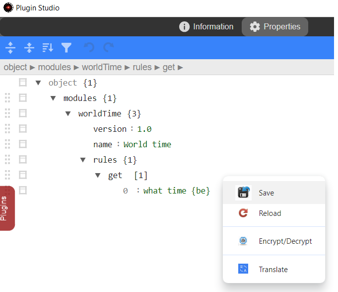

# World time plugin

## Créer le plugin

1. [Démarrez le serveur dans un terminal](tutorial-best-practices.md#terminal-de-demarrage-et-debogage)
2. [Créez un plugin par _Plugin Studio_](tutorial-plugin-studio.md)
    * Nom : `worldTime`
    * Affiché: `World time`
    * Rules: 
        * Oui
        * Par la syntaxe de la phrase
    * Script methods: sélectionnez `Méthodes de localisation du langage`
    * Ajouter une image 
        * Sélectionnez l'image `<A.V.A.T.A.R>/resources/app/assets/images/PluginCreation/worldTime.png`
    * Pas de documentation

    {width="450"}

## Définir les règles du plugin

1.  [Modifiez les propriétés du plugin](plugin-studio.md#gestion-des-proprietes)
    * Cliquez sur l'onglet _Properties_
    * Modifiez l'action `test` par `get`
    * Modifiez la règle par `what time {be}`
        * Voir [Root matches](plugin-rules.md#correspondances) dans le tableau des correspondances de règles de plugin pour plus de détails sur l'écriture de la règle
    * Ouvrez le menu contextuel
        *  Sauvegardez les propriétés par le menu `Save`

    {width="350"}

    * Fermez _Plugin Studio_
    * Clique sur _Later_ pour ne pas redémarrer A.V.A.T.A.R

2. Modifiez le fichier script du plugin dans [Visual Studio](tutorial-prerequisites.md#editeur-de-code) (ou un autre éditeur de texte)
    * Ouvrez le fichier `<A.V.A.T.A.R>/resources/app/core/plugins/worldTime/worldTime.js  `
    * Modifiez le tableau de commandes et le nom de la méthode `test` par `get`
    * Modifiez la variable `client` par `data.client` dans la fonction `Avatar.speak`
    * Accessoirement, vous pouvez supprimer tous les commentaires et les imports ajoutés pendant la création du plugin

    ``` js title="time.js" hl_lines="21 37 39"
    //language pak
    let Locale;

    export async function init() {

        if (!await Avatar.lang.addPluginPak("worldTime")) {
            return error('worldTime: unable to load language pak files');
        }

    }

    export async function action(data, callback) {

        try {
            Locale = await Avatar.lang.getPak("worldTime", data.language)
            if (!Locale) {
                throw new Error (`worldTime: Unbale to find the '${data.language}' language pak.`);
            }

            const tblActions = {
                get : () => get(data)					
            }
            
            info("worldTime:", data.action.command, L.get("plugin.from"), data.client);
                
            tblActions[data.action.command]()
        } catch (err) {
            if (data.client) Avatar.Speech.end(data.client);
            if (err.message) error(err.message);
        }	
            
        callback();
    
    }


    const get = (data) => {
        
        Avatar.speak(Locale.get(["message.test", data.client]), data.client);
    
    }
    ```

3. Redémarrez A.V.A.T.A.R
    * Faite un ++ctrl++ +`C` dans le terminal pour arrêter le serveur
    * Récupérez la dernière commande `npm start .` pour redémarrer le serveur

4. Testez le plugin  
    * Démarrez un client si ce n'est pas déjà fait
    * Exécutez la règle `what time is it`

    ??? warning "Attention"
        Si le message {width="300"} apparaît dans la console A.V.A.T.A.R, vérifiez si le pak de langue du client existe bien dans le répertoire _time/locales_. Si il n'existe pas, copiez le pak de langue existant en _XX_.pak, ensuite modifiez la valeur de la clé `test`.

## Modification du plugin

Nous allons maintenant faire en sorte d'avoir un plugin fonctionnel qui va nous permettre de demander l'heure pour toutes les principales villes du monde.

1. [L'object relations](tutorial-nlp.md#datarelations-object)

    D'abord, nous pouvons vérifier si [l'object relations](tutorial-nlp.md#datarelations-object) peut être utile pour le développement du plugin (voir aussi le [Traitement naturel du langage](tutorial-nlp.md)).

    * Ajoutez dans la fonction _get()_ un _console.log()_ pour afficher l'objet relation
    ``` js title="time.js" hl_lines="5"
    const get = (data) => {
        
        Avatar.speak(Locale.get(["message.test", data.client]), data.client);

        console.log('Relation:', data.relations);
    }
    ```
    * Redémarrez A.V.A.T.A.R dans le terminal
    * Exécutez la règle `what time is it in new york`
    
        {width="350"}

    * Nous pouvons voir l'objet _relations.location_
    * Testez plusieurs règles avec des villes du monde pour vérifier :
        1. Que majoritairement les plus grandes villes du monde sont correctement reconnues
        2. Que si il n'y a pas de ville dans la règle, l'objet _relation.location_ n'existe pas

    * Les tests sont concluants dans la majorité des cas, nous allons donc nous servir du traitement du langage pour développer le plugin.

???+ tip
    Quelques villes comme Beijing (ou Pékin) ne sont pas reconnues comme timeZone. Ce petit problème, non inhérant au traitement du langage et qui n'est pas vu dans cet exemple peut être traité simplement au cas par cas par le module `moment-timezone`.


2. Ajoutez des paramètres dans les propriétés

    La timezone étant sur une ville principale, nous allons ajouter 2 paramètres:

    -  Un paramètre `zone` pour une timezone par défaut lorsqu'il n'y a pas de ville dans la règle
    -  Un paramètre `speech` pour que le message de la timezone par défaut soit en relation avec la ville où nous habitons (allons au bout des choses !)

    Modifiez les paramètres du plugin comme ci-dessous:

    {width="450"}


3. Installez les modules necéssaires

    * Nous avons besoin de 2 modules d'import :
        * `underscore` est un module A.V.A.T.A.R, il n'est donc pas nécessaire de l'installer (voir [best practices](tutorial-best-practices.md#modules-npm))
        * `moment-timezone`: Ce module est à installer

    * Ouvrez un terminal et déplacez-vous dans le répertoire du plugin
    
        ```
        cd <A.V.A..T.A.R>/resources/app/cores/plugin/worldTime
        ```
    * Installez le module `moment-timezone`

        ```
        npm install moment-timezone
        ```

        {width="450"}

4. Ajoutez les imports dans le script au début du fichier

    ``` js title="worldTime.js"
    import _ from 'underscore';
    import moment from 'moment-timezone';
    ```
    
5. Modifiez la fonction _get_ pour inclure la recherche de l'heure comme ci-dessous

    **Note:** Modifiez les _Avatar.speak_ avec une phrase localisée dans votre langue

    ``` js title="worldTime.js"
    
    const get = (data) => {
       try {
            // Defines the city, NLP relation or default
            const city = data.relations?.location?.text ? data.relations.location.text : Config.modules.worldTime.default.zone;
            // Defines the city for the speech
            const speechCity = city === Config.modules.worldTime.default.zone ? Config.modules.worldTime.default.speech : city;
            // Updates chars in the city to be conform to timeZones
            const location = city.replace(/ /gi,"_");
            // Retreives timeZones
            const timeZones = Intl.supportedValuesOf('timeZone');
            // Searchs for the city in the timeZones table 
            let even = _.find(timeZones, item => { return item.toLowerCase().indexOf(`${location}`.toLowerCase()) !== -1; });
            if (even) {
                // even can be a string or a Array
                even = typeof even === 'string' ? even : even[0];
                // Defines the location (e.g. 'en' or 'fr') for a language-correct sentence.
                moment.locale(data.language);
                // Builds the sentence
                const sentence = moment.tz(Date.now(), even).format(`[In ${speechCity}, it is] H:m:s [the] dddd DD MMMM`);
                // Speaks the sentence
                Avatar.speak(sentence, data.client);
            } else {
                // Speaks a default sentence if no timezone
                Avatar.speak(`i'm sorry, i couldn't retrieve the ${speechCity} time`, data.client);
            }
        } catch (err) {
                if (data.client) Avatar.Speech.end(data.client);
                if (err.message) error(err.message);
        }
    }
    ```

    * Redémarrez A.V.A.T.A.R dans le terminal
    * Exécutez la règle `what time is it in new york`

???+ success
    Le plugin `worldTime` vous donne l'heure pour les plus grandes villes du monde !

## Localiser le plugin

Nous pouvons maintenant ajouter la localisation des messages. Pour l'exemple, nous allons ajouter l'anglais et le français.

1. Créez (ou modifiez) 2 pak de langues dans le répertoire locales comme ci-dessous en remplacant la variable _city_ par un $$ (voir la fonction [_get_](API.md#lang-pakgetkey))

    === "en.pak"

        ``` json
        {
            "message": {
                "time":"[in $$, it is] H:m:s [the] dddd MMMM DD"
            },
            "error": {
                "notime":"i'm sorry, i couldn't retrieve the $$ time"
            }
        }
        ```

    === "fr.pak"

        ``` json
        {
            "message": {
                "time":"[a $$, il est] H:m:s [le] dddd DD MMMM"
            },
            "error": {
                "notime":"je suis désolé, je n'ai pas réussi à récupérer l'heure de $$"
            }
        }
        ``` 

2. Modifiez le fichier script pour le multi-langage

    ``` js title="worldTime.js" hl_lines="19 24"
    const get = (data) => {
       try {
            // Defines the city, NLP relation or default
            const city = data.relations?.location?.text ? data.relations.location.text : Config.modules.worldTime.default.zone;
            // Defines the city for the speech
            const speechCity = city === Config.modules.worldTime.default.zone ? Config.modules.worldTime.default.speech : city;
            // Updates chars in the city to be conform to timeZones
            const location = city.replace(/ /gi,"_");
            // Retreives timeZones
            const timeZones = Intl.supportedValuesOf('timeZone');
            // Searchs for the city in the timeZones table 
            let even = _.find(timeZones, item => { return item.toLowerCase().indexOf(`${location}`.toLowerCase()) !== -1; });
            if (even) {
                // even can be a string or a Array
                even = typeof even === 'string' ? even : even[0];
                // Defines the location (e.g. 'en' or 'fr') for a language-correct sentence.
                moment.locale(data.language);
                // Builds the sentence
                const sentence = moment.tz(Date.now(), even).format(Locale.get(["message.time", speechCity]));
                // Speaks the sentence
                Avatar.speak(sentence, data.client);
            } else {
                // Speaks a default sentence if no timezone
                Avatar.speak(Locale.get(["error.notime", speechCity]), data.client);
            }
        } catch (err) {
                if (data.client) Avatar.Speech.end(data.client);
                if (err.message) error(err.message);
        }
    }
    ```

## Page d'information du plugin

Nous pouvons maintenant ajouter une page d'information au format [Markdown](https://www.markdownguide.org/basic-syntax/).  

???+ Note 
    Le format [Markdown](https://www.markdownguide.org/basic-syntax/) est un format de création de page HTML avec un format d'écriture très simple et qui ne nécessite aucunes connaissances particulières en HTML. 

    Cette document est réalisée avec [Markdown](https://www.markdownguide.org/basic-syntax/) et est aussi le format d'écriture adopté par [GitHub](https://github.com/)  
    Voir aussi le site [mkdocs-material](https://squidfunk.github.io/mkdocs-material/reference/) pour plus d'information

???+ Rappel
    
    | Nom de fichier | Description|
    |:---------------|:-----------|
    |`info.md`|Si il n'existe pas de fichier `info_<application language>.md` alors ce fichier est utilisé|
    |`info_<application language>.md`|_application language_: Code court du [langage de l'application](server-properties.md#application-language)<br>Si ce fichier existe alors il est utilisé.<br>Exemple: `info_en.md`|

Pour l'exemple, nous allons ajouter l'anglais et le français.

1. Ouvrez un terminal et déplacez-vous dans le répertoire _assets_ du plugin
    
    ```
    cd <A.V.A..T.A.R>/resources/app/cores/plugin/worldTime/assets
    ```

2. Créez 2 fichiers d'information au format [Markdown](https://www.markdownguide.org/basic-syntax/) pour l'anglais et le français comme ci-dessous

    === "info_en.md"

        ``` html
        # World time

        

        World time lets you find out the time for all world's major cities.  

        ## Rules

        ### Default location
        - `what time is it`: Returns the time for the default location

        ### Major world city
        - `what time is it in new york`: Returns the time for New York city
        - `in new york, what time is it`: Returns the time for New York city

        ## Parameters
        * `default.zone`: The default city (the _timeZone_) if no city is in the rule
        * `default.speech`: The default city to speak if no city is in the rule

        ## Adding a language
        You can localize A.V.A.T.A.R speech by adding a language pack to the _WorldTime/locales_ folder, copying an existing pack and modifying the key values.
        ```

    === "info_fr.md"

        ``` html
        # World time

        

        World time vous permet de connaître l'heure pour toutes les grandes villes du monde. 

        ## Règles

        ### Emplacement par défaut
        - `what time is it`: Retourne l'heure de l'emplacement par défaut

        ### Grande ville du monde
        - `what time is it in new york`: Retourne l'heure pour la ville de New York
        - `in new york, what time is it`: Retourne l'heure pour la ville de New York

        ## Paramètres
        * `default.zone`: La ville par défaut (la _timeZone_) si aucune ville n'est mentionnée dans la règle
        * `default.speech`: La ville à utiliser pour le dialogue d'A.V.A.T.A.R si aucune ville n'est mentionnée dans la règle.

        ## Ajouter un langage
        Vous pouvez localiser le dialogue d'A.V.A.T.A.R en ajoutant un pack de langues dans le dossier _WorldTime/locales_, en copiant un pack existant et en modifiant les valeurs de clés.
        ``` 

3. Redémarrez A.V.A.T.A.R dans le terminal
4. Afficher la page d'information du plugin dans _Plugin studio_

    === "Anglais"

        {width="550"}

    === "Français"

        {width="550"}

4. Vous pouvez changer le langage de l'application pour vérifier le résultat dans un autre langage


<br><br>
[:material-skip-previous: Introduction](examples-developer.md){ .md-button style="float:left;"}[Meteo :material-skip-next:](meteo.md){ .md-button style="float:right;"}   
<br><br>