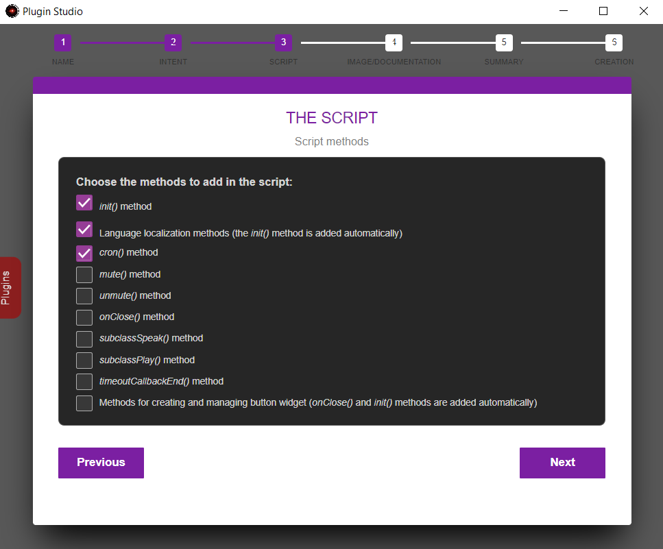
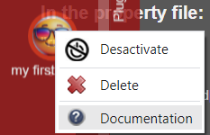

# Créer un plugin

L'application vous offre la possibilité de créer un plugin automatiquement par l'interface _Plugin Studio_. Bien que cela ne soit pas indispensable pour les utilisateurs avancés, nous vous conseillons vivement de toujours l'utiliser pour avoir des templates de fichiers directement au bon format et incluants les méthodes et propriétés utiles pour votre développement.

En plus du serveur, il est possible de créer des plugins sur chaque client A.V.A.T.A.R.  
Un plugin client est généralement utilisé pour réaliser des actions propres au client qui ne peuvent pas être effectuées avec les API depuis un plugin du serveur ou encore utilisé pour ajouter des wigdets boutons dans l'interface du client.

???+ note
    Il n'est pas possible de créer un plugin par le _Plugin Studio_ d'un client.

    Pour créer un plugin pour un client :

    1. Créer le plugin par _Plugin Studio_ sur le serveur 
    2. Copier ensuite le plugin dans le répertoire _plugins_ du client

1. Dans l'interface **Serveur**, faites un clic gauche sur le node serveur
2. Menu _Edition_ -> _Plugin Studio_ 
3. Par un clic gauche, ouvrez l'onglet _Plugin_
4. Cliquez sur _Create a Plugin_ pour ouvrir la fenêtre de création d'un plugin

/// note | Note d'information
La création d'un plugin ne peut se faire que par le _Plugin Studio_ du Serveur A.V.A.T.A.R.  
Le _Plugin Studio_ des clients A.V.A.T.A.R n'est pas prévu pour créer des plugins. Voir l'étape 6 pour plus de détails.
///

## Etape 1 - Informations Générales

* `Entrez un nom pour le plugin` (obligatoire):* Pour l'exercice, entrez **_myFirstPlugin_**
* `Entrez un label d'affichage` (optionnel): 
    * Pour l'exercice, entrez **_my first plugin_**

{: style="height:400px;width:auto"}

* Cliquez sur **_Suivant_**

## Etape 2 - L'intention
L'intention permet de vérifier si la phrase que vous prononcez valide une règle vocale définie pour le plugin.

* `Le plugin a des règles vocales ?`
    * Il n'est pas obligatoire d'avoir des règles vocales pour un plugin.  
    Par exemple, un plugin peut gèrer des automatismes ou des actions sur des périphériques directement sans règle vocale.
    * Pour l'exercice, choisissez **_Oui_**
* `Comment les règles du plugin sont vérifiées ?`
    * Il existe deux façons de vérifier une règle vocale:
        * Par la syntaxe de la phrase 
        * Par un terme dans la phrase
    * Pour l'exercice, choisissez **_Par la syntaxe de la phrase_**

??? warning
    Soyez prudent avec le choix par un terme dans la phrase qui peut facilement être en doublon avec d'autres règles d'autres plugins.


{: style="height:400px;width:auto"}
    
* Cliquez sur **_Suivant_**

## Etape 3 - Le script
Le fichier script est le point d'entré pour développer un plugin.  
Cette étape vous permet d'y ajouter automatiquement des [méthodes](tutorial-script.md#les-methodes) qui intéragissent avec l'application lorsque c'est nécessaire. 

{: style="height:400px;width:auto"}

* Pour l'exercice, cochez **_init()_**, **_méthodes de localisation des messages_** et **_cron()_**.<br>
* Cliquez sur **_Suivant_**


## Etape 4 - Image et documentation

* `Image` - Choix d'une image au format `png` qui sera affichée pour le plugin. Une image est ajoutée par défaut si aucune image n'est choisie.
* `Documentation` - Vous disposez de l'onglet _Information_ du _Plugin Studio_ pour afficher des informations sur le plugin. Dans certains cas, il est préférable de créer une documentation html accessible par un navigateur. Si la documentation a besoin d'un serveur HTTP, le serveur A.V.A.T.A.R peut être utilisé comme serveur de documentation.

???+ note "Information"
    Pour accéder à la documentation d'un plugin, ouvrez l'onglet des plugins puis faites un _clic gauche_ sur le plugin, si le plugin n'est pas le plugin courant, l'onglet se ferme. Recommencez alors une deuxième fois pour afficher son menu contextuel. Si celui-ci a une documentation, le menu _Documentation_ apparaitra dans son menu.

{: style="height:350px;width:auto"}

* Cliquez sur **_select_** puis déplacez-vous dans le répertoire _assets/images/pluginCreation_
* Sélectionnez l'image _myFirstPlugin_
    * Cette image est un exemple, vous pouvez choisir n'importe quelle image `png` depuis n'importe quel répertoire. L'image sera copiée et renommée dans le répertoire _images_ du plugin. 
* Cliquez sur **_yes_** pour la documentation HTML.
    * Ajouter une page de démarrage _index.html_
    * Cliquez sur la case à cocher "Serveur de documentation"
* cliquez sur **_Suivant_**

## Etape 5 - Récapitulatif

{: style="height:350px;width:auto"}

* Visualisez les informations de création puis cliquez sur **_Créer_**

## Etape 6 - Création 

* La page d'information  du plugin _myFirstPlugin_ est affichée
* Ouvrez l'onglet des plugins, _my first plugin_ a été ajouté.

{: style="height:350px;width:auto"}


* Cliquez sur l'onglet **_Properties_** pour visualiser les propriétés du plugin

{: style="height:350px;width:auto"}


* Cliquez sur le plugin pour ouvrir son menu et cliquez sur **_documentation_**.



* Fermez la fenêtre _Plugin Studio_


Le détail les fichiers créés pour le projet  _myFirstPlugin_ :

=== "intent.myFirstPlugin.js"

    ```js linenums="1"
    import {default as _helpers} from '../../ia/node_modules/ava-ia/helpers/index.js';

    export default async function (state, actions) {
        if (state.isIntent) return (0, _helpers.resolve)(state);
        
        for (var rule in Config.modules.myFirstPlugin.rules) {	 
            var match = (0, _helpers.syntax)(state.sentence, Config.modules.myFirstPlugin.rules[rule]); 	
            if (match) break;
        }
        
        if (match) {
            state.isIntent = true;
            state.rule = rule;
            return (0, _helpers.factoryActions)(state, actions);
        } else 
            return (0, _helpers.resolve)(state); 
    };
    ```

    :information_source:
    Le fichier d'intention est expliqué en détail dans la partie 5 du tutoriel: [L'intention](tutorial-intention.md)

=== "action.myFirstPlugin.js"
    
    ``` js linenums="1"
    import {default as _helpers} from '../../ia/node_modules/ava-ia/helpers/index.js'

    export default function (state) {
        return new Promise((resolve) => {
            setTimeout(() => { 
                state.action = {
                    module: 'myFirstPlugin',
                    command: state.rule
                };
                resolve(state);
            }, Config.waitAction.time);
        });
    };
    ```

    :information_source:
    Le fichier d'action est expliqué en détail dans la partie 6 du tutoriel: [L'action](tutorial-action.md)

=== "myFirstPlugin.js" 
    - <p style="font-size:14px">`Ligne 7`: La fonction `init()` exécutée au chargement du plugin.</p>
    - <p style="font-size:14px">`Ligne 8`: Charge les paquets de messages localisés</p>
    - <p style="font-size:14px">`Ligne 13`: La fonction `cron()` permettant l'exécution de tâches à intervales réguliers.</p>
    - <p style="font-size:14px">`Ligne 17`: La fonction `action()` est le point d'entrée de toutes les actions du plugin.</p>
    - <p style="font-size:14px">`Line 20`: Recherche des messages localisés dans la langue du client</p>
    - <p style="font-size:14px">`Ligne 45`: La fonction `test()` est la fonction privée de test générique ajoutée à la création du plugin. Elle devra ensuite être supprimée.</p>

    ```js linenums="1"
    import * as path from 'node:path';
    import * as url from 'url';
    const __dirname = url.fileURLToPath(new URL('.', import.meta.url));

    let Locale

    export async function init() {
        if (!await Avatar.lang.addPluginPak("myFirstPlugin")) {
            return error('myFirstPlugin: unable to load language pak files');
        }   
    }
    
    export async function cron () {
        // Do stuff
    }

    export async function action(data, callback) {

        try {
            Locale = await Avatar.lang.getPak("myFirstPlugin", data.language);
            if (!Locale) {
                throw new Error (`myFirstPlugin: Unable to find the '${data.language}' language pak.`);
            }

            // Table of actions
            const tblActions = {
                // test (see rules table in the property file)
                test : () => test(data.client)					
            }
            
            // Writes info console
            info("myFirstPlugin:", data.action.command, L.get("plugin.from"), data.client);
                
            // Calls the function that should be run
            tblActions[data.action.command]();
        } catch (err) {
            if (data.client) Avatar.Speech.end(data.client);
            if (err.message) error(err.message);
        }	
            
        callback();
    
    }

    const test = (client) => {
    
	    Avatar.speak(Locale.get(["message.test", client]), client);
  
    }
    ```

     :information_source:
    Le fichier script est expliqué en détail dans la partie 7 du tutoriel: [Le script](tutorial-script.md)

=== "myFirstPlugin.prop" 
    <p style="font-size:14px">Le fichier de propriétés du plugin incluant:</p>

    - <p style="font-size:14px">`Ligne 3: Un object `modules`.`myFirstPlugin` **obligatoire** regroupant toutes les propriétés du plugin.</p>
    - <p style="font-size:14px">`Ligne 6`: Un object `modules`.`myFirstPlugin`.`rules` avec lequel l'intention est vérifiée dans le fichier `intent.myFirstPlugin.js`</p>
    - <p style="font-size:14px">`Ligne 11`: Un object `cron` comme demandé à la création du plugin _myFirstPlugin_ et définissant l'interval d'exécution de la fonction `cron()` du fichier `myFirstPlugin.js`. Par défaut initialisé toutes les 2 heures.</p>

    ```json linenums="1"
    {
        "modules": { 
            "myFirstPlugin": {
                "version": "1.0",
                "name": "My first plugin",
                "rules": {
                    "test": ["test * (command|order)"]
                }
            }
        },
        "cron": {
            "myFirstPlugin": { 
                "name": "myFirstPlugin",
                "time": "0 * */2 * * *"
            }
        }
    }
    ```

=== "package.json"
    <p style="font-size:14px">Le fichier `package.json` n'est pas obligatoire, le plugin peut très bien fonctionner sans ce fichier. Néanmoins ce fichier de configuration est préférable si vous ajoutez des modules `npm` au plugin.</p>

    <p style="font-size:14px">Modifiez les valeurs des sections comme vous voulez.</p>

    ```json linenums="1"
    {
        "name": "myFirstPlugin",
        "version": "1.0.0",
        "type": "module",
        "description": "Plugin myFirstPlugin for A.V.A.T.A.R",
        "repository": "https://github.com/YOUR-REPOSITORY",
        "keywords": [
            "myFirstPlugin"
        ],
        "author": "YOUR-NAME",
        "license": "mit"
    }
    ```

=== "locales\\<_lang_>.pak"
    <p style="font-size:14px">Ce fichier est créé à titre d'exemple et doit être complété. Il contient des objets principaux (ici "message") regroupant par catégorie les messages que vous désirez ajouter en <_clé_>:<_valeur_>.</p>
    <p style="font-size:14px">Utilisez la fonction `Locale.get("message.first")` pour récupérer la valeur.</p>

    ```json linenums="1"
    {
        "message": {
            "first":"i am testing the command for $$"
        }
    }
    ```

=== "documentation\\index.html"
    <p style="font-size:14px">La page de démarrage de la documentation définie dans le fichier _documentation.ini_. Ce fichier est créé à titre d'exemple et doit être modifié.</p>

    ``` html
    <!DOCTYPE html>
    <html>
        <head>
            <meta charset="UTF-8">
            <meta http-equiv="Content-Security-Policy" content="default-src 'self'; script-src 'self'; style-src 'self' 'unsafe-inline'">
        </head>
        <body>
            <h1>myFirstPlugin documentation</h1>
        </body>
    </html>
    ```


## Test de fonctionnement

A.V.A.T.A.R est mis à jour avec le nouveau plugin sans avoir besoin de redémarrer.  
Si l'option de visualisation de toutes les informations est active, vous pouvez visualiser le chargement du plugin dans la console

Dictez la règle pour tester le plugin:

* **Règle:** `test la commande`


<br><br>
[:material-skip-previous: Prérequis](tutorial-prerequisites.md){ .md-button style="float:left;"}[Le répertoire et les fichiers :material-skip-next:](tutorial-plugin-folders-files.md){ .md-button style="float:right;"}   
<br><br>
