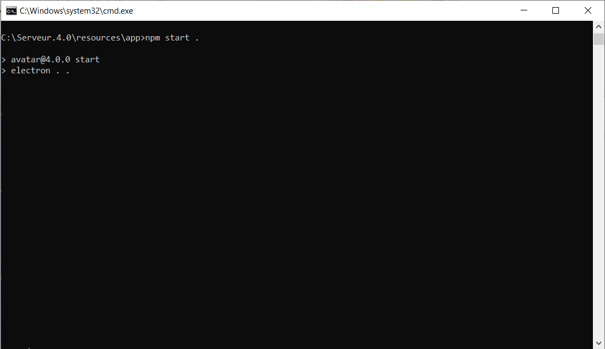

# Prerequisites

## Goals
This tutorial will guide you through the development process.  
The [examples](developer-examples.md) and the documentation for the [server API](server-API.md) and [client API](client-API.md) are also interesting chapters for learning how to develop a plugin.

## Assumptions
A plugin is an A.V.A.TA.R overlay running in a [Node.js](https://en.wikipedia.org/wiki/Node.js) environment. Therefore, developing a plugin assumes that you are completely familiar with Node, npm, javascript and the basics of front-end web development. If you need to do some preliminary reading on the subject before getting started, we recommend the following resources:

* [First steps on the Web (MDN Web Docs)](https://developer.mozilla.org/en-US/docs/Learn)
* [Introduction to Node.js](https://nodejs.org/en/learn/getting-started/introduction-to-nodejs)


## Good pratices

It is preferable to have a development orientation before creating a plugin, which will be either:

- For personal use
- Added to the A.V.A.T.A.R library for public use

If it's a personal decision, you'll be the only one using it, so you can ignore this paragraph.  
On the other hand, if you choose to share your plugins with the community, you'll need to respect certain conventions:

- **Localize the plugin**: A.V.A.T.A.R is multi-language, so localize at least the current language to allow translation of an existing language pack if necessary.
- **Add documentation**: This part is always overlooked, but it's essential for using the plugin. Depending on the complexity of the documentation, you can choose between :
    - Add an information page in [Markdown](https://www.markdownguide.org/basic-syntax/) format, which will be displayed in the plugin information page in _Plugin Studio_.
    - Add an HTML document that can be displayed in a web browser.

    Note that in both cases, it is preferable to write in English.

- **Think multi-room**: A.V.A.T.A.R is a client-server application, so make sure that the plugin is always functional even if the client is not installed on the same plateform as the server.
    - For example, a classic mistake is to use the server's `ffplay` application when the music is to be played on a client.
- **Think multiplatform**: A.V.A.T.A.R runs on Windows, Linux and MacOS platforms. There are some peculiarities between systems, so always check that the specific conditions for each platform are respected if specific applications are to be used. If you don't know whether the plugin works on a particular platform, please note this in the documentation.

## Required tools
### Code editor
You will need a text editor to write your code.  
We recommend using [Visual Studio Code](https://code.visualstudio.com/), although you can choose whichever one you prefer.


### GitHub
GitHub is a collaborative development platform built on Git. While neither is strictly necessary to create a plugin, managing your source code versions is indispensable. We also use GitHub project releases (in A.V.A.T.A.R format only) to display them in the A.V.A.T.A.R plugin library. 

So if you don't have a GitHub account, [Create a GitHub account](https://github.com/signup) now.
You can then use the [GitHub Desktop](https://desktop.github.com/) application to manage your projects if you prefer to use a visual interface instead of the command line.

???+ note
    If you're not a **contributor**, other users won't see your projects and won't be able to download them from the A.V.A.T.A.R plugin library. Your A.V.A.T.A.R GitHub projects will remain personal to you and will be displayed in your library **only**. 

    Please note that to become a contributor for public use, you must submit a request. You will then be added as a contributor and users will be able to use your plugins.


### nodejs and npm
Although the [Electron](https://www.electronjs.org/) framework integrates [node.js](https://nodejs.org/) in its executable, it is theoretically not necessary to install nodejs and npm, for A.V.A.T.A.R and to develop a plugin, this installation is mandatory.  

This step is made during the installation of [prerequisites](introduction.md#prerequisites) the server and each client.  


## npm packages 

Developing a plugin means using npm packages in your application.  
Some of these packages are accessible by default in node.js, others from packages already installed in A.V.A.T.A.R, but you can also install specific packages to your plugin.

1. First, check that the package is not a module included in node.js
    - If one exists, then you can import it into the script of the plugin:
    ```js
    import * as path from 'node:path';
    ```
2. Then open the file _A.V.A.T.A.R/resources/app/package.json_ in a text editor
    - Search for the module you are interested in
    - If one exists, you can import it into the script of the plugin:
        ```js
        import _ from 'underscore';
        ```
    - If it doesn't exist:
        - Open a terminal
        - Move to the plugin folder
            ``` hl_lines="6"
            A.V.A.T.A.R (client or server)
                ├── resouces
                    ├── app
                        ├── core
                            ├── plugins
                                ├── Your plugin
            ```
        - Install the package in the plugin folder
            ``` hl_lines="6"
            > npm install package_name
            ```
        -  Check package installation
            ``` hl_lines="6"
            A.V.A.T.A.R
                ├── resouces
                    ├── app
                        ├── core
                            ├── plugins
                                ├── Your plugin
                                    ├── node_modules
                                        ├── package_name
                                    ├── package.json
            ```

            /// note
            If you have created the plugin via [Plugin Studio](tutorial-create-plugin.md), a _package.json_ file is automatically added to its folder. The package is added to it after the installation.
            ///

/// danger
Never install a new package in A.V.A.T.A.R client or server packages!
///

## Development terminal and debugging 

During development, we prefer to start/stop the server (or client) more quickly from a terminal.  
We also prefer to use _console.log()_ to display useful information and error messages.

1. Open a terminal
2. Move to the application's _app_ folder 
    ``` hl_lines="3"
    A.V.A.T.A.R
        ├── resouces
            ├── app
    ```
3. Start the application with npm
    ``` hl_lines="1"
    > npm start .
    ```
    {width="550"}

4. You now have an npm console for starting/stopping and viewing messages


<br>
[Create a plugin :material-skip-next:](tutorial-create-plugin.md){ .md-button style="float:right;"}   
<br><br>