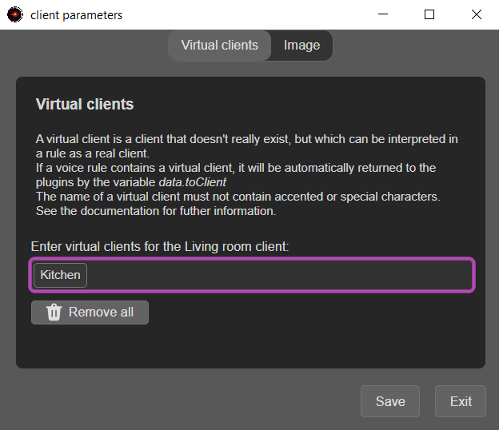
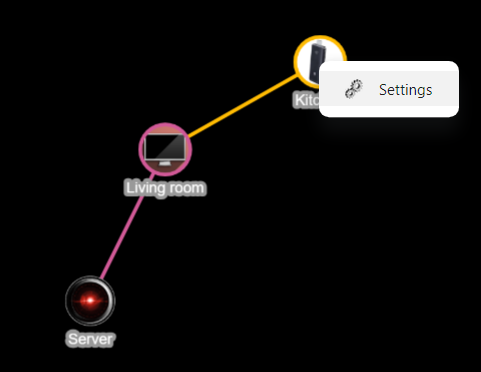
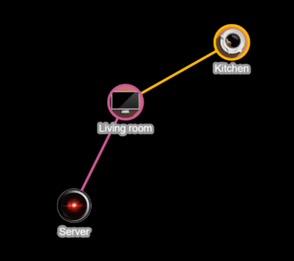

# Virtual client

A virtual client is a client that doesn't exist but which can be interpreted in a rule as a real client.  
If a voice rule contains a virtual client, it will be automatically returned to the plugins by the _data.toClient_ variable.

Take the following rule passed from the `Living room` client, where `Kitchen` is a virtual client:

```
turns on the light in the kitchen
```

The plugin's _action_ function will have the following values in its `data` object:

```json
{
  client: 'Living room',
  toClient: 'Kitchen',
  ... // Other parameters
}
```

_data.toClient_ can then be used directly in an action:

```
turn on the light in ${data.toClient}
```

## Create a virtual client

A virtual client must be created from a real customer.  
To create a virtual customer:

1. Left-click on a client in the server interface 
2. Select the _Settings_ menu 
3. Enter a virtual client name

    {width="400"}

4. Click on _Save_
5. Restart A.V.A.T.A.R
6. Place the virtual client node in the interface

/// note
The node position is automatically saved when you exit A.V.A.T.A.R.
///

The virtual client has a default image.  
To select another image:

1. Left-click on the virtual client
2. Click on _Settings_

    {width="300"}

3. Choose an image in `.png` format
4. Test in the interface and/or click on _Save_

    {width="300"}


/// note
You can choose an image in `.png` format from any folder.  
When saved, it will be copied to the _app/assets/images/rooms_ folder.
///


<br><br>
[:material-skip-previous: Getting started](getting-started.md){ .md-button style="float:left;"} 
<br><br>