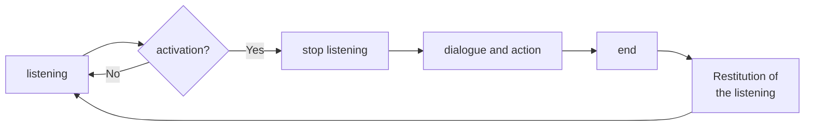
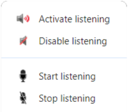

# Voice rules

## Trigger listening

 Listening is triggered by configurable keywords in the [Dialog](client-properties.md#dialog-tab) tab of each client's properties.

There are 3 ways to say a rule:

=== "keyword and rule"

    The rule is said in the same sentence as the trigger keyword.  

    ``` mermaid
    graph LR
    A[keyword and rule]
    A --> B[execution of the action];
    ```
    
    <span style="color:green;">You:</span> Jarvis, what time is it?  
    <span style="color:yellow;">Client:</span> The time is 10 a.m.
    
=== "Keyword"

    Listening is activated by the trigger keyword, the client responds, then you say the rule.  

    ``` mermaid
    graph LR
    A[keyword]
    A --> B[listening message];
    B --> C[rule];
    C --> D[execution of the action];
    ```

    <span style="color:green;">You:</span> Jarvis  
    <span style="color:yellow;">Client:</span> I'm listening  
    <span style="color:green;">Vous:</span> What time is it?  
    <span style="color:yellow;">Client:</span> The time is 10 a.m.


=== "Loop mode"

    Listening is activated by the trigger keyword, the customer responds, you pass a rule, another... then you end the dialog.

    ``` mermaid
    graph LR
    A[keyword]
    A --> B[listening message];
    B --> C[rule];
    C --> D[execution of the action];
    D--> E{shall we<br>continue?};
    E --> F{rule?}; 
    F --> |Yes| D; 
    F --> |No| G[Exit]; 
    ```

    <span style="color:green;">You:</span> Jarvis  
    <span style="color:yellow;">Client:</span> I'm listening  
    <span style="color:green;">Vous:</span> quelle heure est-il ?  
    <span style="color:yellow;">Client:</span> What time is it?  
    <span style="color:yellow;">Client:</span> Would you like anything else?  
    <span style="color:green;">Vous:</span> turn on the TV     
    <span style="color:yellow;">Client:</span> It's done  
    <span style="color:yellow;">Client:</span> anything else?  
    etc...  
    etc...  
    <span style="color:yellow;">Client:</span> anything else?   
    <span style="color:green;">Vous:</span> it's fine thanks    
    <span style="color:yellow;">Client:</span> At your service   


    /// Note
    Loop mode must be enabled in the [Dialog](client-properties.md#dialog-tab) tab of each client's properties.

    All sentences are defined in the [Rules](client-properties.md#rules-tab) tab of each client's properties.
    ///

## Listening mode

To use A.V.A.T.A.R properly, you need to understand how a dialog is executed.  
The diagram below shows the various steps in the execution of a rule.



As can be seen in the diagram, the listening of the client is stopped at the beginning and restored at the end, so as not to pick up sentences, noises or say another rule at the same time that could interfere with the dialogue and actions in progress.

In the client console, you can see the various related messages:

{width="250"}

* `Stop listening...`: Listening is stopped, you can no longer say a rule
* `Ready to listen!` : The client is in listening mode, you can say a rule

/// danger | Important
After a dialog and/or an action, if you don't see the `Ready to listen!` in the console and listening is not reactivated, this is usually due to a development error in the plugin linked to the rule that doesn't send the end-of-action request to the client. 

In this case, you'll need to reactivate the listening function manually (see below), and don't forget to correct the plugin error!
///


## Listening actions in the contextual menu

You can use contextual menu actions to manage listening:

{width="150"}
   

These actions are available:

* On each client node context menu in the server interface 
* In the contextual menu accessible by left-clicking on its name in each client's interface.

### `Activate listening`
Enables listening on the client. This action resets the listening function if it has been deactivated.

### `Disable listening`
Disables listening on the client.

### `Start listening`
Activates listening on the client. This action is identical to the trigger keyword.

### `Stop listening`
Stop listening on the customer if this has been triggered.


<br><br>
[:material-skip-previous: Getting started](getting-started.md){ .md-button style="float:left;"} 
<br><br>