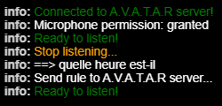

# Les règles vocales

## Déclencher l'écoute

 L'écoute est déclenchée par des mots-clés configurables dans l'onglet [Dialog](client-properties.md#dialog-tab) des propriétés de chaque client.

Il existe 3 méthodes pour dire une règle :

=== "Mot-clé et règle"

    La règle est dite dans la même phrase que le mot-clé déclencheur.  

    ``` mermaid
    graph LR
    A[mot-clé et règle]
    A --> B[exécution de l'action];
    ```
    
    <span style="color:green;">Vous:</span> Jarvis quelle heure est-il ?  
    <span style="color:yellow;">Client:</span> Il est 10 heures
    
=== "Mot-clé"

    L'écoute est activée par le mot-clé déclencheur, le client vous répond, puis vous passez la règle.  

    ``` mermaid
    graph LR
    A[mot-clé]
    A --> B[message d'écoute];
    B --> C[règle];
    C --> D[exécution de l'action];
    ```

    <span style="color:green;">Vous:</span> Jarvis  
    <span style="color:yellow;">Client:</span> Je t'écoute  
    <span style="color:green;">Vous:</span> quelle heure est-il ?  
    <span style="color:yellow;">Client:</span> Il est 10 heures


=== "Loop mode"

    L'écoute est activée par le mot-clé déclencheur, le client vous répond, vous passez une règle, une autre... puis vous mettez fin au dialogue.

    ``` mermaid
    graph LR
    A[mot-clé]
    A --> B[message d'écoute];
    B --> C[règle];
    C --> D[exécution de l'action];
    D--> E{on continue ?};
    E --> F{règle ?}; 
    F --> |Yes| D; 
    F --> |No| G[Exit]; 
    ```

    <span style="color:green;">Vous:</span> Jarvis  
    <span style="color:yellow;">Client:</span> Je t'écoute  
    <span style="color:green;">Vous:</span> quelle heure est-il ?  
    <span style="color:yellow;">Client:</span> Il est 10 heures  
    <span style="color:yellow;">Client:</span> Tu veux autre chose ?  
    <span style="color:green;">Vous:</span> allume la télé     
    <span style="color:yellow;">Client:</span> C'est fait  
    <span style="color:yellow;">Client:</span> autre chose ?  
    etc...  
    etc...  
    <span style="color:yellow;">Client:</span> Tu veux autre chose ?   
    <span style="color:green;">Vous:</span> c'est bon merci    
    <span style="color:yellow;">Client:</span> A ton service   


    /// Note
    Le mode loop doit être activé dans l'onglet [Dialog](client-properties.md#dialog-tab) des propriétés de chaque client.

    Toutes les phrases sont définies dans l'onglet [Rules](client-properties.md#rules-tab) des propriétés de chaque client.
    ///

## Mode écoute

Pour bien utiliser A.V.A.T.A.R, il convient de comprendre comment un dialogue est exécuté.  
Le diagramme ci-dessous montre les différentes étapes d'exécution d'une règle.


Comme on peut le voir dans le diagramme, l'écoute du client est arrêtée au début puis est restituée à la fin afin ne pas capter des phrases, des bruits ou dicter une autre règle en même temps qui pourraient interférer avec le dialogue et les actions en cours.

Vous pouvez voir dans la console du client les différents messages en relation:

{width="250"}

* `Stop listening...`: L'écoute est arrêtée, vous ne pouvez plus passer de règle
* `Ready to listen!` : Le client est en mode écoute, vous pouvez passer une règle

/// danger | Important
Après un dialogue et/ou une action, si vous ne voyez pas le `Ready to listen!` dans la console et que l'écoute n'est pas réactivée, cela est généralement dû à une erreur de développement du plugin lié à la règle qui n'envoie pas la requête de fin d'action au client. 

Dans ce cas, vous devrez réactiver l'écoute par une action manuelle (voir ci-dessous) mais aussi ne pas oublier de corriger l'erreur du plugin !
///


## Les actions d'écoute du menu contextuel

Vous disposez d'action de menu contextuel pour gérer l'écoute :

{width="150"}
   

Ces actions sont accessibles:

* Sur chaque menu contextuel des nodes clients dans l'interface du serveur 
* Dans le menu contextuel accessible par un clic gauche sur son nom dans l'interface de chaque client.

### `Activate listening`
Active l'écoute sur le client. Cette action permet de réinitialiser l'écoute si celle-ci a été désactivée

### `Disable listening`
Désactive l'écoute sur le client.

### `Start listening`
Active l'écoute sur le client. Cette action est identique au mot clé déclencheur.

### `Stop listening`
Stop l'écoute sur le client si celle-ci a été déclenchée.


<br><br>
[:material-skip-previous: Pour commencer](getting-started.md){ .md-button style="float:left;"} 
<br><br>